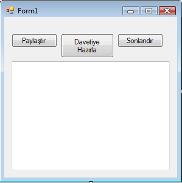
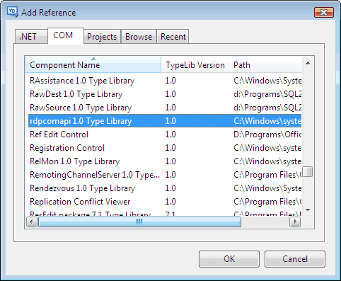
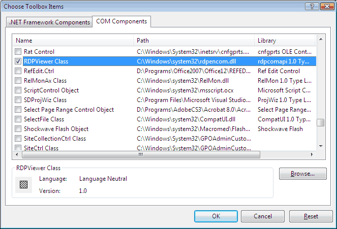

Masaüstü paylaşım yazılımları özellikle teknik sorunlarda müşterilere
yardımcı olma noktasında gerçekten cankurtaran özelliğine sahipler. Peki
hiç kendi masaüstü paylaşım yazılımınızı programlamayı denediniz mi? Hiç
kolay olmayacağını baştan belirtmekte fayda var. Onun yerine çok daha
kolay bir yoldan bahsedeceğiz.

Windows Vista ile beraber gelen **Meeting Space** artık eski
**Netmeeting**'in yerini almış durumda. Maalesef **Netmeeting** ile
**Meeting Space** arasında bir bağ kurmak mümkün değil. Biz
örneğimizdeki **İstemci** **(Görüntüleyici)** ve **Sunucu (Paylaşımcı)**
uygulamaları için **Windows Desktop Sharing API (RdpEncom.dll)**
arayüzlerini kullanacağız. **Windows Meeting Space** ve **Remote
Assistance** uygulamalarının da kullandığı **API** olan bu araçlar
maalesef yukarıda da bahsettiğim üzere **NetMeeting** ile uyumlu değil.

Kullanacağımız toplam iki referans bulunuyor;

RDPSRAPISharingSession – Masaüstünü paylaşmamızı sağlayacak COM objesi.\
 IRDPSRAPIViewer – ActiveX Gösterici

**Sunucu Uygulaması**

Gelin sunucu uygulamasını hazırlayarak işimize başlayalım. Aşağıdaki
ekran görüntüsünde sunucu uygulamamızın kabaca form tasarımını
görebilirsiniz. Sırası ile **Button1, Button2 ve Button3** adındaki
düğmeleri ekledim. **textbox1** metin kutusunu da davet bağlantı metnini
göstermek için kullanacağım. Davet bağlantı metni dediğimiz istemcinin
sunucuya bağlanabilmesi için gerekli tüm bilgileri içeren bir metin. Bu
metni istemci yazılımına verdiğimizde direk sunucuya bağlanabilecek.
Herhangi IP, port vs iletilmesi gerekmiyor. Siz uygulamalarınızda bu
davet metnini farklı şekillerde sunucudan istemciye iletebilirsiniz.
Gerçek hayatta nasıl senaryolar olabileceğine dair makalemizin sonunda
yer ayırıyor olacağım.

Kod ekranımıza dönüp kodlarımızı yazmadan önce projemize **RDPComapi
DLL** referansını eklememiz gerekiyor. **Solution Explorer** içerisinde
projenize sağ tuş tıklayarak **Add Reference** bölümünden aşağıdaki gibi
gerekli seçimi yapabilirsiniz.

Sıra geldi kodlarımızı yazmaya. İlk olarak **RDPCOMAPILib**
kütüphanesini import edeceğiz. Sonrasında da global bir **RDPSession**
tanımlayacağız. Benim kullanacağım değişkenin adı kısa olması amacıyla
**X** olacak.

Imports RDPCOMAPILib\
   \
  Public  Class Form1\
        Dim x  As  New
RDPSession\
\
 End 
Class

Kullanıcılar sunucuya bağlantığında çalıştırılmak üzere **Misafir**
adında bir objeyi parametre alan bir **Sub** yaratacağız. Yarattığımız
bu kodu ileride **RDPSession**'a ait **OnAttendeeConnected** durumuna
bağlayacağız.

     Private  Sub Geliyor(ByVal Misafir 
As  Object)\
           Dim
Misafirim  As IRDPSRAPIAttendee =
Misafir\
          Misafirim.ControlLevel =
CTRL\_LEVEL.CTRL\_LEVEL\_INTERACTIVE\
       End  Sub

Yukarıdaki kod içerisinde bize parametre olarak gelen **Misafir**
objesini kendi yarattığımız bir **IRDPSRAPIAttendee** objesine
eşitliyoruz. Sonrasında söz konusu objeye, yani misafire ait
**ControlLevel** özelliğini **CTRL\_LEVEL.CTRL\_LEVEL\_INTERACTIVE**
olarak düzenliyoruz. Farklı **ControlLevel** seçeneklerinden herhangi
birini kullanmak mümkün. Siz kendi çözümünüzde ihtiyaç duyduğunuz
şekilde bu ayarı değiştirebilirsiniz, örneğin istemci sadece sunucuyu
izliyor da olabilir. Bizim örneğimizde istemci sunucunun masaüstünde
işlem yapabilecek. Sıra geldi hazırladığımız **Sub'ın** durum
bağlantısını yapmaya.

     Private  Sub Button1\_Click(ByVal sender 
As System.Object,  ByVal e
 As System.EventArgs)  Handles Button1.Click\
           
AddHandler x.OnAttendeeConnected, 
AddressOf Geliyor \
           x.Open()\
        End  Sub

Sunucu ile istemci arasındaki bağlantıların davetiye metinlerine bağlı
olduğundan bahsetmiştik. Bu yapı esasen **Meeting Space**'de de
kullanılan ve **Windows Desktop Sharing API'**nin parçalarından biri.
Sunucu bir davetiye metni hazırlıyor ve bu metin istemci tarafından
kullanılarak bağlantı oluşturuluyor. Şimdi sunucu tarafından davetiye
metinleri oluşturabilmek için gerekli kodu yazacağız.

     Private  Sub Button2\_Click(ByVal sender 
As System.Object,  ByVal e
 As System.EventArgs)  Handles Button2.Click\
           Dim
Davetiye  As IRDPSRAPIInvitation =
x.Invitations.CreateInvitation("Denek",  "Grup",  "", 10)\
          TextBox1.Text =
Davetiye.ConnectionString\
       End  Sub

Bir davetiye yaratırken ilk parametre olarak kullanıcı adı, ikinci
parametre olarak varsa herhangi bir kullanıcı grubu adı, üçüncü
parametre olarak da gerekiyorsa bir şifre yerleştirebiliyoruz. Dördüncü
parametrede ise toplam kaç kişinin sunucuya bağlanabileceği bilgisi yer
alıyor. Bu bilgiler davetiye metninin içine yerleştiriliyor ve istemci
uygulama tarafından aktarılan değerler ile bunlar birbirini tutmaz ise
bağlantı kurulmuyor. Son olarak biz davetiye metnimizi formumuzdaki
metin kutusuna yerleştiriyoruz. Davetiye metnini kopyalayp,
yapıştırabilir veya bir dosya olarak kaydedebilirsiniz. Böylece
kullanıcılar davetiyelerini MSN gibi yazılımlarla birbirlerine
gönderebilir.

Son olarak sunucu uygulamamızın kodu aşağıdaki şekilde tamamlanıyor.

 Imports RDPCOMAPILib\
   \
  Public  Class Form1\
       Dim x  As  New
RDPSession\
   \
       Private
 Sub Button1\_Click(ByVal sender 
As System.Object,  ByVal e
 As System.EventArgs)  Handles Button1.Click\
          
AddHandler x.OnAttendeeConnected, 
AddressOf Geliyor\
          x.Open()\
       End  Sub\
   \
       Private
 SubGeliyor(ByVal Misafir 
As  Object)\
           Dim
Misafirim As IRDPSRAPIAttendee =
Misafir\
          Misafirim.ControlLevel =
CTRL\_LEVEL.CTRL\_LEVEL\_INTERACTIVE\
       End  Sub\
   \
       Private
 Sub Button2\_Click(ByVal sender 
As System.Object,  ByVal e
 As System.EventArgs)  Handles Button2.Click\
           Dim
Davetiye  As IRDPSRAPIInvitation =
x.Invitations.CreateInvitation("Denek",  "Grup",  "", 10)\
          TextBox1.Text =
Davetiye.ConnectionString\
       End  Sub\
   \
       Private
 Sub Button3\_Click(ByVal sender 
As System.Object,  ByVal e
 As System.EventArgs)  Handles Button3.Click\
          x.Close()\
         x = 
Nothing\
       End  Sub\
   \
  End  Class

**İstemci Uygulama**

İstemci uygulamamızda **IRDPSRAPIViewer ActiveX** objesini kullanıyor
olacağız. Araç çubuğunuza söz konusu kontrolü eklemeniz gerekecek.

Araç çubuğuna kontrolü ekledikten sonra tek yapmanız gereken formunuzun
üzerine bir adet **RDPViewer** eklemek. Ben uygulama içerisinde birkaç
**TableLayoutPanels** kullanarak formun penceresinin boyutu
büyütüldüğünde **RDPViewer** objesinin de otomatik büyümesini sağladım.

     Private  Sub Button1\_Click(ByVal sender 
As System.Object,  ByVal e
 As System.EventArgs)  Handles Button1.Click\
           Dim
Davetiye = InputBox("Davetiye
metniniz lütfen?", 
"Dikkat")\
          AxRDPViewer1.Connect(Davetiye,  "Denek",  "")\
       End  Sub

**Bağlan** düğmesine basıldığında basit bir şekilde kullanıcıdan
davetiye metnini bir **InputBox** ile alıyoruz. Sunucu tarafında bir
şifre belirtmediğimiz için burada da kodumuzda herhangi bir şifre
yazmıyoruz. İstemci uygulamamızın tam kodu aşağıdaki şekilde sonlanıyor.

 Public  Class Form1\
   \
       Private
 Sub Button1\_Click(ByVal sender 
As System.Object,  ByVal e
 As System.EventArgs)  Handles Button1.Click\
           Dim
Davetiye = InputBox("Davetiye
metniniz lütfen?", 
"Dikkat")\
          AxRDPViewer1.Connect(Davetiye,  "User1",  "")\
       End  Sub\
   \
       Private
 Sub Button2\_Click(ByVal sender 
As System.Object,  ByVal e
 As System.EventArgs)  Handles Button2.Click\
          AxRDPViewer1.Disconnect()\
       End  Sub\
   \
  End  Class

**Sonuç**

Sanırım masaüstü paylaşım uygulamasını programlamanın ne kadar da
kolaylaştığından bahsetmeme gerek yok. Tabi yukarıda kullandığımız
yapılar şu an için sadece Windows Vista üzerinde geçerli. Gerçek hayatta
bu projeyi tam olarak nerede kullanabiliriz diyenler olursa ufak bir
tavsiyede bulunabilirim. Varsayalım müşterilerinize satışını yaptığınız
bir yazılımınız var ve destek sağlamanız gerekiyor. Programınızın yardım
menüsünden müşterileriniz yardım talebinde bulunurlar. Yardım talebinde
bulundukları anda yine sizin programınız bir davetiye hazırlayarak
davetiye metnini sizin web sunucunuzda bulunan web servisi aracılığı
teknik destek merkezine iletir. Teknik destek merkezinizdeki görevliler
gelen davetiye üzerinden direk müşterinin masaüstüne bağlanarak yardımcı
olabilirler. Gerçekten hoş bir uygulama olacağı kesin. Eminim ki
üzerinde düşünüldüğünde çok farklı uygulama senaryoları oluşturulabilir.

Hepinize kolay gelsin.

