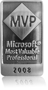

# 2008 Yılında MVP'lik Ödülü
*"Congratulations!
We are pleased to present you with the 2008 Microsoft® MVP Award! The
MVP Award is our way to say thank you for promoting the spirit of
community and improving people’s lives and the industry’s success every
day. We appreciate your extraordinary efforts in ASP/ASP.NET technical
communities during the past year... "*

Yukarıdaki yazıyı Microsoft'tan gelen mailden alarak bloga yapıştırmak
bir klasiktir artık :) O nedenle ben de böyle başlamayı uygun gördüm.
Anlayacağınız 2007 yılında yaptıklarıma dair Microsoft bana teşekkür
etmek amacıyla 2008 yılında **MVP** ödülüne layık görmüş. Kendime böyle
bir amaç biçmemiş olmakla beraber tabi ki MVP ödülü gurur verici bir
"teşekkür" niteliği taşıyor. Diğer yandan bir araç olarak MVP'liğe
baktığımızda artık Microsoft tarafında ürün geliştirme ekipleri ile çok
daha yakından ve rahat irtibat kurma şansım olacağından bunun ileriki
dönemlerde paylaşabileceğim bilginin niteliğini de olumlu yönde
etkileyeceğini düşünebiliriz. MVP profilimi merak edenler
[buradan](https://mvp.support.microsoft.com/profile=B10B654A-87F1-4482-871E-90701937B8C9)
ulaşabilirler.

Eh, artık hepimize hayırlı, uğurlu olsun :) yola devam...

*Bu yazi http://daron.yondem.com adresinde, 2008-4-2 tarihinde yayinlanmistir.*
