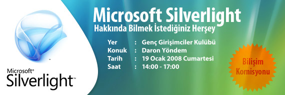

Bu hafta sonu **Cumartesi** günü saat **14.00-17.00** arasında [Genç
Girişimciler
Kulübü](http://www.gencgirisimciler.org/bpi.asp?cid=594&caid=311)'nde
**Silverlight** semineri veriyor olacağım. Hepinizi beklerim. Özellikle
CETURK seminerine gelen arkadaşları da bekliyorum :) Tamamen Silverlight
işleyeceğimiz için biraz daha derinlere dalma şansımız olacaktır. WPF
konusunda ileride ayrı bir seminer daha düzenlemeyi planladığımız için
bu seminerde WPF işlemeyeceğiz. **Expression Blend 2** ile Silverlight
ve özellikle data uygulamalarına değineceğiz.

Etkinlik katılım formu ve detayları için aşağıdaki adresi ziyaret
edebilirsiniz.

<http://www.gencgirisimciler.org/bpi.asp?cid=594&caid=311>

