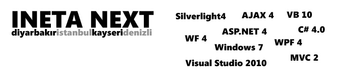

# INETA NEXT Turu Tam Programı Burada!
INETA NEXT etkinliklerimizle ilgili duyuruyu bundan yaklaşık bir hafta
önce sizinle paylaşmıştım. Maalesef o zamanlarda içeriği paylaşma
şansımız yoktu çünkü içeriğimizde daha Microsoft tarafından lansmanı
yapılmamış ürünlere dair oturumlar olacaktı :) Eh artık zamanı geldi ve
içeriğimizi paylaşmaktan gurur duyuyorum.

Diyarbakır - Dicle Üniversitesi, Tıp
Fakültesi Konferans Salonu\
5 Aralık\
11.00-12.30 Visual Basic 
10 Yenilikleri - Daron Yöndem (yazgelistir.com)\
14.00-15.30 Windows 7'de neler var? - Muammer Benzeş
(birliktegelistir.com)\
16.00-17.00 Silverlight 4 - Daron Yöndem (yazgelistir.com)**\
6 Aralık\
**11.00-12.30 C\# 4.0 Yenilikleri - Erkan Balaban (ceviz.net)\
14.00-15.30 WPF 4 ile 3D Animasyon Programlama - Daron Yöndem  (yazgelistir.com)\
16.00-17.30 ASP.NET 4.0 - Erkan Balaban (ceviz.net)

İstanbul - Microsoft Ofisi
([Kroki](http://tinyurl.com/msistoffice))\
12 Aralık;\
10.00-11.00 Silverlight 4 - Daron Yöndem (yazgelistir.com)\
11.00-12.00 ASP.NET MVC 2 - Oğuz Yağmur (csharpnedir.com)\
14.00-15.00 IIS Media Services - Muammer Benzeş (birliktegelistir.com)\
15.15-16.15 Visual Basic 10 Yenilikleri - Daron Yöndem
(yazgelistir.com)**\
13 Aralık\
**11.00-12.30 ASP.NET 4.0 Yenilikleri - Uğur Umutluoğlu (nedirtv.com)\
14.30-15.45 Workflow Foundation 4.0 - Burak Selim Şenyurt
(csharpnedir.com)\
16.00-17.00 C\# 4.0 Yenilikleri - Erkan Balaban (ceviz.net)\
17.15-18.00 IE 8 Toolbar Geliştirme 
- Barış Kanlıca (yazgelistir.com)

Kayseri - Erciyes Üniversitesi
Mühendislik Fakültesi Konferans Salonu\
19 Aralık\
11.00-12.30 C\# 4.0 Yenilikleri -Burak Selim Şenyurt  (csharpnedir.com)\
14.00-15.30 Silverlight 4 - Daron Yöndem (yazgelistir.com)\
15.45-16.45 ASP.NET 4.0 - Selçuk Yavuz (ceviz.net)

**20 Aralık\
**11.00-12.30 ASP.NET MVC 2 - Selçuk Yavuz (ceviz.net)\
14.00-15.30 Visual Basic 10 Yenilikleri - Daron Yöndem
(yazgelistir.com)\
15.45-16.45 Workflow Foundation 4.0 - Burak Selim Şenyurt
(csharpnedir.com) 

Denizli - Pamukkale Üniversitesi Kongre
Kültür Merkezi Ana Salon\
26 Aralık\
11.00-12.30 Silverlight 4.0 - Daron Yöndem (yazgelistir.com)\
14.00-15.30 C\# 4.0 Yenilikleri - Oğuz Yağmur (csharpnedir.com)\
15.45-16.45 Asp.NET 4.0 Yenilikleri - Uğur Umutluoğlu (nedirtv.com)**\
27 Aralık\
**11.00-.12.30 Visual Basic 10 Yenilikleri - Daron Yöndem
(yazgelistir.com)\
14.00-15.30 Asp.NET MVC 2 - Oğuz Yağmur (csharpnedir.com)\
15.45-16.45 ASP.NET AJAX 4.0 - Uğur Umutluoğlu (nedirtv.com)

Kayıt için [www.inetatr.org](http://www.inetatr.org) adresini ziyaret
etmeyi unutmayın!

Bu arada ilk etkinlik duyurumuzda da yer alan "Bir katılımcıya yeni bir
beyin verilecektir" :) cümlesi biraz merak uyandırmış. Zaten amacı da
buydu söz konusu cümlenin. Merak etmeye devam etmeniz gerekecek fakat
emin olun bir katılımcıya çekilişle yeni bir beyin vereceğiz :) Bizde
yalan yok :) Ayrıca birçok da sürpriz hediye olacak, benden söylemesi.

*Bu yazi http://daron.yondem.com adresinde, 2009-11-30 tarihinde yayinlanmistir.*
