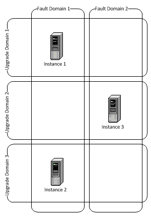
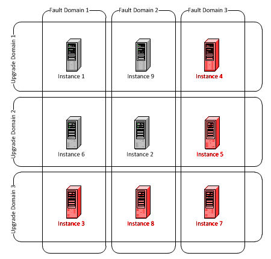

**[Aşağıdaki makalenin SDK2.2 ile beraber yeni Azure özelliklerine uygun
şekilde güncellenmiş halini
[burada](http://daron.yondem.com/tr/post/Fault_ve_Update_Domain_SDK2_2)
bulabilirsiniz.]**

Azure ortamında yayınlayabileceğimiz role'lerin instance count ve
instance size gibi özellikleri olduklarını daha önceki yazılarda
görmüştük. Böylece uygulamamızın kaç sanal makinede çalışacağına, ne
kadar kaynak kullanacağına karar verebiliyoruz. Azure'un en önemli
noktalarından biri ise Fault Tolerance yani hata toleransı. En basit
noktada Microsoft, Azure ortamındaki uygulamalarda %99.95 uptime
(çalışır durumda olma) garantisi veriyor. Bu garantiyi verebilmek için
tabi Microsoft'un bir şartı var, o da her role'ün en az iki instance
olması. Bu istek tabi ki çok doğal bir istek fakat %99.95'i garantilemek
ve hatta yükseltmek için aklımızda bulundurmamız gereken birkaç detay
daha var. İşte bunlar da Fault Domain ve Update Domain ;)

### Fault Domain

Varsayılan ayarlarda her role'de en az iki tane Fault Domain oluyor.
Maalesef şimdilik Fault Domain sayısını biz belirleyemiyoruz ve tamamen
bizden bağımsız bir şekilde FC (Fabric Controller) tarafından
yönetiliyor. Normal şartlarda iki instance bir role yüklediğimizi
düşünürsek her bir instance ayrı Fault Domain'lere alınacaktır.

Fault Domain'lerin amacı network seviyesinde veya doğrudan donanım
seviyesinde hatalar olduğunda uygulamanızın ayakta kalmasını sağlamak.
Bunun için iki instance olan bir role'ün her instance'ı Azure
DataCenter'ı içerisinde farklı
[Rack](https://www.google.com/search?hl=en&q=server+rack&bav=on.2,or.r_gc.r_pw.,cf.osb&biw=1920&bih=909&wrapid=tlif132692877954510&um=1&ie=UTF-8&tbm=isch&source=og&sa=N&tab=wi&ei=klMXT9qOK4eA4gTR3_i4Dw#um=1&hl=en&tbm=isch&sa=1&q=server+rack&oq=server+rack&aq=f&aqi=g10&aql=&gs_sm=e&gs_upl=22481l22637l0l22824l2l2l0l0l0l0l146l274l0.2l2l0&bav=on.2,or.r_gc.r_pw.,cf.osb&fp=8e9296b2612614e5&biw=1920&bih=909)'lere
yerleştiriliyor. Eğer bir Rack'te sorun çıkarsa söz konusu instance
başka bir noktaya taşınana kadar FC Load Balancer'a trafiği kalan
instance'lara göndermesini söylüyor. Bu sürede yeni VM (sanal makina)
hazır olduğunda uygulamanız oraya yüklenerek yine trafik aktarımı
başlatılıyor.

### Upgrade Domain

Azure ortamında projenize bir upgrade gönderdiğinizde doğal olarak tüm
instance'ların kapatılıp, upgrade edilip tekrar açılmaları düşünülemez.
Uygulamanız çalışır durumdayken bir yandan da bölüm bölüm upgrade
edilmeleri gerekiyor. İşte bu noktada UpgradeDomain'ler devreye giriyor.
UpgradeDomain'leri "beraber upgrade edilecek instance" grupları şeklinde
düşünebilirsiniz. Eğer iki instance uygulamanız varsa önce ilki Load
Balancer'dan çıkartılacak ve upgrade edilecek, sonra da ikincisi.
Böylece dışarıdan gelen taleplere sürekli olarak cevap verebilen ve
ayakta olan bir instance kesinlikle olacak. Azure içerisinde Upgrade
Domain sayısının varsayılan değeri 5.

\
*UpgradeDomainCount csdef içerisinde.*

UpgradeDomain sayısını isterseniz CSDEF içerisinde düzenleyebilirsiniz.
UpgradeDomain sayısı ile FaultDomain sayılarının ve tabi ki instance
sayınızın farklı durumlardaki birleşimi çok farklı sonuçlar verebilir.
Bu konuda çok yapabileceğiniz birşey olmasa da :) en azından başınıza
neler gelebileceğini bilmenizde fayda var.

Diyelim ki UpgradeDomainCount sayısını ayarlamadınız ve varsayılan
değeri olan 5 ile kaldı. Uygulamanızı ise 3 instance olacak şekilde
ayarladınız. Karşınıza çıkabilecek seçeneklerden biri aşağıdaki şekilde;

\
*Senaryo 1*

Yukarıdaki manzara çok güzel gözüküyor. Herşey güzel bir şekilde
dağıtılmış. FaultDomain'lerden biri giderse geriye iki instance kalacağı
garanti. Aynı şekilde Upgrade gerçekleşirken de tek bir instance dışarı
çekilecek ve upgrade tüm instance'lara tek tek yapıldığı sürede de en az
iki instance sahibi olacağımızı biliyoruz. Yani :) 3 instance olarak
düzenlediğimiz senaryoda arada sırada 2 instance'a düşme ihtimalimiz
var. Tabi burada şu notu da iletmem gerek, FaultDomain'lerin çatlaması
her dakikada bir olan birşey değil. Belki de aylarca hiç başınıza
gelmeyecek ki zaten başınıza gelse de pek farkına varabileceğinizi
sanmıyorum ama yine de bu durumu akılda tutmak gerek. 3 instance
olduğunda 10 dakika için sadece 1 instance kaybediyor olmak çok problem
olmasa da 3000 instance kullanırken 10 dakikalığına 1000 instance
kaybetmek ciddi sorun olabilir.

\
*Senaryo 2*

Peki ya FC performans kazanmak amacıyla toplam 3 instance'ınızın ikisini
aynı Fault Domain'e koyma kararı alırsa? Fault Domain sayısını bizim
belirleyemediğimizden bahsetmiştik. İşte böyle bir durumda hangi Fault
Domain'de hata yaşandığına göre 1 veya 2 instance'a düşme şansınız var.
Hatta daha da felaket senaryolarına doğru ilerlersek eğer network
seviyesinde / Rack seviyesinde hata gerçekleşirken siz de upgrade
gerçekleştiriyorsanız :) yukarıdaki resimden hem UpgradeDomain2'yi hem
de Fault Domain 1'i kaldırırsanız... servisiniz tamamen aşağı inmiş
oluyor. Tabi burada şunu diyebilirsiniz :) Fault varsa neden upgrade
domain'e upgrade çakarsın ki? :) ya tam upgrade anına denk geldiyse ve
zaten upgrade süreci başlamıştıysa :) Çok ince bir ip üzerinde
olduğumuzun farkındayım, milyonda bir ihtimallere doğru ilerliyoruz ama
en azından bu detayları bilmekte fayda var diye düşünüyorum.

\
*Senaryo 3*

Şimdi gelin biraz daha farklı bir senaryoya gidelim :) Role'ümüz 9
instance. UpgradeDomainCount'u da 3 olarak ayarladık. FC de 3 Fault
Domain düzenlemiş. Yine milyonda bir senaryosuna gidersek ve Upgrade
esnasından farklı bir Rack'de hata oldu dersek, 9 instance'dan 4'e
düşüyoruz. Cılkını çıkardığımın farkındayım :) Ama umarım genel
perspektifi aktarabilmişimdir.

Görüşmek üzere ;)

