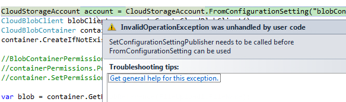

# Windows Azure'da Blob Storage Maceralarına Devam
**[Aşağıdaki makalenin SDK2.5 ile beraber yeni Azure özelliklerine uygun
şekilde güncellenmiş halini
[burada](http://daron.yondem.com/software/post/Azure_Blob_Storage_giris_SDK2_5)
bulabilirsiniz.]**

Son son Blob storage'a giriş yapmıştık :) tam herşey oldu derken bir
hata almış ve orada takılmıştık. Gelin şimdi aynı yerden devam edelim.
Aldığımız hataya hatırlamak gerekirse;


 *İşte o hata...*

Aslında bu hatayı, nedenini ve çözüm şeklini anlamak çok önemli.
Biliyorsunuz ki bir azure ortamında konfigürasyon bilgilerini CSCFG'de
saklıyoruz. Peki neden Web.Config'de saklamıyoruz? Yani ne oldu ki
Web.Config'e? En son gördüğümde hala ASP.NET projesinin içinde duruyordu
:) İşte zaten sorun da orada...

ASP.NET projesi içerisinde herşey Azure projemizi paketlerken CSPKG'nin
içinde kalıyor. Yani proje paketinin bir parçası oluyor. Oysa CSCFG ayrı
dosya olarak durabiliyordu. Eh biz de en ufak bir ayar değişikliğinde
tüm paketi tekrar göndermek istemediğimiz için tüm ayarları CSCFG'de
tutuyorduk. Eğer ki ayarları Web.Congif'de tutacak olursa her ayar
değişikliğinde tüm paketi tekrar yaratıp full upgrade sürecine girmemiz
gerekecek. Bu hiç de hoş bir durum değil.

Peki zaten ayarlar CSCFG'de duruyorsa ve bunu herkes biliyorsa neden
StorageClient kütüphanesinde böyle bize SettingPublisher falan soruyor
:) Hikaye aslında şu noktada karışıyor... Windows Azure Storage
servislerini kullanabilmeniz için illa uygulamanızın da Azure ortamında
barındırılması gerekmiyor... Yani uygulamanızı yine kendi sunucunuzda
tutup sadece bir dosya saklama ve paylaşma ortamı olarak yani "Storage"
olarak Windows Azure Storage'ı kullanabilirsiniz. Zaten bu nedenle
"hosted service" tanımları ile "storage account" tanımları birbirinden
farklı yerlerde, birbirinden bağımsız.

Varsayalım ki bir sonraki rapidshare'i yazıyorsunuz :) ısrarla sitenizin
tamamını azure'a almak istemiyorsunuz çünkü belki de kendinizce
sebepleriniz var. Ama hala Azure ortamına gelip sadece storage kısmını
kullanıp ciddi bir yükten kurtulabilirsiniz.

Şimdi altın soru geliyor :) Storage Account için connection stringimizi
CSCFG'ye koyuyorsak.... normal bir ASP.NET projemizden Storage Account'u
kullanmak istediğimizde nereye koyacağız connection stringi? Normal
ASP.NET projelerinde CSCFG var mı? Yok!

Bir çay alın, biraz düşünün :) Birazdan "eveeet" sesi ile beraber neden
StorageClient'ın bizden SettingsPublisher sorduğunu bulacaksınız :)

StorageClient bizim onu normal bir ASP.NET/IIS ortamından mı yoksa Cloud
/ Azure ortamından mı çağırdığımızı bilmiyor. Aslında istese anlar :) da
onun kodu yazılmamış çünkü wrapper'ı daha generic tutmak istemişler.
Duruma göre bizim connection string Web.Config'de veya CSCFG'de
olabilir. Bizim StorageClient'a yani elimizdeki wrapper'a ayarları
nereden alabileceğini önceden söylemiş olmamız gerekiyor.

**[C\#]**
```cs
CloudStorageAccount.SetConfigurationSettingPublisher((configName, configSetter) =>
    {
        var connectionString = ConfigurationManager.
                    ConnectionStrings[configName].ConnectionString;
        configSetter(connectionString);
    });
```

Yukarıdaki kod ile StorageClient wrapper'ımıza ayarları web.config'den
almasını söyleyebiliyoruz. Bu kod tabi ki eğer projenize azure dışında
çalışıyorsa anlamlı olacaktır. Bizim örneğimizde bir azure projemiz
olduğu için bizim CSCFG'ye doğru bir yönlendirme yapmamız şart.

**[C\#]**
```cs
CloudStorageAccount.SetConfigurationSettingPublisher((configName, configSetter) =>
{
    configSetter(RoleEnvironment.GetConfigurationSettingValue(configName));
});
```

İşte yukarıdaki şekilde sorunumuzu çözmüş olduk. Bunu hele bir de
Global.asax'da Application Start'a alırsanız "yeme de yanında yat"
durumu oluşur :) Bu hali ile projemizi çalıştırırsak upload'un olup
olmadığını pek görme şansımız da olmayacak. O nedenle isterseniz bir de
upload bittikten sonra StorageClient'tan dosyanın full yolunu isteyelim.

**[C\#]**
```cs
protected void Button1_Click(object sender, EventArgs e)
{
    CloudStorageAccount account = 
        CloudStorageAccount.FromConfigurationSetting("blobConnection");
    CloudBlobClient blobClient = account.CreateCloudBlobClient();
    CloudBlobContainer container = blobClient.GetContainerReference("dosyalar");
    container.CreateIfNotExist();
    var blob = container.GetBlobReference(FileUpload1.FileName);
    blob.UploadFromStream(FileUpload1.FileContent);
    Response.Write(blob.Uri.ToString());
}
```

Kod güzel gözüküyor :) Çalıştırdığımızda bakalım neler olacak. Hemen bir
dosya seçip upload işlemini yapın. Bu arada ASP.NET maxrequestlength
limitini değiştirmedik, unutmayın. O nedenle şimdilik koca koca dosyalar
yerine ufak resimlerle falan denemekte fayda var :)


*Dosya upload olmuş :)*

Güzel... dosya yüklenmiş ve linkini de almışız. Tabi bu noktada linkin
formatına dikkat edelim :) Daha önce konuştuğumuz storage account ve
blob link yaratma şeklinde pek benzemiyor gibi. Normalde container adı
ve sonra da blob adı gelmesi gerekirdi. Tabi onun için account adının da
domain başında subdomain tadında durması gerekiyordu. Eğer bu projeyi
Azure'daki canlı bir Storage Account'a yönlendirirseniz herşey aynen
daha önce konuştuğumuz gibi olacaktır. Ama local emülatörde
çalışıyorsanız maalesef bu linklerin yapısı daha farklı olacak. Lokal
emülatörde sadece tek bir storage account olabiliyor ve table, queue,
blob gibi servisler farklı IP'ler yerine farklı portlardan yayınlanıyor.
Durum böyle olunca default account adı olan "devstoreaccount1" i de URL
içerisinde görüyoruz. Özetle, bu emülatöre özel geçici bir durum :)

Şimdi yukarıdaki örnekten yarattığınız adresi kopyalayıp yeni bir
tarayıcı penceresinde açmaya çalışın :) "Çalışın" diyorum çünkü
açamayacaksınız :) Varsayılan ayarlarında her blob dışarıya kapalı.
Dosya kaydedildi ve isterseniz yine StorageClient API'leri ile yani C\#
kodu ile siz o dosyaya ulaşabilirsiniz çünkü zaten sizde connection
string yani access key var. Ama dışarıdan kimse bu dosyaya erişemeyecek.
Bir container içindeki blobları dışarıya açmak istiyorsak.. aşağıdaki
kodu yazıyoruz :)

**[C\#]**
```cs
        protected void Button1_Click(object sender, EventArgs e)
        {
            CloudStorageAccount account = 
                CloudStorageAccount.FromConfigurationSetting("blobConnection");
            CloudBlobClient blobClient = account.CreateCloudBlobClient();
            CloudBlobContainer container = blobClient.GetContainerReference("dosyalar");
            container.CreateIfNotExist();
            BlobContainerPermissions containerPermissions = new BlobContainerPermissions();
            containerPermissions.PublicAccess = BlobContainerPublicAccessType.Blob;
            container.SetPermissions(containerPermissions);
            var blob = container.GetBlobReference(FileUpload1.FileName);
            blob.UploadFromStream(FileUpload1.FileContent);
            Response.Write(blob.Uri.ToString());
        }
```

Yukarıdaki koddaki tek farklılık container'a tüm bloblar için public
access yani genele erişim hakkı vermemiz. Kodu tekrar çalıştırırsanız
artık bu hak verilmiş ve container içerisinde her dosyaya kendi linki
ile erişilebiliyor olacaktır.

**[C\#]**
```cs
CloudStorageAccount account = 
        CloudStorageAccount.FromConfigurationSetting("blobConnection");
CloudBlobClient blobClient = account.CreateCloudBlobClient();

CloudBlobContainer container = blobClient.GetContainerReference("dosyalar");

foreach (var blobItem in container.ListBlobs())
{
    Response.Write(blobItem.Uri);
} 
```

Hızlıca konumuza devam edecek olursak :) Örneğin bir Container
içerisinde blobların listesine nasıl ulaşırım derseniz sanırım
yukarıdaki kod yardımcı olabilir. Container üzerinden ListBlobs demeniz
yeterli. Sonra tek tek gibip her blob'tan Uri'sini alabilirsiniz.

**[C\#]**
```cs
CloudStorageAccount account = 
        CloudStorageAccount.FromConfigurationSetting("blobConnection");
CloudBlobClient blobClient = account.CreateCloudBlobClient();

CloudBlobContainer container = blobClient.GetContainerReference("dosyalar");

foreach (var blobItem in container.ListBlobs())
{
    ((CloudBlob)blobItem).Delete();
}
```

Aynı şekilde bir blobu silmek de yukarıdaki kadar kolay. Sanırım konsept
yavaş yavaş akıllarda netleşiyordur.

**[C\#]**
```cs
CloudStorageAccount account = 
        CloudStorageAccount.FromConfigurationSetting("blobConnection");
CloudBlobClient blobClient = account.CreateCloudBlobClient();

CloudBlobContainer container = blobClient.GetContainerReference("dosyalar");

foreach (var blobItem in container.ListBlobs())
{
    using (var fileStream = System.IO.File.OpenWrite(Path.GetTempFileName()))
    {
        ((CloudBlob)blobItem).DownloadToStream(fileStream);
    } 
} 
```

Bir blobu tekrar LocalStorage gibi bir yere indirip dosya üzerinde işlem
yapmak isterseniz bu sefer de DownloadToStream gibi bir metodu
kullanabilirsiniz. Yukarda ufak bir örneği mevcut.

### Sonuç olarak...

Birincisi şunu söyliyim :) Blob konusu bitmedi :) ama sanırım
akıllardaki çoğu soru işaretini cevaplamıştır. Azure ortamında 180
instance çalışan web role'ünüzün kalıcı dosya saklama yeri kesinlikle
Blob'lar olacaktır. İşin güzel tarafı özellikle dışarıya açılacak
dosyalarda blobların bunu doğrudan yapıyor olması. Böylece dosya
downloadları, resimler gibi birçok şeyin trafiği aslında sunucunuz
üzerinden geçmiyor bile. Blobların performansından, arka planda doğru
şekilde dağılmasında Microsoft sorumlu çünkü orada zaten hem bandwidth
:) hem REST API transaction başına para alıyorlar. Tabi storage alanı
için de para alınıyor :) İşin maddi kısmına şimdilik pek bulaşmak
istemesem de (ileride bakacağız bunlara) gönülleri rahatlatmak adına
şöyle bir bilgi verebilirim. Şu an için bloblarda storage için kabaca GB
başına 12 cent alınıyor ;) Aldığım bilgilere göre en ucuz cloud storage
seçeneğiymiş PAAS civarlarında :) Microsoft'un yalancısıyım.. ;)

Kendinize çok iyi bakın.


*Bu yazi http://daron.yondem.com adresinde, 2012-6-19 tarihinde yayinlanmistir.*
