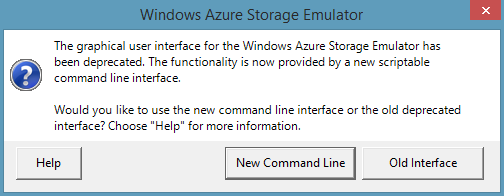
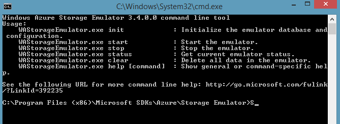
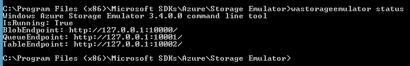

Azure SDK'yi yüklediğinizde makinenize iki farklı emülatör yükleniyor.
Bunlardan biri DevFabric de denilen Compute Emulator, yani uygulamanıza
Azure ortamını yaşatan arkadaş, diğeri ise Storage Emulator, Azure
Storage servislerini lokalde test etmemizi sağlayan araç. Her iki araca
da Visual Studio ile ilk projenizi F5'e basarak çalıştırdıktan sonra
"notification bar" dan ulaşabilirsiniz.

*Azure Emülatörleri İş Başında*

### Storage Emulator

Storage Emulator localde sadece bir storage account sağlayabildiği için
projeler arası çakışmalara neden olabilir. Özellikle aynı isimler
container'lar kullanıyorsanız farklı datalar farklı projelerde kendini
göstermeye başlayabilir :) Bu durumu engellemek adına Storage
Emülatör'ün arayüzünü açıp tüm storage'ı resetleyebilirsiniz.

*Storage Emulator'ü gidiyor... yerine command line geliyor...*

"Herkes gider mersine biz gideriz tersine." sözünü hatırlatan kıvamda :) Azure Emulatorü'nün UI sürümünü Microsoft artık geliştirmeyeceğini söylüyor. Scripting desteği verebilmek açısından command line araçlarının gelmesi önemli fakat bu durum "UI'dan vaz geçme"yi de gerektirmez bence. Neyse, kişisel yorumlarımı bir kenara koyalım :) "Yeni command line" arayüzünü (şaka gibi) açtıktan sonra karşınıza kullanabileceğiniz komutların bir listesi geliyor.

*Storage Emülatörü komutları karşımızda.*

Storage Emulator içerisinde toplam üç storage servisi (Blob, Queue,
Table) için gerekli endpointler yaratılmış durumda. 

*Servislerin local endpointleri.*

Bu Endpoint'lere ister doğrudan REST Call'larla gidin ister StorageClient ile gidin bire
bir Azure ortamındaki Storage servisleri ile aynı tepkileri vermekle
yükümlüler ve itiraf etmek gerekirse şu ana kadar herhangi bir
yanlışlarını görmedim :)

### Arkada neler oluyor...

Esas işin ilginç tarafı şimdi başlayacak :) Storage Emulator SQL'e
bağımlı. Bunun nedeni tüm datayı aslında SQL'de tutuyor olması. Burada
çok önemli bir detay var; Storage Emulator'ın datayı SQL'de tutuyor
olması Azure ortamında da aynı şeyin yapıldığı anlamına gelmiyor. Hatta
açıklamalara göre Azure'daki Storage servislerinin arkasında SQL yok
(Zaten mantıksız olurdu) ama arkada ne var diye sorarsanız :) bilmiyorum
:)

Lokal yüklemede emülatörün arkasında SQL olması işimizi özellikle
debuggine senaryolarında kolaylaştırabiliyor. Ne kadar ki
üretkenliğinizi yükseltmek adına Storage Explorer tadında araçlarla
çalışmak zorunda kalacak olsanız da :) işin dibine inmek isterseniz
aslında basit bir şekilde SQL Management Studio ile bağlanıp emülatörün
kullandığı veritabanını da inceleyebilirsiniz.

*Storage Emülatörü arkasında SQL'e bir bakış.*

Yukarıdaki ekran görüntüsünde basit bir şekilde BlobContainer listesini
görebiliyorsunuz. Bunun gibi tüm Storage verisini local emülatör SQL'de
tutuyor. Acaba yolladıklarım kaydoluyor mu gibi testleri buralarda
yapmak mümkün. Tabi yine tekrar etmem gerek; çok alt seviye bir testing
aracı olarak düşünmek lazım bu yöntemi.

### Azure Emulator

Gelelim bir de işin Azure Emulator tarafına. Azure Emulator
bilgisayarınızdaki IIS Express'i kullanarak Web Role emülasyonu yapıyor.
Instance'larınızı ve konsollarını tek tek emülatör arayüzünden
görebiliyorsunuz. Bir anlamda local bir FC rolü oynamaya çalışıyor.

*Azure Emulator UI*

Yukarıdaki ekran görüntüsünde gördüğünüz deployment'ta sadece bir instance web role var. Buradaki rollerin her birine
bağlanıp durumlarını takip edebiliyoruz. Ayrıca buradan instance'ları
suspend edebilir farklı durumlara verdikleri tepkileri de
ölçebilirsiniz.

*Local emülatörün parçaları...*

Yukarıda kabaca local Azure Emülatörünün mimari olarak nasıl da gerçek
Azure ortamına benzetilmeye çalışdığını görebilirsiniz.
IISConfigurator'dan tutun WaIISHost'larımıza kadar herşey neredeyse
aynı. Her Instance için bir **HostBootStrapper** var ve instance tipine göre
de **WaWorkerHost** veya **WaIISHost** kullanılarak uygulama ayağa kaldırılıyor.
Böylece Azure ortamına çok benzeyen bir debugging deneyimi
yaşayabiliyoruz.

Hepinize kolay gelsin.

