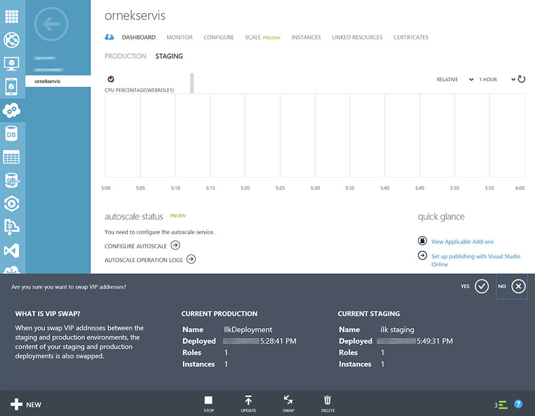

# Azure'da Service Upgrade (SDK2.2)
Azure ortamına bir servisi deploy ettikten sonra doğal olarak bir gün
onu upgrade de etmemiz gerekecek :) İşte gibi bir senaryoda
ilerleyebileceğim birkaç yol var. Bunlardan ilki normal upgrade
prosedürü. Her zamanki gibi Azure projenize sağ tıklar ve package'ı
yaratırsınız. Sonra management portalına girersiniz :)

\
*Normal bir upgrade senaryosu...*

Upgrade etmek istediğiniz deployment'ın ana ekranında hemen alt menüden
"Update" komutunu verebilirsiniz.

\
*Upgrade sürecini başlatırken.*

Upgrade'i başlattığınız anda karşınıza yukarıdaki ekran gelecektir. Yeni
deployment için bir isim verebilir ve yani azure deployment paketi ile
konfigürasyon dosyasını iletebilirsiniz. Alt kısımdaki seçenekler Update
işlemi ile aslında tam olarak el değmesini istediğiniz VM'leri
seçebilmenizi amaçlıyor. Örneğin Role listesinden belirli bir Role'ü
seçerseniz diğer Role'lerin bulunduğu makienlere deployment
yapılmayacaktır. Malum bir Cloud Service Paketi'nde tüm roller var ve
yeni bir paket verdiğinizde sistemin hangi rollerde kod değişikliği
olduğunu yakalama şansı yok. O nedenle her paket yüklemesinde tüm
rolleri update sürecinden geçirmek istemiyorsanız DropDownList'ten doğru
Role'ü seçmek işi kolaylaştırabilir.

Altta yer alan iki Checkbox ise aslında epey aydınlatıcı metinlere sahip
:) Birincisi Role Boyutu ve Role Instance Sayısı'nda değişiklik yapılıp
yapılmadığı soruyor. Eğer değişiklik yoksa sadece paket dağıtımı
yapılacak. Son Checkbox ise klasik SLA ile ilgili. Tek Instance Roller
varsa bunların deployment'ına ek olarak izin vermeniz gerekiyor çünkü bu
deploymentlarda SLA sağlanmayacak.

Buradan itibaren "OK"'e basmanız halinde upgrade işlemi başlayacak ve
instance sayınıza göre her upgrade domain gezilerek tek tek otomatik
upgrade edilecek.

### VIP Swap

Bir diğer upgrade yöntemi ise VIP Swap. VIP Swap aslında arkada hem bir
production hem de staging deploymentlarınızın olmasını gerektirir.
Yaptığı işlem ise basitçe domainlerle IP'leri değiştirmektir :) Yani bir
anda staging deployment'ınızın production, production ise staging olur.
Bunun en büyük avantajı tabi ki anında geri dönebiliyor olmanız :) bir
sorun gördüğünüz anda çat diye eski haline çevirmeniz mümkün. Bu süreçte
kesinlikle sunucularda bir upgrade süreci başlatılmıyor çünkü zaten
upgrade edilmiş bir staging ortamını upgrade edilmemiş bir production
ile değiştiriyorsunuz.

VIP Swap'in belki tek dezavantajı 2000 instance'lı bir deployment'ınız
varsa :) bunu bire bir aynı şekilde hem staging hem de production için
tutmak zorunda olmanız. Her iki ortamın CSDEF'lerinin bire bir aynı
olması gerekiyor. Eğer CSDEF'te değişiklik varsa VIP Swap yapma şansınız
olmayacaktır. Staging'de de aynı kaynakları muhafaza etmeye gelince..
itiraf etmek gerekirse 2000 instance da olsa sonuçta staging'i test
amaçlı tutar ve SWAP sonrası herşey yolundaysa staging sunucularını
silerseniz sonuçta sadece kullandığınız saat kadar ödeme yapacağınız
için çok büyük bir sorun da yaratmayacaktır.

\
*VIP Swap*

VIP Swap yapabilmek için herhangi bir deployment'ın dashboard'unda alt
menüden "Swap VIP" komutunu verebilirsiniz. İşlem zaten süper kolay
tamamlanacaktır ;)

Kolay gelsin.

*Bu yazi http://daron.yondem.com adresinde, 2014-2-24 tarihinde yayinlanmistir.*
