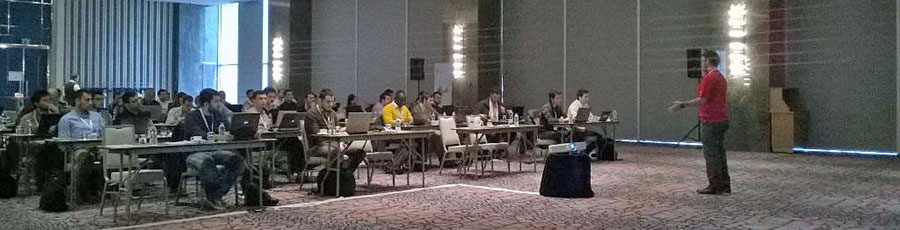

# Microsoft Türkiye Cloud DevCamp Istanbul

Dün Microsoft'un organizasyonunda "Cloud DevCamp" gerçekleştirildi. Ben de gün boyunca üç oturum ile Compute Services, Mobile Services ve Azure Web Sites anlattım. 

Malum bu bir community etkinliği değildi :) özellikle belirtiyim istiyorum çünkü kafalar karışabiliyor. Microsoft'un hafta içi sadece kurumsal katılım için organize ettiği bir etkinlikti. Ben de sizlerle twitter ve facebook üzerinden paylaşmıştım öncesinde. 

<blockquote class="twitter-tweet" data-partner="tweetdeck">
<a href="https://twitter.com/hashtag/microsoftdevcamp?src=hash">#microsoftdevcamp</a> Yemek arası 😍 <a href="https://twitter.com/daronyondem">@daronyondem</a>  <a href="https://twitter.com/mustafakasap">@mustafakasap</a> <a href="https://twitter.com/hashtag/azure?src=hash">#azure</a> <a href="http://t.co/VVp1Kt4MEt">pic.twitter.com/VVp1Kt4MEt</a>
&mdash; ∞ (@rescogitans3) <a href="https://twitter.com/rescogitans3/status/544827551391444992">December 16, 2014</a></blockquote>

Etkinlik community etkinliğinden öte Microsoft'un bir etkinliği olunca yukarıdaki gibi tweetler de kaçınılmaz oldu :) Neredeee.... community etkinliğinde açık büfe görmek pek mümkün değil tabi :) 

Etkinliğe katılan herkese çok teşekkürler. 

Görüşmek üzere!

*Bu yazi http://daron.yondem.com adresinde, 2014-12-17 tarihinde yayinlanmistir.*
