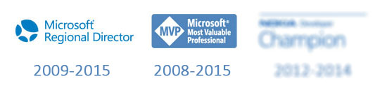

Yine geldik klasik 1 Nisan yenilenme dönemine :) Evet, biliyorum. Şaka gibi... Neyse :) Bu sene de mutlu haberi aldım ve hem **Microsoft Most Valuable Professional** programına hem de **Microsoft Regional Director** programına 2015 için de davet edildim. MVP'lik tarafında tahmin edebileceğiniz üzere **"Microsoft Azure"** ürünü ile ilgili MVP oldum. 

Bu sene Azure konusunda [şirkette de](http://www.xomni.com) çok farklı şeyler yapma şansımız oldu. Aslına bakarsanız birkaç yıldır yaptığımız çalışmaların meyvelerini aldık :)[ Azure Search'ün global lansmanında](http://azure.microsoft.com/blog/2015/03/05/azure-search-is-now-generally-available/) production'da [Azure Search](http://azure.microsoft.com/en-us/services/search/) kullanan tek firma olmanın yanı sıra bunu Türkiye'den bir geliştirme ekibi ile başarmış olmak da ayrı gurur veriyor bana. Tabi sadece Azure Search değil [Azure DocumentDB](http://azure.microsoft.com/en-us/services/documentdb/) tarafında da ürün grubu ile yakınen çalışma şansımız oldu. Daha önceleri [InformationWeek'e verdiğim bir röportajı](http://www.informationweek.com/cloud/software-as-a-service/microsoft-azure-documentdb-customer-test-drive/d/d-id/1316138) twitter/facebook'tan paylaşmıştım :) Azure tarafındaki çalışmalarımızı Microsoft ayrı bir[ başarı hikayesi olarak yayınladı](https://customers.microsoft.com/Pages/CustomerStory.aspx?recid=18667). Tüm bunları yaparken biriktirdiğimiz bilgi ve birikimi de paylaşmaktan çekinmedik :) DocumentDB global lansmanından sadece birkaç gün önce [Azure Meetup'da DocumentDB konuştuk](http://www.meetup.com/Istanbul-Azure-Meetup/events/220325538/). Mayıs'ta da [Azure Search konuşacağız](http://www.meetup.com/Istanbul-Azure-Meetup/events/220964144/). Anlayacağınız yoğun ve hareketli bir yıl oldu ve aynı tempoda devam ediyoruz :)[ Azure Meetup'lar](http://www.meetup.com/Istanbul-Azure-Meetup/) Azure konusunda en güncel ve sıcak sohbetlerin olduğu yer oldu.

Yukarıdaki görseli yenilemek artık her sene bir klasik oldu :) Ama bu sene farkındaysanız bir değişiklik var. O da "Nokia Developer Champion" programı ile ilgili. Nokia Microsoft tarafından satın alındıktan sonra programı sonlandırdı :) Yani artık "Nokia Developer Champion" diye bir program yok. Üç sene o programda bulunmak güzeldi :) Nokia'nın programı emekli olduğum ilk program oldu. 

Bu vesile ile hızlıca, neler oldu, neler bitti ve neler oluyor başlığında bir özet geçmek istedim :) 

Görüşmek üzere.

