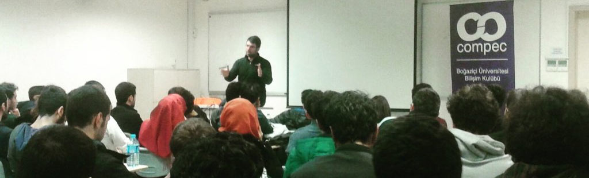

Dün Boğaziçi Üniversitesi Bilişim Kulübü'nün düzenlediği ITTalks etkinliklerinden birinde konuşmacıydım. Bilişim Kulübü'nün isteği üzerine konumuz "İyi kod nasıl yazılır?" şeklindeydi :) Konuyu özellikle Bilişim Kulübü'nün istediğinden neden bahsettiğimi merak etmiş olabilirsiniz. Nedenini tahmin etmiş olmanız da olası :) Malum konu epey tartışmaya açık ve değişken bir konu. Zaten bir saat süren oturum boyunca da "İyi kod nasıl yazılır"dan öte "İyi kod nedir ki?" konusunu konuştuk. Kime göre iyi? Neye göre iyi? Hangi ölçüm birimlerine göre iyi? derken hangi şartlarda hangi ölçüm birimleri olası gibi güzel noktalara da değinerek bana göre "hoş" :) bir sohbet yaptık.

Davetlerinden dolayı [COMPEC](http://compec.boun.edu.tr/site/) ekibine teşekkür ediyorum. Umarım faydalı olmuştur. Kendinize çok iyi bakın ;)

