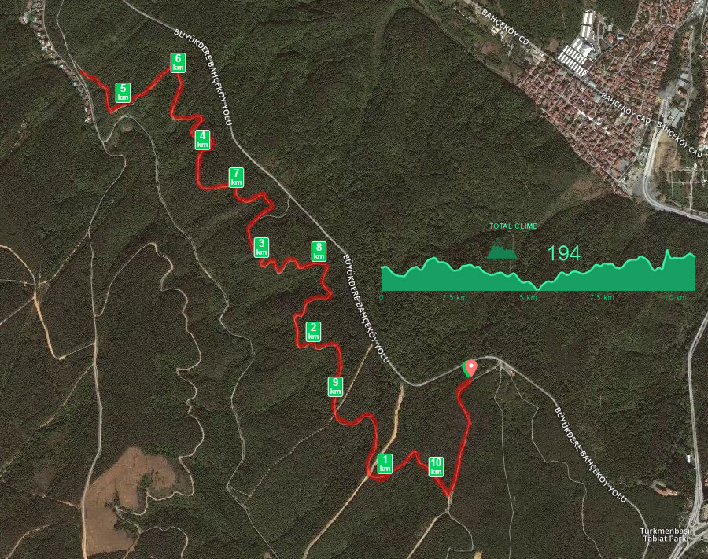
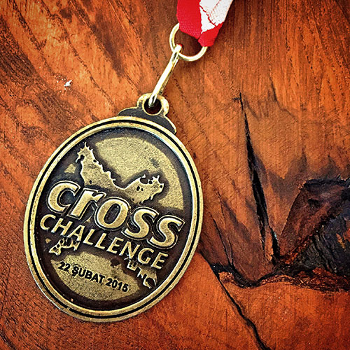

Hafta sonu CrossChallenge koşusundayım. Karda koşmak çok farklı bir deneyimmiş :) Koşu Fatih Ormanı'nda, öğrendiğim kadarı ile ilk defa kullanılan bir parkurda gerçekleşti. Parkurun sürekli olarak koşuculara açılabilmesi için çalışmalar yapılıyormuş anladığım kadarı ile. Bence kesinlikle halka açılması gereken bir parkur. Kişisel olarak Avrupa yakasında ulaşımı en kolay orman parkuru olduğunu düşünüyorum. Ayrıca parkurun başında yer alan organizasyon ve dinlenme alanı da çok başarılı. Tek korkum, herkes burayı öğrenirse kalabalıktan ölebilir mekan :)

<blockquote class="instagram-media" data-instgrm-captioned data-instgrm-version="4" style=" background:#FFF; border:0; border-radius:3px; box-shadow:0 0 1px 0 rgba(0,0,0,0.5),0 1px 10px 0 rgba(0,0,0,0.15); margin: 1px; max-width:658px; padding:0; width:99.375%; width:-webkit-calc(100% - 2px); width:calc(100% - 2px);">
 
 

 
 <a href="https://instagram.com/p/zZS9HgEAAv/" style=" color:#000; font-family:Arial,sans-serif; font-size:14px; font-style:normal; font-weight:normal; line-height:17px; text-decoration:none; word-wrap:break-word;" target="_top">#forest #snow #nature #running #run #crosschallenge #winter #runner #trees #runners #fit #wood #trailrun #runhappy #instarun #instafit #fitness #landscape #beautiful #weather #cold #snowy #ice #frosty #fatihormani #sariyer #istanbul #orman</a>
 
A photo posted by Daron Yöndem (@daronyondem) on <time style=" font-family:Arial,sans-serif; font-size:14px; line-height:17px;" datetime="2015-02-22T07:34:46+00:00">Feb 21, 2015 at 11:34pm PST</time>

</blockquote>

Gelelim yarışa... Yarışın en ilginç tarafı şans eseri hava koşulları nedeniyle neredeyse %80 kar kaplı bir parkura sahip olması oldu. Aslına bakarsanız karda koşmak ciddi tehlikeli. Ayağınızı attığınız karın altında ne olduğunu bilmemek büyük risk. Sırf bu nedenle ayak bileğini burkan birkaç kişi oldu benim bildiğim. Bu gibi koşuları zevk için koşmak gerek, nacizane fikrim :) Eğer karda koşu rekoru diye bir şey tutmuyorsanız gaza gelmenin anlamı yok :) Şaka bir yana, ayakkabı seçimi vs çok önemli bu gibi koşularda.

Parkurun %80'i kar ile kaplıydı dedim hatırlarsanız :) geri kalanı da çamur tabi ki. Toplam 5.2KM'lik parkuru git-gel yaparak 10.4 olarak bitirdik. Gidiş yolunda her ne kadar çamurlara basmiyim diye dikkat etmeye kalksam da :) dönüş yolunda sıçrata sıçrata girip çıktım açıkçası. Hiç zıplayacak halim yoktu. 

Organizasyon anlamında AntrenmanYap ekibi yine süper bir iş çıkardı. Bu kadar yarışa katıldıktan sonra organizasyonlardaki genel acemiliğe karşın AntrenmanYap ekibi kesinliklde işin GURU'su diyebileceğim bir ekip. Eksikler yok muydu? Ufak, tefek... Örneğin yarışın dönüş noktasındaki, RFID okuyucuların bulunduğu platform kaygandı. Oraya plastik halılardan atılsa tam dönüşe denk gelen kayganlık engellenebilirdi. Nitekim yarışın başından sonuna kadar her görevli "dönüşe yavaş girin, kayıyor" dediği için ben epey bir yavaş girdim :) ama yine de ayakkabıların tabanı tırtıklı olunca düz yüzeye tutunması imkansız oluyor. Ufak bir cambazlık hareketi ile kayarak atlattım o dönüşü. 

Yarış bitiminde sponsorun dağıttığı sucuk :) süperdi. Ama yarış sonunda muz olmaması da beni düşündürdü. Sadece geleneksel yarış sonu meyvesi olduğu için değil tabi ki :) merak ettiğim yarışa katılan vejeteryenler tek ikramın sucuk olması hakkında ne düşündüler acaba? :) Ben artık yarışlara yanımda muz vs götürmüyorum. Oysa bu beklentinin yanlış olduğunu anladım. Bazen elma da dağıtıldığı oluyor ki bence besin içeriği açısından muz daha doğru bir seçim. Etkinlikle ilgili ince detaylara takılacak olursam ikinci eleştirim de bu muz eksiği konusu olabilir :)

Sonuç olarak süper bir yarıştı. Ben inanılmaz zevk aldım :) Umarım bu parkurda daha çok yarış organizasyonu yapılır. Son olarak bir eleştiri daha kondurmadan edemeyeceğim :) Etkinlik madalyalarında "tarih" olmamasını daha önceki yarış değerlendirmelerimde paylaşmıştım. AntrenmanYap tarih konusunu atlamamış ama bu sefer de mesafe yok :) Bu madalyaya 10 sene sonra baktığımda kaç KM koştum belli değil :) Böyle giderse yarış organizasyonları ile ilgili bir checklist yapacağım organizasyon yapanlar için :) Madalyada, mesafe, tarih, koşunun adı olmalı. Benden söylemesi!

Bir sonraki yarışta görüşürüz ;)
