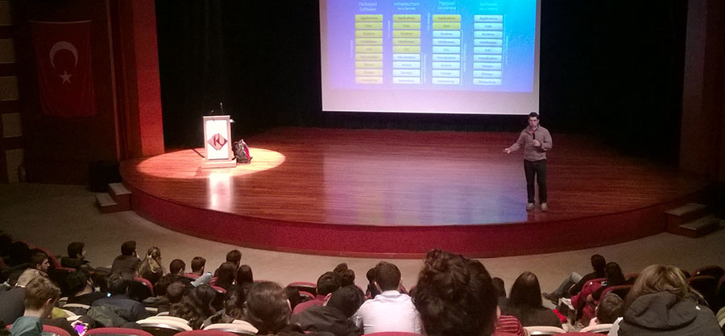

# Kültür Üniversitesi Cloud 101 Oturumu
Bugün Kültür Üniversitesi'nde ilginç bir oturumdaydım. Oturumu benim için ilginçleştiren öğrencilerin sunumu İngilizce olarak yapmamı istemeleri oldu. Tabi istek esasen hocalarından gelmiş. Aslında çok doğal bir istek, zaten tüm üniversite eğitimini İngilizce olarak alan bir gençliğin böyle bir sunumu da İngilizce almasını istemek bana çok mantıklı geliyor. Diğer yandan salonda yabancı öğrenciler de vardı :) 

Konumuza dönersek, etkinlikte ben hızlı bir girişle klasik "Cloud 101" oturumumu yaptım ve Azure, Amazon ve Google derken genel olarak Bulut Bilişim nedir ve bu firmalar ne yapmaya çalışıyor konusuna değindik. Umarım katılan herkes için faydalı bir oturum olmuştur. Organizasyonda emeği geçen tüm öğrenci kardeşlerime ve sevgili hocalarımıza teşekkür ediyorum ;)

*Bu yazi http://daron.yondem.com adresinde, 2015-3-12 tarihinde yayinlanmistir.*
