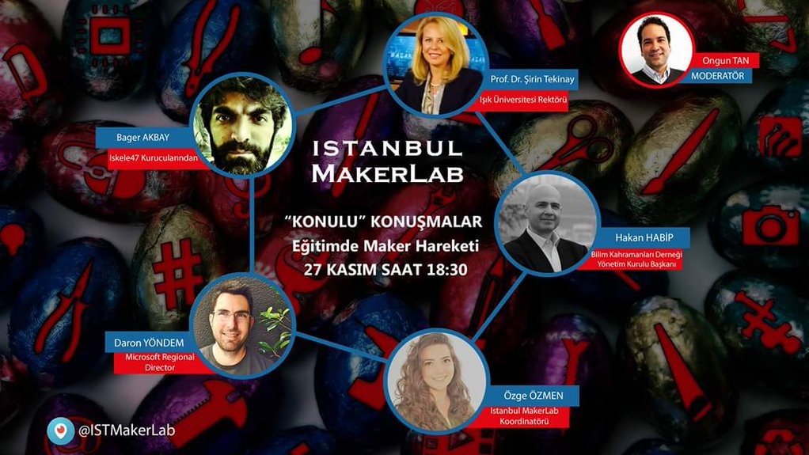

Dün [İstanbul MakerLab](http://istanbul.makerlab.cc/)'ın "Konulu Konuşmalar" etkinliğindeydim. Eğitimde Maker Hareketi üzerine konuştuk. Etkinlik boyunca benim birkaç noktada "Biz yazılımcılar zaten yıllardır Maker'ız işte" diyesim gelmedim desem yalan olur. Tabi bugünün Maker hareketinin zevkli tarafı işin fiziksel dünya ile ilişkisinin daha somut olması :) 3D Printer vs derken daha renkli, elle tutulabilir bir ürün elde etmek sanırım özellikle ufak yaşta çok daha çekici oluyor.

Özellikle ufak yaşta çocuklar için yazılım eğitimine ve daha da önemlisi "üretmeye alışmaya" yönelik Maker hareketinin değeri bence çok büyük. Tabi günün sonunda ne ürettiğinizden önce üretip üretmediğiniz gerçeğine odaklanmak da gerek :) Sanki herşeyden önce tüketim alışkanlıklarımızın yanı sıra "üretmeye" alışmamız ve öncelik vermemiz gerekiyor. Nike'ın sloganından esinlenerek "Just Make it!" diyerek yazımı burada havalı bir şekilde noktalıyorum ;) Görüşürüz.
