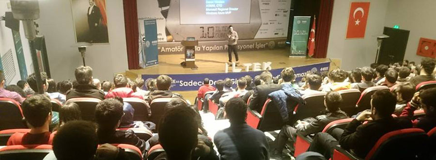

# YTÜ ILTEK Günleri'nde Cloud konuştuk.
Bugün Yıldız Teknik Üniversitesi'ndeydim. IEEE'nin düzenlediği **10. ILTEK Günleri** etkinliğinde Cloud başlıklı bir oturumda genel olarak Cloud manzarasına göz atıp Microsoft, Google, Amazon neler yapıyor kuş bakışı bir inceledik.

Tahmin ettiğimden daha eğlenceli oldu diyebilirim :) Genelde İstanbul'da şehrin karmaşası içerisinde bir şekilde bu gibi etkinliklerde heyecanı ayakta tutmak zor oluyor. IEEE ekibi ve YTÜ öğrencileri gerçekten güzel iş çıkarmışlar. Oturum boyunca dopdolu salon inanılmaz bir dikkat ile beni dinliyordu, mikrofonun arızalanması bile konsantrasyonumuzu dağıtmadı :) 

Buradan her zamanki gibi bu gibi etkinliklerde emeği geçen tüm öğrenci kardeşlerime çok teşekkür ediyorum. IEEE'den daha azını beklemiyordum zaten ;)

Görüşmek üzere.

*Bu yazi http://daron.yondem.com adresinde, 2015-3-25 tarihinde yayinlanmistir.*
