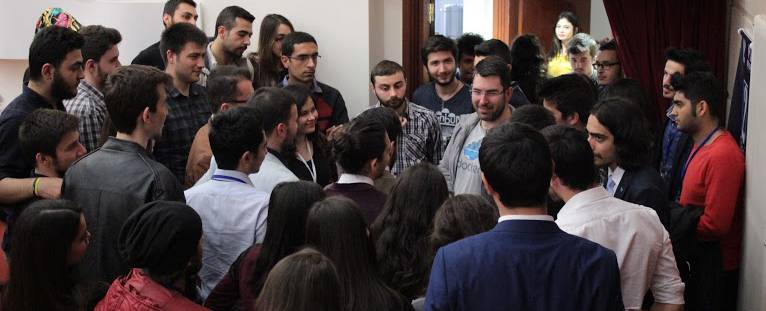

Dün Eskişehir'de Osmangazi Üniversitesi'ndeydim. IEEE'nin "2 Günde Şirketi Alem" etkinliğinde konuştum. Yolculuğun verdiği yorgunluk haricinde süper eğlenceli bir gündü. Özellikle VLOG'u videobomblayan arkadaşları unutmayacağım. Tabi bir de benden esinlenerek 27KG vermiş olan kardeşim var. Merak edenler aşağıdan izleyebilir.



Etkinlikte emeği geçen tüm kardeşlerime çok teşekkürler. Tekrar görüşmek üzere.

<iframe width="560" height="315" src="https://www.youtube.com/embed/qjzJN_MPn_U" frameborder="0" allowfullscreen></iframe>
