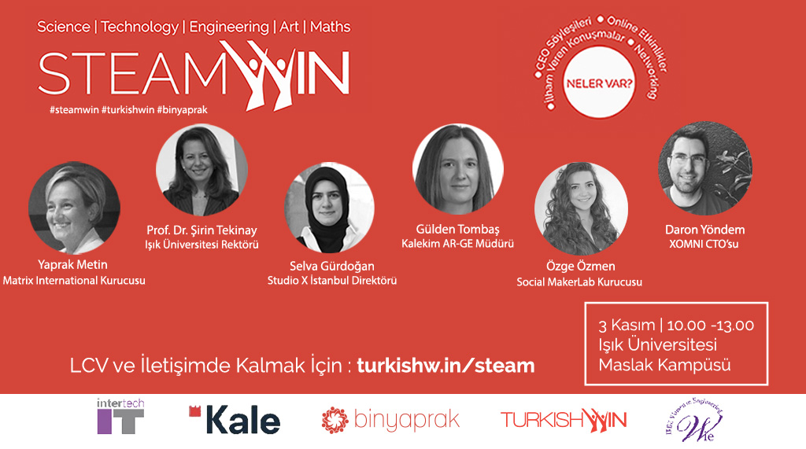

Dün kısa bir oturum için Işık Üniveristesi'ndeydim. **SteamWin** ve **TurkishWIN**'in (Turkish Women's Internation Network) düzenlediği networking etkinliklerinden birinde bana söylenene göre ilk erkek konuşmacı oldum :) İtiraf etmek gerekirse ilk defa bayan oranını bu kadar yüksek olduğu bir gruba konuştum :) Malum genel mühendislik bölümleri manzarasını hepimiz biliyoruz :) 

Şaka bir yana, benim için süper eğlenceli bir oturum oldu. Daha önce dinleme şansını bulanlar için, benim "Boş Durma Boşa Çalış" oturumundan birkaç kare paylaştığımı söyleyebilirim. Organizasyona daveti için sevgili **Melek Pulatkonak**'a teşekkürlerimi iletiyorum. 

Bu gibi katıldığım etkinlikleri kaçırmak istemeyenler lütfen [twitter](http://www.twitter.com/daronyondem) ve [facebook](http://facebook.com/daronyoendem) üzerinden beni takip edebilecekleri gibi [mail listesine](http://eepurl.com/Z_rMf) de üye olabilir ;)

Görüşmek üzere.
