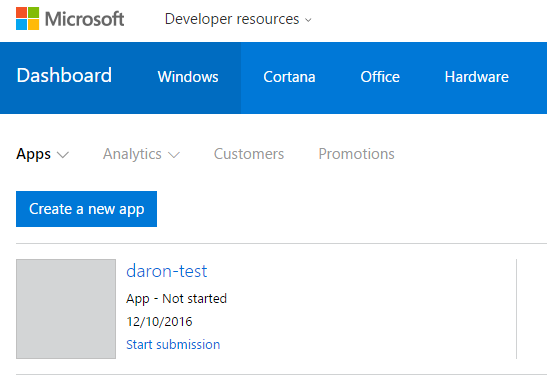
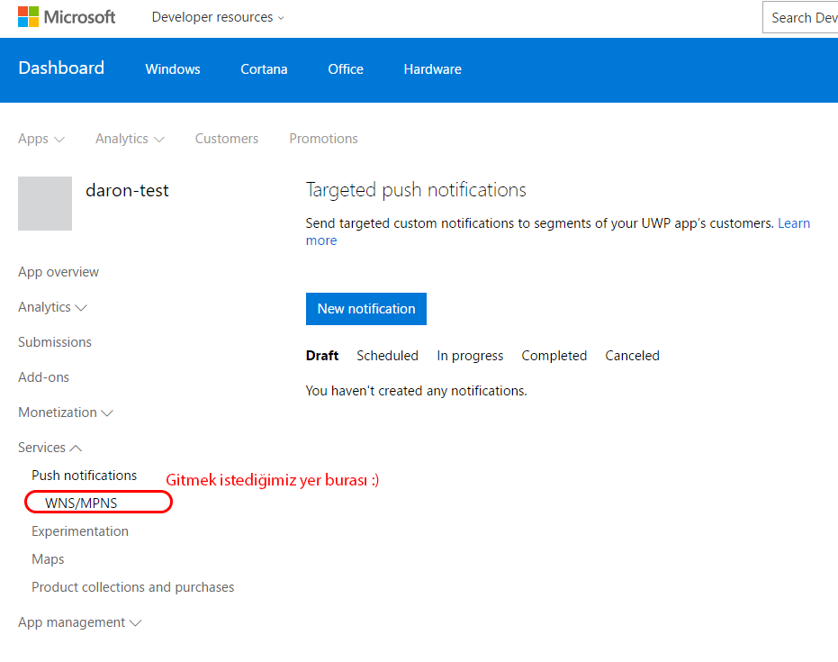
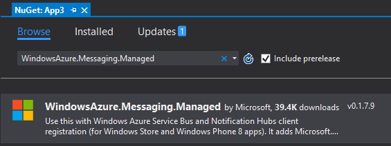

# Azure Notification Hub ve UWP ile Push Notification Kullanımı
Dünkü [Azure Functions ve Notification Hub](http://daron.yondem.com/software/post/Azure_Functions_ve_TimerTrigger_Kullanimi) Binding yazısından sonra gelen birkaç soru ile farkına vardım ki aslında **Notification Hub** konusunda da bir yazı iyi olurmuş :) O nedenle gelin Azure'daki Notification Hub'a bir giriş yapalım. Azure Functions yazısı için test ortamı kurulumunu yaparken attığım adımları sizlerle paylaşarak aslında Notification Hub ile **WNS (Windows Push Notification Services)** kullanarak basit bir UWP uygulamasına Push Notification yollayacağız.

### WNS ve Live Services Kaydı

Azure tarafına geçmeden önce kendimize bir WNS hesabı ayarlayıp erişim bilgilerini almamız gerekiyor. Bunu da ancak bir uygulama ile eşleştirerek yapıyoruz çünkü WNS o uygulamanın deployment sertifikasını kullanacak arka planda.  O nedenle ilk olarak [Windows Dev Center](https://developer.microsoft.com)'a gidip bir uygulama kaydı yaratıyoruz.



Dev Center'a girdikten sonra yukarıdaki gibi bir manzara ile karşılaşacaksınız. **Create a new app** diyerek ilerleyebilirsiniz. Uygulamanızı Store'a göndermeniz falan gerek yok :) Sadece ismini alıyoruz ve gerekli ek kayıtların yaratılmasını sağlıyoruz. 



Uygulamayı yarattıktan sonra hemen yukarıdaki ekran görüntüsündeki gibi **Services** kısmına gidip **Push Notification**'a tıklıyoruz. Burada **New Notification** vs gibi kısımlara kanmayın :) girmek istediğimiz yer **WNS/MPNS** sayfası. 


Yukarıdaki gibi yeni sayfaya yönlendirildiğiniz anda bir sonraki tıklamamız gereken link de "**visit Live Services site**" kısmı olacak. Buraya tıkladığımızda doğrudan WNS registration sayfasına yönlendirileceğiz.


Karşımızda yeni açılacak olan sayfada ilk karşılaşacağınız yer **Application Secrets** kısmı. Buradaki key'e Azure'da Notification Hub'ımızı ayarlarken ihtiyacımız olacak. O nedenle bir kenara yazmanızda fayda var :)


Aynı sayfanın altına doğru scroll ederseniz bu sefer de yukarıdaki kısımla karşılaşacaksınız. Buradan da **Package SID** denilen kısmı alıyor olmamız gerekiyor. Özetle, secret key ile SID'yi kenara yazdınız mı işimiz tamam demektir.

### Azure Notification Hub'ı alma zamanı

Artık Azure Notification Hub'ımızı ayarlayabiliriz. Azure Portal'ına gidip yeni bir Notification Hub hizmeti alabilirsiniz. Hizmeti alırken bir namespace, bir de hub ismi vermeniz gerekecek. **Free Tier** denilen ücretsiz seviyeden devam edebilirsiniz. Bu seviyede namespace başında 10 hub yaratabiliyor ve 500 cihaz için toplam 1 milyon push notification desteği alabiliyorsunuz. Sonraki seviyelerde tabi ki bu sayı artıyor. Test için bu seviye bize yeterli olacaktır. 


Notifcation Hub'ı aldıktan sonra hemen kullanacağınız Push Notification hizmetlerini ayarlamanız gerekecek. Azure Notification Hub **apns** (Apple Push Notification Service), **adm** (Amazon Device Messaging), **gcm** (Google Cloud Messaging), **wns** (Windows Push Notification Services), **Baidu** ve **mpns** (Microsoft Push Notification Service) desteğine sahip. Tüm bu hizmetlerle bizim adımıza konuşabilir. Yapmamız gereken şey bu yazının başında **WNS** için yaptığımız gibi gerekli ayarları yapıp gerekli erişim bilgilerini edinmek. Hatırlarsanız elimizde bir **Package SID** ve **Secret** vardı. İşte bu bilgileri şimdi Azure Portal'ında Azure Notification Hub'ta **Push Notification Services** olarak **WNS** seçip ekleyeceğiz. Bu bilgileri tamamladıktan sonra artık bu Notification Hub ile WNS push notificationları gönderebiliriz.

### UWP Appininin hazırlanması.

Şu ana kadar UWP tarafına pek bulaşmadık. İlk başta Dev Center'da uygulama adını tanımlayıp Live Services'dan da WNS bilgilerini aldık o kadar. Sıra geldi Visual Studio açıp bir UWP uygulaması oluşturmaya. 


UWP uygulamasını yarattıktan sonra ilk yapmamız gereken bu uygulama ile Store'da yarattığımız uygulamanın ilişkisini kurmak. Malum şu anda bu uygulama aslında benim örneğimdeki **Daron-test** uygulaması olduğunu bilmiyor. Bu bilgiye sahip olması kritik aksi halde o aldığımız SID ve Secret'ın bu proje ile bir ilişkisi olmaz. Bu nedenle hemen yukarıdaki gibi **Store / Associate App with Store** derseniz karşınıza gelecek olan ekranda Dev Center'da kullandığınız Microsoft Account ile login olarak uygulama listesine ulaşabilirsiniz. Oradan da tek yapmanız gereken Store'da ismini verdiğiniz uygulamayı seçip onaylamak.



Sıra geldi artık yavaştan birkaç satır kod yazmaya :) Ama ona da başlamadan önce **WindowsAzure.Messaging** nuget paketini almamız gerekiyor ki Notification Hub ile konuşabilelim. Bu nuget paketini de projeye ekledikten sonra artık kod yazmaya hazırız :)

**[App.xaml.cs]**
```cs 
protected async override void OnLaunched(LaunchActivatedEventArgs e)
{
   var channel = await PushNotificationChannelManager.CreatePushNotificationChannelForApplicationAsync();

   var hub = new NotificationHub("daronnotification", "Endpoint=sb://{ENDPOINT}.servicebus.windows.net/;SharedAccessKeyName=DefaultListenSharedAccessSignature;SharedAccessKey={KEY}");
   var result = await hub.RegisterNativeAsync(channel.Uri);

   // Displays the registration ID so you know it was successful
   if (result.RegistrationId != null)
   {
      var dialog = new MessageDialog("Registration tamamlandı: " + result.RegistrationId);
      dialog.Commands.Add(new UICommand("OK"));
      await dialog.ShowAsync();
   }
```

Yukarıdaki kod **app.xaml.cs**'in şu an için bizi ilgilendiren kısmı. İlk satırda mevcut app için bir **PushNotificationChannel** oluşturuyoruz. Sonra bu kanalı NotificationHub'a vermemiz gerekiyor ki artık bu kanaldan notification yollama için Hub yapsık. Bunun için de biraz önce eklediğimiz Nuget paketini kullanacağız. 


Kod içerisindeki **NotificationHub** nesnesini yaratırken hub'ın adını ve portalden **Access Policy**'lerden alacağımız **DefaultListenSharedAccessSignature** endpointini veriyoruz. Son olarak da **RegisterNativeAsync** ile kanalın adresini Notification Hub'a gönderiyoruz. Ben ten amaçlı olarak kanalın ID'sini bir MessageDialog ile de gösterdim. 

### Herşey hazır.

Artık Push Notification gönderebilmemiz için herşey hazır. Test amaçlı olarak Azure Portal'ındaki "Test Send" kısmını kullanabiliriz. 


Testimizi **Windows** platformu için **Toast Notification** olarak yapalım. Zaten sadece **WNS** ayarladığımız için diğer platformlara şu an için notification gönderemeyiz. Ekranın alt kısmına bakarsanız UWP appini çalıştırdığımızda (En azından bir defa çalıştırdığınızı varsayıyorum) kaydolan Push Kanalı'nın bilgilerini görebilirsiniz. Geriye **Send** diyip sonucu görmek kalıyor :)

İşte tüm bunları dünkü [Azure Functions ve Notification Hub](http://daron.yondem.com/software/post/Azure_Functions_ve_TimerTrigger_Kullanimi)  yazısı ile birleştirdiğinizde ortaya güzel bir manzara çıkıyor :) Tabi daha NotificationHub ile ilgii karıştırmadığımız özellikler var. Onlar da sonraki yazılara ;)

Görüşmek üzere.


*Bu yazi http://daron.yondem.com adresinde, 2016-12-11 tarihinde yayinlanmistir.*
