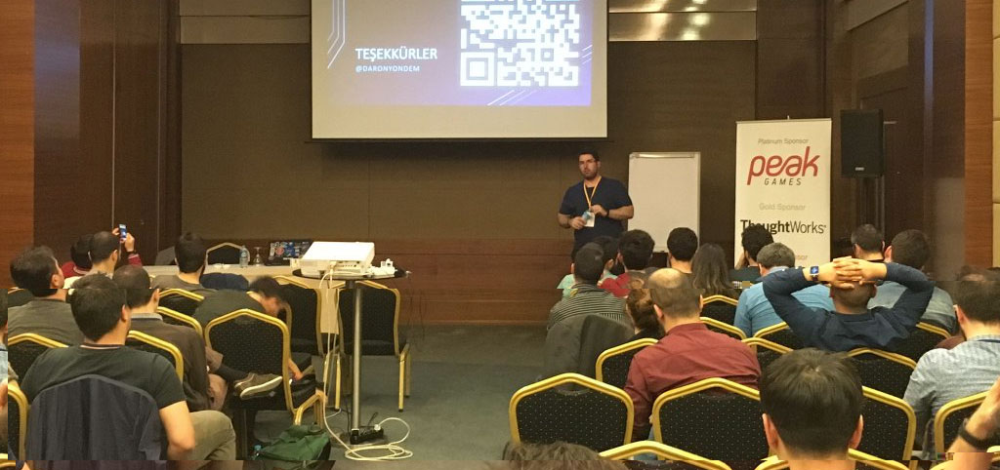

# Voxxed Days Istanbul'da Swagger anlattım.
Aylar önce [Voxxed Days](https://istanbul.voxxeddays.com/#speakers)'in konuşmacı başvurularını açtığını duyduğumda "Neden olmasın?" diyerek Swagger üzerine bir oturum tavsiyesi göndermiştim. Oturumum seçildi :) Neden mi bu kadar şaşırıyorum? Voxxed Days Istanbul konferansını Istanbul Java User Group organize ediyor ve benim Java ile hayatımdaki tüm maceram ancak ismen benzeyebilen JavaScript kadar :D 

Genelde adımın Microsoft teknolojileri ile geçiyor olmasından dolayı bazı etkinliklerden tekme yemediğimi söylersem yalan olur. **Voxxed Days** ekibi bu konuda kesinlikle güzel bir istisna oluşturdu. Teknoloji fanatizmi dahil her tür fanatizmin zararlı olduğunu düşünüyorum. Neyse, konuyu çok dağıtmiyim :) Eğlenceli bir oturumda Swagger'dan bahsettim. Node.JS ve C# örnekleri yaptık :) Zaten oturumun konusunu düşündüğünüzde programlama dili ve teknolojisi araç olarak kenarda kalıyor. 

Oturumdaki kullandığım sunumu da ek kaynaklara ulaşabilmeniz adına yukarıda ekliyorum. Voxxed Days Istanbul ekibine de ayrıca bana bu olanağı tanıdıkları için teşekkür ediyorum.

Görüşmek üzere.

*Bu yazi http://daron.yondem.com adresinde, 2016-5-8 tarihinde yayinlanmistir.*
