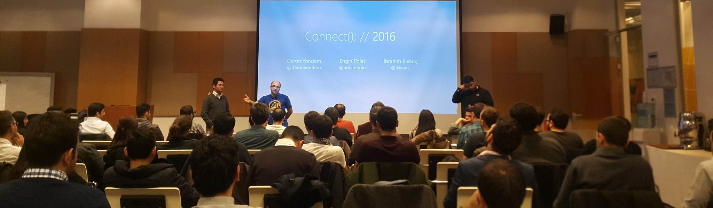

# reConnect 2016'da Azure Yenilikleri
Dün akşam Microsoft binasında **re-Connect 2016** etkinliğini gerçekleştirdik. Etkinliğin başında tüm konuşmacılar olarak esas Connect etkinliğinden edindiğimiz izlenimleri paylaştıktan sonra teknik oturumlara geçtik. Ben de en sonda Azure Yenilikleri'nden bahsettim. **Azure Container Services** ile **DC/OS** ve **Visual Studio + Docker** entegrasyonuna göz attık. Sonrasında **Azure Functions**'a şöyle bir bakıp, **DocumentDB**'nin de local emülatörünü gördük. 30 dakikalık oturumumu 45 dakikaya uzatarak ancak bu kadarını sığdırabildim :)

Hafta içi bir akşamda bizleri yalnız bırakmayan herkese teşekkürler. Bir sonrakinde görüşmek üzere ;)

*Bu yazi http://daron.yondem.com adresinde, 2016-11-24 tarihinde yayinlanmistir.*
