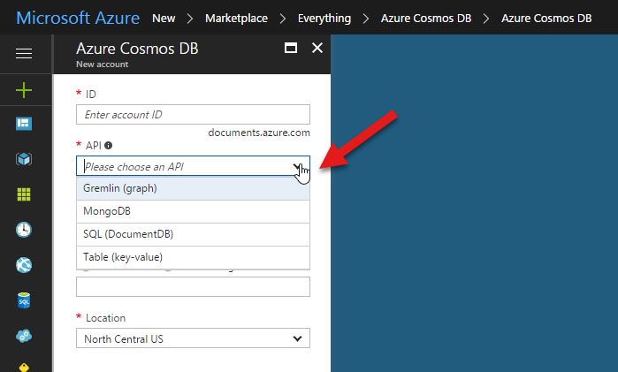
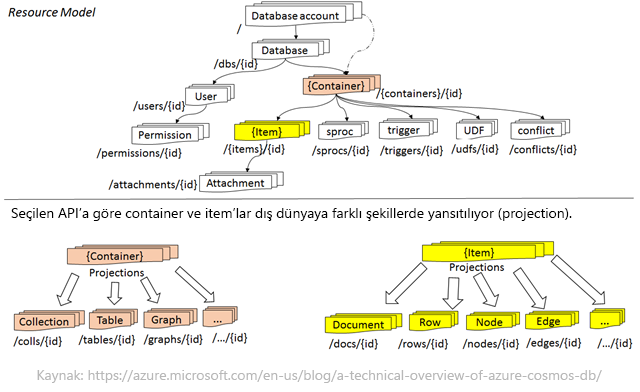
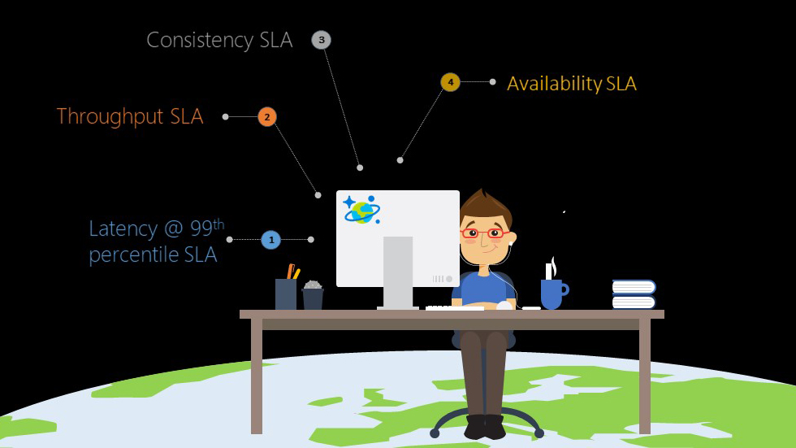
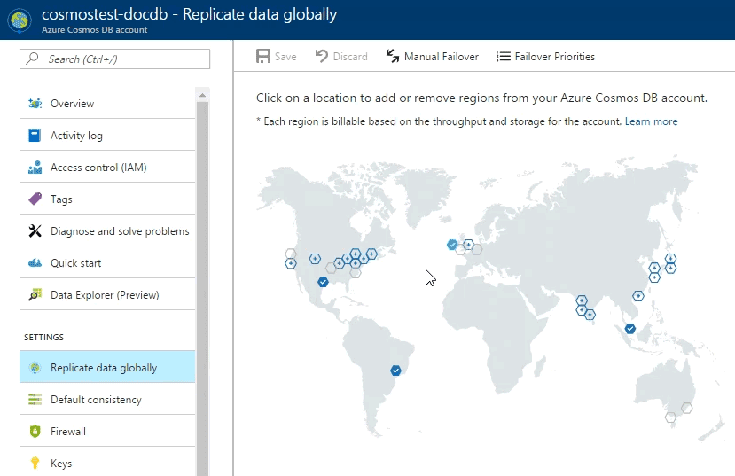

[Build 2017 duyuruları](https://twitter.com/i/moments/862729849965748224) arasında en beklenmedik ürün sanırım Cosmos DB'di. Hem Multi-Model desteği, hem de Multi-API desteği ile rüya gibi bir hizmetten bahsediyoruz. Aslında bu kadarla da bitmiyor, Data Consistency konusunda beş ayrı seviyede seçenek sunması ve dört ayrı eksende SLA'i ile Cosmos DB tüm bunları başarıyla yapabildiğine inanılması zor bir ürün.

### Tarihçe

Aslına bakarsanız CosmosDB çok yeni bir ürün sayılmaz. Eğer hali hazırda **DocumentDB** kullananlarınız varsa Azure hesaplarındaki tüm DocumentDB hesaplarının Build 2017'de duyurulmadan önceki gece bir anda CosmosDB hesabına dönüştüğünü fark etmiş olabilirsiniz. İşin özünde CosmosDB aslında gelişmiş bir DocumentDB. *"Eeee sadece pazarlama için adını mı değiştirdiler?"* Bu sefer hayır :) DocumentDB adında da anlaşılacağı üzere buram buram Document Type NoSQL kokuyor. Oysa artık DocumentDB Data-Model olarak **sadece document type değil, key-value, tabular ve graph desteker durumda**. Tabi durum böyle olunca ürünün adını DocumentDB bırakmak pek doğru olmazdı. O nedenle yeni adı ile CosmosDB karşımızda... 

Her ne kadar yeni bir ürün gibi gözükse de aslında 2012'den itibarin Microsoft'un Office, Skype, Active Directory, Xbox ve MSN hizmetlerinin kullandığı bir ürün var CosmosDB'nin arkasında. 2010'da ilk protitipi'nin testleri yapılmış. Bugün CosmosDB **Ring 0** hizmetlerden biri, yani herhangi bir Azure DataCenter'ı açılırsa CosmosDB'nin hizmet olarak orada bulunması şart, aksi halde DataCenter devreye alınamıyor :) 

### Multi-Model ve Multi-API

Cosmos DB bir önceki paragrafta spoiler verdiğim üzere document type, key-value, tabular ve graph data modellerine destek veriyor. Yeni bir CosmosDB hesabı yaratırken bu modellerden birini seçmeniz gerekmiyor. 

Aslında yukarıdaki ekran görüntüsüne bakarsanız bir data model değil de API seçtiğinizi göreceksiniz. Data Model seçimi özünde CosmosDB için pek bir anlam ifade etmiyor. Cosmos DB her halükarda alt katmanda JSON dokümanlar ve indeksleri ile ilgileniyor. Üst tarafta ise bir API Projection katmanı var ve bu projection katmanına göre CosmosDB'yi kullanma şekliniz değişiyor. O nedenle Cosmos DB için esas önemli olan API seçimi.

Microsoft'tan çaldığım :) yukarıdaki diagramda CosmosDB için bir container ve item'ın farklı API'lar için nasıl yansıtıldığını görebilirsiniz. İlk aklınıza gelecek soru eminim ki "Birden çok API'ı aynı hesapta kullanamıyor muyuz?" sorusu olacak. Bunun resmi cevabı "Hayır" fakat bazı çakallıklar söz konusu :) Şimdilik o topa girmeyeceğim.

Açılan API listesi ile desteklenen Data Model'ler arasındaki ilişkiden de hızlıca bahsetmek lazım. **SQL (Document DB)** olarak geçen API Document Type data saklayabileceğiniz ve isterseniz üzerinde relational SQL sorguları da çalıştırabileceğiniz bir ortam. **MongoDB API**'da Document Type bir ortam sağlıyor. Bu iki seçenek zaten eski DocumentDB günlerinden kalma ve aynen çalışmaya devam ediyor. Bu iki API'ı kullanan bir uygulamanız vardıysa herhangi bir değişiklik yapmanıza gerek yok. **Gremlin** tarafı tahmin edebileceğiniz üzere **Graph** için kullanabileceğiniz API. **Table** ise **key-value** tarafı. **Table API** da aslında Azure Storage Services'ın altındaki **Table Services** ile aynı API setini kullanıyor. Tek farkı birazdan da bahsedeceğimiz SLA konusu. Şu an için Cosmos DB ile beraber gelen Table API'larını Microsoft **"Premium Tables"** olarak adlandırıyor çünkü performansı klasik Table Services'a göre çok daha yüksek. Klasik Table Services daha düşük maliyetli olup latency konusunda bir SLA sunmazken Cosmos DB bu konuda çok daha iddialı. O nedenle CosmosDB tarafında Table API'ı kullandığınızda Table Services'a göre daha yüksek performans alıp daha büyük de bir fatura sahibi oluyorsunuz. Aslına bakarsanız iki hizmet arasındaki tek fark bu değil, Cosmos DB'deki Table API'larında ikincilik index desteği ve birazdan bahsedeceğimiz diğer CosmosDB özellikleri de mevcut. Artık "Standard Table API" olarak adlandırılan diğer Table Services'ın da zamanla uygun fiyatlandırma modeli sağlanabildiğinde CosmosDB'ye migrate edilme planı olduğuna dair dedikodular var, fakat tabi ki bunu zaman gösterecek.

### Global Deployment ve Dört eksende SLA

Availability SLA genelde tüm Cloud hizmetlerinden alıştığımız bir durum fakat üzerine Latency, performans ve data consistency SLA'ini hep beraber global bir deployment ortamında sağlamak gerçekten cesur bir hareket. 

Global deployment demişken, CosmosDB tarafında bir datacenter'a deployment yapmak aşağıdaki kadar kolay. Sadece bölgeyi seçip "Save" demeniz yeterli. Bu noktadan sonra artık veriniz seçtiğiniz consistency level'a göre hedef datacenter'a da kopyalanacak ve oradan da Cosmos DB hesabınız hizmet verebilecek.

SLA'e geri dönecek olursak, o taraftaki ilginç detaylardan biri Throughput ve Latency ile ilgili. Tüm okumalarda %99 ihtimalle 10ms altında, %50 ihtimalle 2ms altında cevap verme garantisi veriyor CosmosDB. Aynı şekilde Indekslenmiş alanlara yapılan 1KB boyutundaki yazmalarda ise 15ms (%99) ve 6ms (%50) gibi bir hız garantisi söz konusu. Tabi bunlar sadece asgari limitler, genelde bunlardan çok daha hızlı tepki alabileceğini söylemem gerek. *Peki Request sayısı artarsa hala garanti geçerli mi? Neye göre bu garanti?* gibi aklınıza onlarca soru geldiğinden eminim. O noktada da CosmosDB'nin fiyatlandırmasına göz atmamız gerek ki durumu anlayalım.

### Fiyatlandırma

Cosmos DB'de fiyatlandırma için iki ana ölçüm var. Bunlardan ilk en basit olan, toplam kullandığınız disk alanı. Cosmos DB'deki tüm hesapların arkasında SSD diskler var. Aylık kullandığınız GB başına bir ücret ödüyorsunuz. Kullanılan bu alan indeksleme verisinin de dahil olduğunu unutmayalım. Tam da bu noktada siz "Her şey indeksleniyordu. O zaman ciddi disk alanı kaplar" demeden ben söyleyeyim :) isterseniz indeksleri bir policy ile elle kaldırabilirsiniz. Böylece ihtiyacınız olmayan yerlerde gereksiz indeksler yüzünden disk alanı maliyetine girmemiş olursunuz. 

Cosmos DB'deki diğer en önemli fiyanlandırma ölçü birimi ise RU (Request Unit). Buradaki Request kesinlikle bir HTTP Request değil. 1 RU doğrudan ID'si ile okunan 1KB datanın okunabilmesi için harcanan kaynağı temsil ediyor. Bu kaynaklar RAM, işlemci, disk, bandwidth vs şeklinde birleştirilerek tek bir birimde toplanmış; **Request Unit**. Herhangi bir sorunun RU maliyetini isterseniz portalda test ederek veya SDK üzerinden de response'daki **x-ms-request-charge** header bilgisini okuyarak görebilirsiniz. Bu şartlar altında reserve ettiğiniz RU sınırları içerisinde Latency dahil tüm SLA'leriniz sağlanacaktır. Eğer limite takılırsanız zaten doğrudan **HTTP Status 429** alıyorsunuz. **x-ms-retry-after-ms** response header'ı ile de ne kadar ms sonra tekrar deneyebileceğiniz ve kotanızın açılacağı size bildiriliyor. Tüm bunları tabi ki Azure Portal'ından da monitör etme şansınız var. Fakat uygulamanız kendi kendine de ne kadar RU provision edeceğine karar verip saniyelik olarak RU provision edebilir. Hatta isterseniz yeni gelen RU/m (RU per minute) ile bir dakika içerisinde kullanacağınız topla RU'yu baştan söyleyip dakika boyunca istediğiniz gibi kotanızı kullanabilirsiniz. Böylelik anlık zıplamalarla değil dakikalık toplamlarla uğraşmak daha kolay ve ekonomik olacaktır.

### 5 Seviyeli Data Consistency

Genelde consistency adına alışık olduğumuz ve ürünlerde sunulan en popülar seçenekler en uç seçenekler, ya tamamen consistent (tutarlı) bir veri yapısı ya da eventual consistency oluyor. CosmosDB tarafında bunlara ek olarak 3 tane daha consistency seviyesi var. Bunların arasında en popülar ve en bilineni **Session Consistency**. Adından da anlaşılacağı üzere çok anlatmaya gerek yok sanırım. Diğer iki consistency seviyesi ise biraz daha arada-derede kalıyor. **Bounded Staleness** da bağımlı bayatlık :D diye Türkçe'ye çevirebilirim sanırım.  Okumalarınızın yazmaya göre ne kadar eski olacağına ya değişim sayısı ya da süre cinsinden karar verebiliyorsunuz. Tahmin edebileceğiniz üzere aslında bu yapı Full Consistency ile Session Consistency arasında bir yerlerde kalıyor. Bir diğer seviye ise **Consistent Prefix**; burada garanti edilen ise eventual consistency'ye göre okumalarınızda alacağınız veri-zaman sırasının yazmalarla eş olması. 

Bu yazıda şöyle hızlı bir giriş yaptık Cosmos DB'ye. Nedir, ne değildir, neler oluyor gibi genel soruları cevaplamaya çalıştım. Bu konuların detaylarına gireceğimiz başka yazılar da yazmayı planlıyorum :) Aklınıza gelen sorular varsa aşağıya yorum olarak bırakabilirsiniz.

Görüşmek üzere. 

