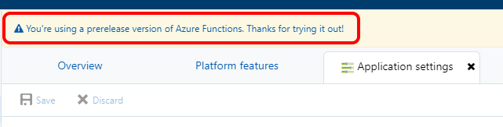
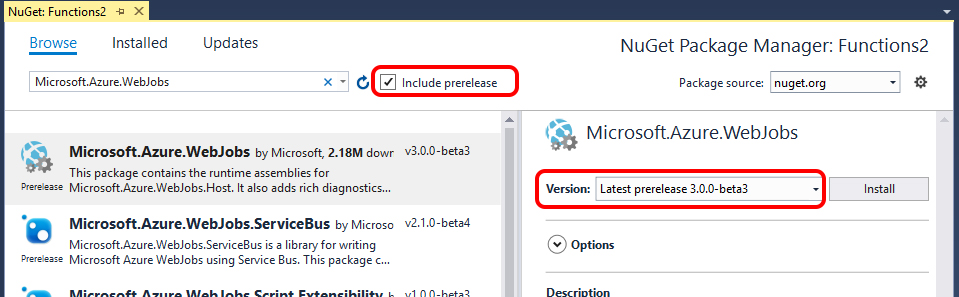
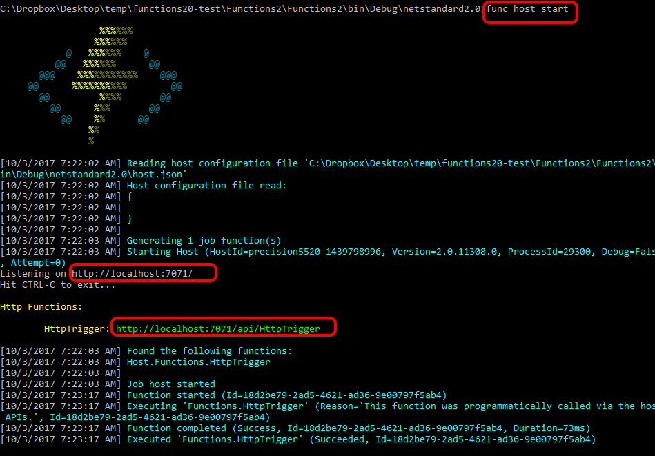

---
Title: Azure Functions 2 Runtime'da .NET Core 2
PublishDate: 10/3/2017
IsActive: True
Section: software
MinutesSpent: 115
Tags: Serverless, Azure Functions, .NET Core
---

Visual Studio 2017 yüklediyseniz Azure Functions araçlarının artık nihai olgunluğa geldiğini görmüşsünüzdür :) Aslında o konuda da bir yazı borcum var size ama **Preview seven** bir insan olduğum için hali hazırdaki araçlar olgunlaşınca yine bir Preview buldum kendime, hatta bu sefer "[Early Preview](https://github.com/Azure/azure-webjobs-sdk-script/wiki/Azure-Functions-runtime-2.0-known-issues)". Bu yazıda Azure Functions runtime 2.0 üzerinde .NET Core 2 çalıştıracağız, aslında bakarsanız biz **.NET Standard 2.0** ile ilerleyeceğiz fakat Azure Functions Runtime 2.0 Preview kullanacak olursak alt tarafta .NET Core 2'ye yaslanma şansımız oluyor. Bu durum özellikle cross-platform development yapanlar için önemli. Mac'te localde Azure Functions kullanıp C# yazacağım diyenlerden bahsediyorum :) Eğer platform derdiniz yoksa rahat rahat .NET Framework 4.6.1 ve .NET Standard 2 ile ilerleyebilirsiniz. Bu durumda aslına bakarsanız Azure Functions Runtime 2 Preview kullanmanıza da gerek kalmaz. Fakat .NET Core 2 kullanmasanız da [Microsoft.NET.Sdk.Functions](https://www.nuget.org/packages/Microsoft.NET.Sdk.Functions) şu an .NET Standard 2 desteklemediği için functions.json dosyasını elle yaratmamız gerekecek. 

### Azure'da Functions 2.0 Runtime

Functions 2.0 Runtime her ne kadar "Early Preview" olsa da aslında şu an Azure'da var :) Yeni bir Function App yarattıktan sonra **"Application Settings"** e gidip "~1" olan değeri **"beta"** olarak değiştirmeniz gerekiyor. 


Bu işlemi tamamlayıp ayarları kaydettiğiniz aşağıdaki gibi bir uyarı başarılı şekilde yeni preview moduna geçtiğinizi gösterecek.



### .NET Standard 2.0 ile Azure Function  

Şu an güncel tooling bu senaryoyu desteklemediği için herşeyi elle yapmamız gerekecek. İlk adımda **Visual Studio 2017 15.3.5** kullanarak bir **.NET Standard 2 Class Library** yaratacağız. Bunu yapmadan önce sisteminizde [.NET Core 2](https://www.microsoft.com/net/core#windowscmd) yüklü olduğundan emin olun. Projeyi yarattığınız gibi .NET Standard 2.0'da olup olmadığını bir kontrol etmekte fayda var. Sonrasında ilk iş [Microsoft.Azure.WebJobs paketinin 3.0.0-beta3](https://www.nuget.org/packages/Microsoft.Azure.WebJobs/3.0.0-beta3)'ünü yüklemek.



```txt
Install-Package Microsoft.Azure.WebJobs -Version 3.0.0-beta3
```
Daha maceraseverleriniz [myget'ten nightly build'leri](http://www.myget.org/F/azure-appservice/api/v2) de alabilirler :) İkinci ekleyeceğimiz nuget paketi de Microsoft.AspNetCore.Mvc.Core'un Stable 2.0 sürümü olacak. Tekrar hatırlatiyim, .NET Core 2 released, bizim kullanacağımız Azure Functions Runtime Preview :) Kafa karışıklığı olmasın :)

```txt
Install-Package Microsoft.AspNetCore.Mvc.Core -Version 2.0.0
```
Hazırlıklarımızı kısmen tamamladığımıza göre hafiften kod yazıp örnek bir HttpTrigger tanımlayabiliriz. Bunun için ben aşağıdaki gibi süper basit bir API yazdım.

```csharp
using Microsoft.AspNetCore.Http;
using Microsoft.AspNetCore.Mvc;
using Microsoft.Azure.WebJobs.Host;
using Microsoft.Extensions.Primitives;
using System.Linq;

namespace Functions2
{
    public class HttpTriggerSample
    {
        public static IActionResult Run(HttpRequest req, TraceWriter log)
        {
            if (req.Query.TryGetValue("name", out StringValues value))
            {
                return new OkObjectResult($"Merhaba {value.FirstOrDefault()}");
            }
            return new BadRequestObjectResult("Bad Request");
        }
    }
}
```
Şu an için MetaData based discovery Azure Functions Runtime 2'de çalışmadığı için klasik function başına klasör yaratma taktiği ile ilerlememiz gerekiyor. Ben projede "HttpTrigger" adında bir klasör yarattım ve bu klasörün içerisine de aşağıdaki **function.json**'ı koyarak HttpTrigger tanımlamasını sonlandırdım.
tık hazırız
```csharp
{
  "bindings": [
    {
      "type": "httpTrigger",
      "methods": [
        "GET"
      ],
      "authLevel": "anonymous",
      "name": "req"
    }
  ],
  "scriptFile": "../Functions2.dll",
  "entryPoint": "Functions2.HttpTriggerSample.Run"
}
```
Azure Functions'taki HttpTrigger konusunu merak edenler [geçen seneki yazıma](http://daron.yondem.com/software/post/Azure_Functions_ile_ilk_Serverless_Maceramiz) bakabilirler :) Burada tabi **Compiled Function** kullandığımız için DLL'in path'ini ve içerisinde çalıştırılacak metodun adresini vermemiz gerekiyor. Bunun haricinde **function.json** içerisindeki diğer herşey eskisi gibi. Root'a bir de boş **host.json** koyduktan sonra her iki dosyayı da **Copy Always** olarak işaretlemeyi unutmayın. 


Solution'ın nihai manzarası yukarıdaki gibi olacak. Eğer siz de bu noktaya kadar gelebildiyseniz büyük ihtimalle projeyi localde çalıştırmak isteyeceksiniz. Projeyi Visual Studio içerisinde build edebilirsiniz. Çalıştırmak içinse bir yükleme daha yapmamız gerekiyor; [Azure-Functions-Core-Tools](https://www.npmjs.com/package/azure-functions-core-tools). Bu arkadaşın da .NET Core destekleyen sürümünü yüklediğimiz için bunun da Preview olduğunu hatırlatiyim :)

```txt
npm i -g azure-functions-core-tools@core
```

Artık hazırız; projenizin Debug klasöründen netstandard2.0 klasöründeki çıktılarına gidip bir command line açıp **func host start** diyebilirsiniz. 



Dakikada bir debugger ataçlamayalım şimdi dediğinizi duyar gibiyim :) Visual Studio'dan F5 ile debug moda geçmek için aşağıdaki ayarları kullanabilirsiniz.


Görüşmek üzere.


