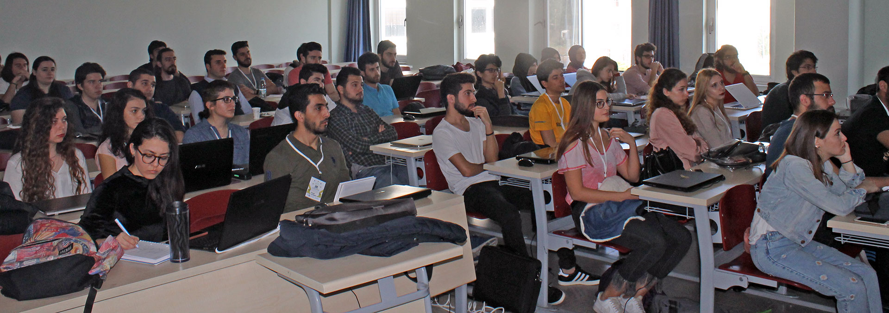

Dün yine İzmir'deydim :) Bu sefer IEEE Türkiye'nin **CSCON 2017** konferansı için Dokuz Eylül Üniversitesi'ndeydim. Tam günlük bir Azure eğitimi yaptık :)

Gün boyunca beni yalnız bırakmayan sevgili İzmir MSP'lerine buradan çok teşekkür ediyorum :) Süper bir misafirperverlik gösterdiler. Bu arada, unutmadan, eğer "Eğitimi kaçırdık bizim için ne var?" diyorsanız sizi de [Youtube'daki geçen seneki Microsoft Yaz Okulu videolarıma](https://www.youtube.com/watch?v=hXIaylJg5F8) alabilirim. 

Görüşmek üzere.
