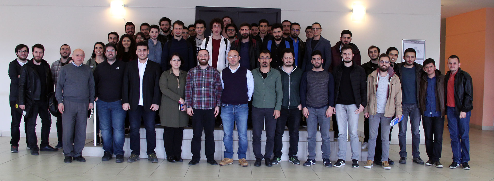

Dün **İstanbul Ticaret Üniversitesi**'ndeydim. Her zamanki **Cloud 101** oturumunu sundum. Benden sonra da sevgili **Yiğit Özaksüt** Xamarin anlattı :) 

Etkinlikte emeği geçen tüm kardeşlerime ve bizi misafir eden hocalarımıza çok teşekkürler. Özellikle teşekkür etmek istediğimiz bir de **Şeref Fatih Yılmaz** var tabi :) Birinci sınıf olmasına rağmen :) taşın altına ilk el atan kendisi olmuş. 

Uzun süredir etkinliklerde yukarıdaki gibi bir toplu fotoğraf da çekilmediğimizin farkına vardım :) Eski günleri hatırlattı açıkçası.

Bir sonrakinde görüşmek üzere. 
