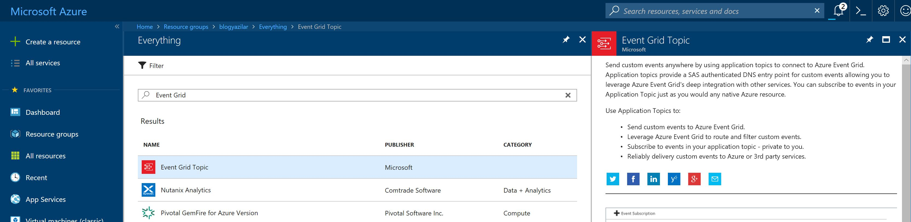
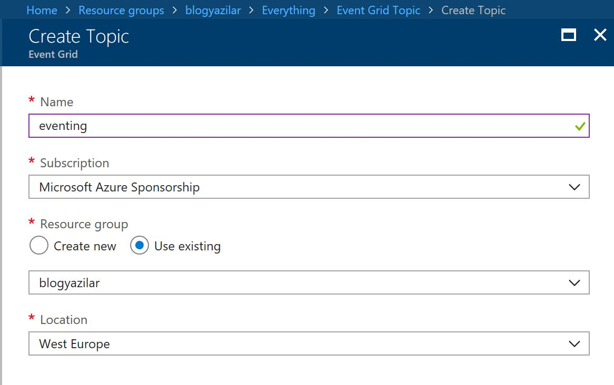
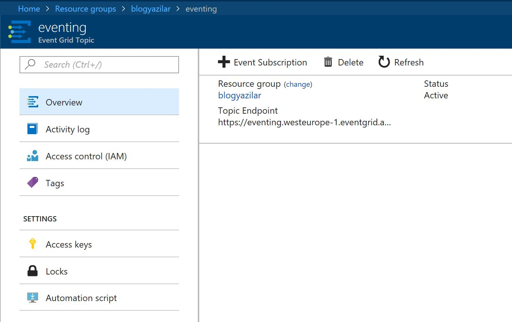
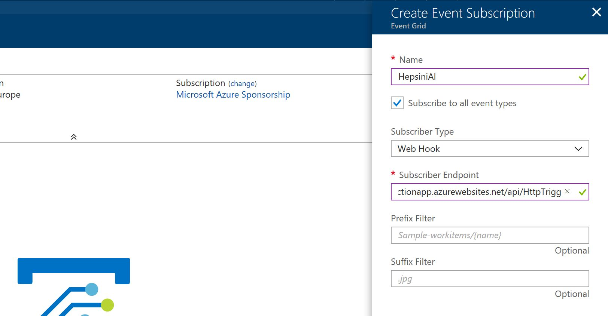

[Dünkü yazıda](Azure-Event-Grid-Nedir) Azure Event Grid'e hızlı bir giriş sonrasında Azure içerisindeki **Publisher** ve **Handler**'lar ile nasıl kullanabileceğimize dair bir örnek yapmıştık. Bu yazıda ise kendi Publisher ve Handler'ımızı yazacak olsak karşımıza neler çıkar sorusunu cevaplayacağız. 

### Önce kendi Publisher'ımızı hazırlayalım.

Event Publish etmek için tabi ilk önce Azure'da bir **Event Grid Topic** yaratmamız gerekiyor. 



Ben aşağıdaki ekran görüntüsünden de anlayabileceğiniz üzere örnek olması için **eventing** adında bir topic yarattım. Her zamanki gibi benim süper yaratıcı isimlendirme stratejilerimden uzak duruyorsunuz :) 



Herşey bittiğinde Topic'in sayfasına giderek Endpoint adresini alabileceksiniz.



Bu noktada Endpoint'i aldıktan sonra buraya ulaşmak için kullanabileceğiniz iki farklı Authentication metodu var. Birincisi "Access Keys" sekmesinden alacağınız Key'i HttpRequest'in Header'ında `aeg-sas-key` olarak taşımak. İkinci seçenek ise Shared Access Signature (SAS) kullanmak. SAS Token'ı de yine Hedaer'da taşımanız gerekiyor, fakat bu sefer header key `aeg-sas-token` olacak. Yazıyı uzatmamak adına SAS Token kısmına girmeyeceğim. Access Key ile devam edeceğiz. 


Ben test amaçlı olarak event publish etmek için Fiddler kullanacağım. Hangi programlama dilinde, hangi teknolojiyi kullanmak istiyorsanız yukarıdaki gibi bir **HttpRequest** göndermeniz Azure Event Grid'e Event Publish etmeniz için yeterli olacaktır. .NET tarafındaysanız [mevcut SDK](https://docs.microsoft.com/azure/event-grid/sdk-overview)'yi de kullanabilirsiniz.

```javascript
[{
  "id": "1900",
  "eventType": "kayitGeldi",
  "subject": "kayitlar/yenibirkayit",
  "eventTime": "2017-10-11T21:05:07+00:00",
  "data": {
    "birKey": "birValue"
  },
  "dataVersion": "1.0"
}]
```
Göndereceğimiz eventin JSON hali yukarıda. Tahmin edebileceğiniz üzere `data` kısmına biz istediğimiz payload'u koyabiliyoruz. Toplamda bir Event'in datasının 64KB'yi geçmemesi gerekiyor. JSON schema'da geri kalan kısımların açıklamalarını ise aşağıda bulabilirsiniz.

- **id** : Tekil bir Id.
- **eventType** : Event'leri dinleyecek olan kişilerin eventleri filtrelemek için kullanabilecek bir tip tanımı. String olarak yapılmalı.
- **subject** : Event'lerin Routing ve Filtering'inde işe yarayacak bu Event'i tanımlayan bir Path.
- **eventTime** : Yayıncı tarafında eventin gerçekleştiği zaman. Yani gönderen kişinin bu eventin gerçekleştiğini bildiği zaman.
- **dataVersion** : Yayıncı olarak belirleyebileceğiniz ve `data` schemanızın versiyonlanması için kullanabileceğiniz bir alan.


Bu noktada Event Grid Topic'inize event gönderdiğinizde bir süre sonra Azure Portal'da da yukarıdaki gibi gözükecektir. Tabi eventlerin Event Grid tarafından bir yerlere aktarılması için bir de Subscriber lazım. Bunun için de deneme amaçlı olarak bir Azure Function yazacağız. Fakat Azure Function'ı klasik bir HTTP API olarak kullanacağız. Yani `EventTrigger` vs kullanmayacağız. 

```CS
#r "Newtonsoft.Json"
#r "Microsoft.Azure.WebJobs.Extensions.EventGrid"

using Newtonsoft.Json;
using Newtonsoft.Json.Linq;
using Microsoft.Azure.WebJobs.Extensions.EventGrid;
using System.Net;

public static async Task<HttpResponseMessage> Run(HttpRequestMessage req, TraceWriter log)
{
    var messages = await req.Content.ReadAsAsync<JArray>();
    log.Info(req.Content.ReadAsStringAsync().Result);
    if (messages.Count > 0 && string.Equals((string)messages[0]["eventType"], 
        "Microsoft.EventGrid.SubscriptionValidationEvent", 
        System.StringComparison.OrdinalIgnoreCase))
    {
        log.Info("Validate request received");
        return req.CreateResponse<object>(new
        {
            validationResponse = messages[0]["data"]["validationCode"]
        });
    }
    foreach (JObject message in messages)
    {
        EventGridEvent eventGridEvent = message.ToObject<EventGridEvent>();
        log.Info($"Subject: {eventGridEvent.Subject}");
        log.Info($"Time: {eventGridEvent.EventTime}");
        log.Info($"Event data: {eventGridEvent.Data.ToString()}");
    }
    return req.CreateResponse(HttpStatusCode.OK);
}
```
Yukarıdaki kodun içerisinde anlatmam gereken birkaç şey var. Birincisi her gelen requestin Body'sini logluyorum :) Bunun nedeni test ederken neler geldiğini görebilelim diye. 

Kodun içerisindeki ilk `IF` bloğu bize `SubscriptionValidationEvent` gelip gelmediğini kontrol ediyor. Azure Event Grid'e bir subscriber eklendiğinde (bunu kod ile uzaktan yapmak da mümkün, biz birazdan portaldan yapacağız) Event Grid hemen bir validasyon kodu gönderiyor. Bu validasyon kodunun karşı taraf tarafından geri döndürülmesi halinde subscription tamamlanıyor. Bu validasyon yanlışlıkla alakasız yerlere milyonlarca event gitmesin de yerleştirilmiş bir validasyon. 

Kodun içerisinde ikinci bölümde bir `ForEach`döngüsü göreceksiniz. Burada da Eventleri tek tek geziyoruz. Azure Event Grid'den duruma göre geriye toplamda 1MB'ı geçmeyecek şekilde birden çok event gelebilir. Kodun bu kısmında parsing için [https://www.nuget.org/packages/Microsoft.Azure.WebJobs.Extensions.EventGrid/1.0.0-beta2](Microsoft.Azure.WebJobs.Extensions.EventGrid) paketi kullanılıyor. Maksat bu paketten de haberdar olun :)

Bu hali ile Azure Function'ı koyduğumuz artık bu Function'ın HTTP Adresini alıp subscriber olarak Event Grid Topic'imize ekleyebiliriz.



Hemen Azure Portal'ında Event Grid Topic'e gidip **"+Event Subscriber"** diyoruz. Karşınıza yukarıdaki gibi bir ekran gelecektir. Buradan subscription'a bir isim verip **Subscriber Type** olarak da **Webhook** seçin. Son olarak bir de bizim Azure Function'ın HTTP adresini koyduk mu işlem tamamdır. Buradaki **Prefix Filter** ve **Suffix Filter** gelen eventin **Subject**i üzerinden işleyecek. Eğer filtrelemek istiyorsanız bu bilgileri de girebilirsiniz. 


Azure Function'ın endpointi subscriber olarak eklediğiniz anda Azure Function loglarına bakabilirsiniz. Yukarıdaki ekran görüntüsünde 26ms süren ikinci sıradaki çalışma anında atılan log sağda gözüküyor. Logun içinde bize gelen HTTP Request'in Body'si var.

```javascript
[{

  "id": "44e97d3c-13ac-4a26-b221-b6e3093abe97",
  "topic": "/subscriptions/fef31e52-6ea1-46c7-9494-2b5901e9af2b/resourceGroups/blogyazilar/providers/microsoft.eventgrid/topics/eventing",
  "subject": "",
  "data": {
    "validationCode": "1b902fff-05d2-4e2a-a517-b6621dad7028"
  },
  "eventType": "Microsoft.EventGrid.SubscriptionValidationEvent",
  "eventTime": "2018-02-16T09:57:11.8315133Z",
  "metadataVersion": "1",
  "dataVersion": "1"
}]
```
JSON'ı yukarıdaki gibi yazıya da taşıdım :) Validasyon kodu açıkça belli. Azure Function'ımız bunu alıp geri döndürüyor. Artık validasyon tamamlandı. Şimdi yazının en başındaki JSON'ı Fiddler ile Event Grid endpointine gönderebiliriz.


Event geldi. Yukarıdaki log listesinde en üstteki, 238ms süren istek bizim evente ait. Logun detayına baktığımızda da aşağıdaki JSON'ı görüyoruz.

```javascript
[{

  "id": "1900",
  "eventType": "kayitGeldi",
  "subject": "kayitlar/yenibirkayit",
  "eventTime": "2017-10-11T21:05:07+00:00",
  "data": {
    "birKey": "birValue"
  },
  "dataVersion": "1.0",
  "metadataVersion": "1",
  "topic": "/subscriptions/fef31e52-6ea1-46c7-9494-2b5901e9af2b/resourceGroups/blogyazilar/providers/Microsoft.EventGrid/topics/eventing"
}]
```

Hemen JSON'ın detaylarına bakmaya başlayalım.

- **topic** : Event Grid'in tam adresi. Bu adres Event Grid hesabını oluştururken veriliyor. 
- **metadataVersion** : Yine Event Grid tarafından event JSON'ının şeması için verilmiş versiyon numarası. Bu da bizim kontrolümüze dışında genel event JSON'ını ile ilgili bir versiyonlama. 

Böylece hem kendi **Publisher**'ımızı yazmak için nasıl ilerleyebileceğimizi hem de **Handler** tarafında validasyon yapıp sonra da eventleri nasıl karşılayabileceğimizi görmüş olduk. Unutmayon, bir Event Grid Topic'ini N sayıda subscriber dinleyebilir, farklı routing ve filtering'ler kullanarak farklı subscriberlar da ekleyebilirsiniz. Hatta bunları kod ile yapmak da mümkün ;)

Görüşmek üzere.

