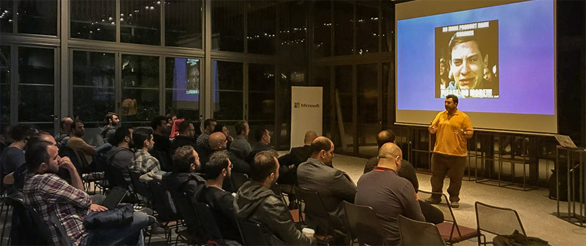

# Teknolot Meetup Grubu

Bir süredir, sağolsun [Yiğit](https://twitter.com/ozaksuty)'in daveti, ile [Xamarin Istanbul Development Meetup](https://www.meetup.com/Xamarin-Istanbul-Development-Meetup/) grubunda aslında pek de Xamarin ile alakası olmayan konularda konuştuğumuzu fark etmiş olabilirsiniz :D Meetup grupları ile ilgili olarak genel iki sıkıntı hissediyorum. Birincisi *"teknoloji veya ürün odaklı"* meetup grupları. Aslında bu gruplar meetup.com'un doğasına çok uygun ve meetup dediğin özünde böyle olur. Fakat bence ciddi bir satürasyona neden oluyor. Kimsenin seksen farklı grubu takip edecek zamanı olmadığı gibi, seksen farklı gruba yetecek bir yazılım community'si de yok. Diğer yandan kimse sadece tek bir ürün de kullanmıyor. Ülkemizdeki yazılımcı profili arz-talep çemberinde *"her şeyi yapmak zorunda kalan"* yazılımcı şeklinde şekilleniyor. İkinci problem ise grupları çoğrafik bölgelere adanması. Bence bu kadar bölünecek bir boyuta sahip ne çoğrafyaya, ne de popülasyona sahibiz. En uzun iç uçuşumuz 1 saat, yazılımcı nüfusumuz da atla deve değil. Zaten etkinlikler hep İstanbul'da olmuyor mu? :) Güldüğüme bakmayın, canım sıkkın. Neyse... bir diğer dert ise benim şahsi derdim. Anlatabileceğimiz bir konu olduğunu düşündüğümde "Yahu hangi meetup grubu uygun acaba buna?" diye sorgulamaktan sıkıldım. Bazen yer de bulamıyorum açıkçası. 

Tüm bunları düşüne düşüne... sonunda bir karar verdim ve [bir süredir ayakta tutmaya](http://daron.yondem.com/teknolottv_darontv_ve_azureshowcom) çalıştığım [**teknolot**](https://www.meetup.com/Teknolot/) grubumuzu meetup.com altında açtık. Bu sefer sevgili [Yiğit](https://twitter.com/ozaksuty) ve Ankara'dan [Cihan](https://twitter.com/cihanyakar)'ın da desteği var. Yalnız değilim :) Böylece içinde istediğimizi anlatabileceğimiz, istediğimiz yerde etkinlik yapabileceğimiz, adından hiçbir şey anlaşılmayan bir grubumuz oldu :) Beraber neler yapacağımıza karar vermemiz için sizin de katılmanızı tabi ki çok isterim. 

Aslında ben bu blogpostu biraz geç yazıyorum :) İlk etkinliğimizi çoktan yaptık. Twitter'dan vs duyurmuştum. [İkinci etkinlik ayın 30'unda](https://www.meetup.com/Teknolot/events/255230251/). Sonraki etkinlikler için de konuşmak isteyenleri, konu fikirlerinizi, bizi davet etmek isteyenleri... özetle her konuda sizden geri dönüş bekliyorum :) Twitter'dan seslenebileceğiniz gibi, meetup.com'dan da mesaj atabilirsiniz. 

Görüşmek üzere.

*Bu yazi http://daron.yondem.com adresinde, 2018-10-11 tarihinde yayinlanmistir.*
