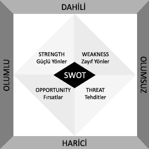

# SWOT Analizi nedir, nasıl yapılır? 

**SWOT** Analizi, diğer adı ile **TOWS Matrisi** önceden belirlenmiş bir
konu dahilinde karar alma aşamasında yardımcı bir araç olarak
kullanılır. Analizin temel amacı karar verme aşamasında konu ile ilgili
kuvvetli veya zayıf, avantajlı veya dezavantajlı noktaların beraberce
görülebilmesini sağlamaktır. **SWOT** kısaltması İngilizce **Strengths**
(Güçlü Yönler), **Weaknesses** (Zayıf Yönler), **Opportunities**
(Fırsatlar), ve **Threats** (Tehditler) kelimlerinin ilk hariflerinden
oluşur. Türkçe şekliyle GZFT olarak da kullanıldığı nadiren de olsa
görülebilir.

Stanford Üniversitesi'nde **Albert S Humphrey** tarafında yürütülen
araştırmalar sonucunda geliştirilen **SWOT** tekniği kişisel veya
kurumsal yapıların pazarın mevcut durumuna göre karar almalarını
sağlamak için iç ve dış durumu yansıtan bir ayna olarak
nitelendirilebilir.

**SWOT** analizi başlangıcında analiz süresince değerlendirilecek olan
konu kesinlikle net bir şekilde tanımlanmalıdır. Soyut, genel konular
üzerine yapılacak bir **SWOT** analizinin faydası olmayacaktır.
Analizin, **Strengths** (Güçlü Yönler), **Weaknesses** (Zayıf Yönler)
kısımları kişi ve kurum içi yapı ile ilgilidir, diğer yandan
**Opportunities** (Fırsatlar) ve **Threats** (Tehditler) kısımları ise
dış çevre ile ilişkilidir. **SWOT** analizlerini **PEST** (Political,
Economic, Social and Technological) analizleri ve **Beyin Fırtınası**
(Brainstorming) teknikleri ile beraber kullanmak mümkündür.

Örnek bir **SWOT** analizi konusu olarak Networking sektöründe çalışan
bir kurumun Web Barındırma hizmetleri verip vermemesini ele alalım.

  -------------------------------- -------------------------------------------
  **Strengths (Güçlü Yönler)**     **Weaknesses (Zayıf Yönler)**

  Teknik bilgi sahibi ekip var.\   Call Center görevlileri sayısı yetersiz.\
   Altyapı uzmanı ekip var.         Altyapı genişletilmeli.

  **Opportunities (Fırsatlar)**    **Threats (Tehditler)**

  -                                Rekabet yüksek.\
                                    Kar marjları düşük.
  -------------------------------- -------------------------------------------

Yukarıda çok basit bir **SWOT** analizini inceleyebilirsiniz. Analiz
üzerinde daha çok çalışılması gerektiği kesin. Bir örnek olması amacıyla
hızlı bir şekilde düzenledim. Her bir kategori için daha fazla madde ve
fikir bulunmalı. Fakat şu anki yapısı ile baktığımızda söz konusu
Networking şirketinin Web Barındırma hizmet sektörüne girmesi doğru bir
hamle olarak gözükmüyor. Kurumun kuvvetli olduğu yönleri kadar eksik
yönleri de var, ayrıca herhangi bir fırsat yokken tehditler mevcut.

Aşağıdaki link ile standart bir **SWOT** analizi şablonunu PDF olarak
bilgisayarınıza indirebilirsiniz.

[SWOT Analiz Şablonu - 11042007\_1.pdf (185.42
KB)](../media/SWOT_Analizi_nedir_nasil_yapilir/11042007_1.pdf)

Bir **SWOT** analizini sonunda kişi veya kurumun stratejisini belirleme
aşamasında sorulması gereken dört soru vardır;

1.  Güçlü olduğumuz noktaları nasıl değerlendirebilir, kullanabiliriz?
2.  Zayıf olduğumuz noktaları nasıl güçlendirebilir veya etkisiz
    kılabiliriz?
3.  Fırsatları en iyi nasıl değerlendirebiliriz?
4.  Tehditlere karşı nasıl bir savunma sistemi kurmalıyız?

Yukarıdaki sorular sorulurken veya **SWOT** analizi yapılırken eğer özne
bir kurum ise, analiz ekibi içerisinde bir muhasebeci, satış uzmanı,
yönetici ve üretim uzmanı (mühendis) bulunması faydalı olacaktır.

İyi çalışmalar.

*Bu yazi http://daron.yondem.com adresinde, 2007-4-12 tarihinde yayinlanmistir.*