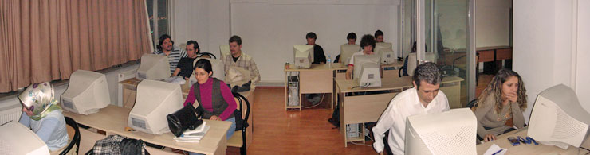

# Mayasoft Ders Hatırası 

Mayasoft Bilişim Akademisi'nde **30.04.2007** tarihli dersimizde
**Photoshop CS3** ile beraber gelen **Auto-Align Layers** ve
**Auto-Blind Layers** özelliklerini inceledik. İncelememizi yaparken
gerçek bir demo olması amacıyla sınıf içerisinde çektiğimiz fotoğrafları
kullandık. Aşağıda toplam beş farklı çekimi birleştirerek oluşturduğumuz
sınıf fotoğrafını inceleyebilirsiniz.

Ayrıca öğrencilerimden **Ersin Kılıç**'ın portre fotoğrafı üzerinde
**Photoshop CS3 Liquify** özelliğini de deneme şansımız oldu. Maalesef
kendisi Almanya'da bir ajans ile anlaşmalı olduğu için fotoğraflarını
yayınlayamayacağım :D

*Bu yazi http://daron.yondem.com adresinde, 2007-5-1 tarihinde yayinlanmistir.*