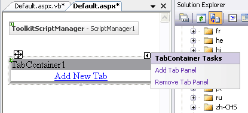
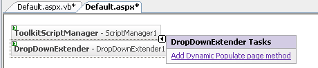

# AJAX Control Toolkit v.1.0.10606.0 Yenilikleri 

Biraz gecikmiş de olsam sizlere **AJAX Control Toolkit**’in yeni
sürümünü duyurmak ve bazı yeniliklerden bahsetmek istiyorum. **ASP.NET
AJAX** kitabımda detaylıca incelediğim AJAX Control Toolkit bağımsız
programcılar tarafından ASP.NET AJAX ile kullanılabilir ASP.NET
kontrollerinin toplandığı, ücretsiz ve açık kaynak kodlu bir kütüphane.
Kütüphanenin 18 Haziran’da yayınlanmış en son sürümü olan 1.0.10606.0
paketini aşağıdaki adresten bilgisayarınıza indirebilirsiniz.

<http://www.codeplex.com/AtlasControlToolkit/Release/ProjectReleases.aspx?ReleaseId=4923>

Gelelim yeni sürümlerle beraber bizleri bekleyen yeniliklere. Benim ilk
dikkatimi çeken kontrol kütüphanesi içerisindeki her kontrolün artık çok
daha anlamlı ikonlara sahip olması oldu. Görsel açıdan güzel bir gelişme
olmuş. Ayrıca bazı kontrollerle ilgili Visual Studio’nun **Designer**
modunda bazı kolaylıklar sağlanmış. Bunlardan ilki **Tab**
kontrollerinin tablarının designer arayüzünde de artık düzenlenebiliyor
olması. Tab kontrolleri haricinde neredeyse tüm kontrollerle designer
arayüzünde kullanılmak üzere işlevler eklenmiş. **PageMethodları** veri
kaynağı olarak kullanabileceğimiz kontrollerin artık designer arayüzünde
“**Add Dynamic Populate Page Method**” adında bir komutu var. Bu komuta
direk tıklayarak uygun fonksiyonun doğru parametreler ile **Code
Behind** sayfasına otomatik eklenmesi sağlanabiliyor. Bence bu işlev
zaman kazandıran en önemli gelişmelerden biri olmuş.

En sevdiğim yeni özellik ise **ToolkitScriptManager** ile beraber
geliyor. **ASP.NET AJAX Extension** kullanırken her sayfada bir
**ScriptManager** olması şart. ScriptManager sayfaya ASP.NET AJAX
kütüphanesi ile ilgili **JavaScript** dosyalarını, kodlarını eklerken
AJAX Control Toolkit’in genel JavaScript kütüphanesi hariç sayfamızda
kullandığımız her bir **AJAX Control Toolkit** kontrolü ile ilgili
**JavaScript** kodları da ayrıca sayfaya linkleniyordu. Birden fazla
AJAX Control Toolkit kontrolü kullandığımız bir sayfanın kullanıcıya
giden kaynak kodunu incelediğimizde çok sayıda harici **JavaScript**
kaynaklarının sayfaya linklendiğini görüyorduk. Bu durum artık
**ToolkitScriptManager** ile değişiyor. Yeni sürümü ile beraber
yarattığınız her AJAX Control Toolkit web sitesinde yaratılan her yeni
web sayfasına **ToolkitScriptManager** otomatik olarak ekleniyor ve eski
**ScriptManager’ın** tüm işlevlerini miras almak ile beraber sayfadaki
farklı **JavaScript** kaynaklarını tek bir dosya halinde kullanıcıya
gönderiyor. Sonuç olarak sayfanın yüklenmesi aşamasında 10, 15 adet
harici **JavaScript** kaynağından yükleme yapmak yerine daha derli toplu
yüklemeler yapılıyor. Toplam yükleme boyutu azalmıyor fakat yükleme
sayısı azaldığı için performans artışı sağlanıyor.

Genel olarak yapılan yenilikler gerçekten başarılı, umarız kısa zamanda
kütüphane yeni kontroller de eklenerek daha da genişler. Bir sonraki
**AJAX Control Toolkit** sürümünde görüşmek üzere :)

*Bu yazi http://daron.yondem.com adresinde, 2007-7-10 tarihinde yayinlanmistir.*