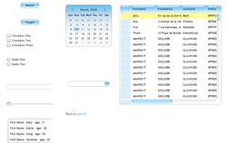
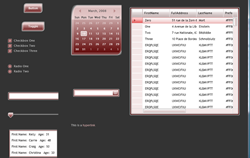
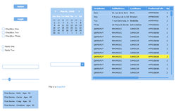
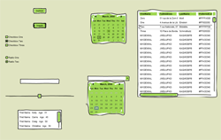

# Hazır Silverlight 2.0 Kontrol Şablonları 

**Silverlight 2.0** ile beraber gelen **Resource** yapısından ve kontrol
şablonlarından daha önceki [bir
yazımda](http://daron.yondem.com/tr/post/64891675-eba7-4cad-88a5-70cb3d148993)
bahsetmiştim. Resource yapılarını herhangi bir Silverlight
uygulamasındaki **App.XAML** dosyası içerisine koyduğunuzda tüm
uygulamada global olarak kullanılabiliyor. Kendi şablonlarınızı
oluşturarak ilerleyebileceğiniz gibi önceden hazırlanmış şablonlar da
kullanabilirsiniz. Bu yazımda sizlerle **[Corrina
Barber](http://blogs.msdn.com/corrinab/)** tarafından hazırlanmış olan
Silverlight Resource şablonlarını paylaşacağım. Böylece hazır şablonları
doğrudan uygulamanızda kullanabilir veya ufak değişiklikler yaparak
farklı tasarımlara yelken açabilirsiniz. Umarım yakın zamanda daha çok
tasarımcı bu şekilde kaynaklar hazırlayarak internette paylaşır, biz
yazılımcılara yardımcı olur :)

  ----------------------------------------------------------------------------- ------------------------------------------------------------------------------
            
  [Tasarım 1'i İndir](../media/Hazir_Silverlight_2_0_Kontrol_Sablonlari/24052008_1.zip)   [Tasarım 2'yi İndir](../media/Hazir_Silverlight_2_0_Kontrol_Sablonlari/24052008_2.zip)
            
  [Tasarım 3'ü İndir](../media/Hazir_Silverlight_2_0_Kontrol_Sablonlari/24052008_3.zip)   [Tasarım 4'ü İndir](../media/Hazir_Silverlight_2_0_Kontrol_Sablonlari/24052008_4.zip)
  ----------------------------------------------------------------------------- ------------------------------------------------------------------------------

Hepinize kolay gelsin ;)

*Bu yazi http://daron.yondem.com adresinde, 2008-5-25 tarihinde yayinlanmistir.*