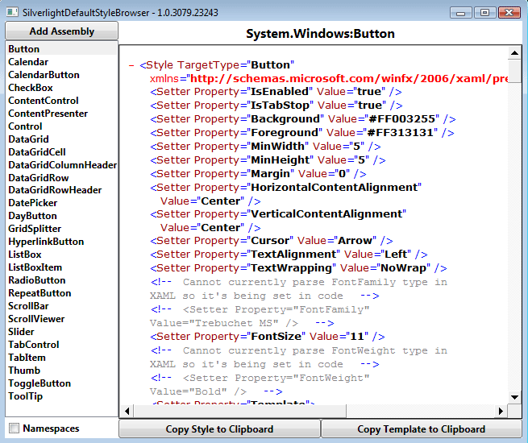

# Silverlight 2.0 kontrollerinin varsayılan görselliklerine ait XAML kodları 

Silverlight 2.0 ile ilgili "Control Templating" yazılarımda Silverlight
kontrollerinin bazılarının tasarımlarının nasıl değiştirilebileceğini
gösterirken varsayılan tasarımları ile ilgili XAML kodlarını
alabileceğimiz MSDN adreslerini de sizlerle paylaştım. Devam eden
günlerde farklı kontrollerin tasarımı ile ilgili ek makaleler de
hazırlayacağım. Fakat bazı durumlarda MSDN'e ulaşma şansınız olmayabilir
veya MSDN içerisinde istediğiniz kontrolün tasarımı ile ilgili XAML
kodunu bulamayabilirsiniz. Peki ne yapabiliriz?

Aslında bahsettiğimiz bütün tasarımlar sonuçta Silverlight Library
içerisinde duruyor. Bu assembly içerisinden **generic.xaml** adındaki
Resource'u dışarı çıkardığınız içerisinde tüm varsayılan tasarımlara ait
XAML kaynağını bulabiliyorsunuz. Ama durun :) tüm bunları tek tek elle
yapmanıza gerek yok. Bahsettiğim işleri otomatik olarak yaparak
Silverlight 2.0 SDK yüklü bir makineden tüm varsayılan XAML
tasarımlarını almanızı sağlayan uygulamayı ClickOnce ile
[buradan](http://delay.members.winisp.net/SilverlightDefaultStyleBrowser/SilverlightDefaultStyleBrowser.application)
yükleyebilirsiniz. Böylece yeni sürümleri çıktığında program kendini
otomatik olarak yenileyecektir.

Ayrıca programı aşağıdaki adresten de bilgisayarınıza indirebilirsiniz.

[Silverlight Default Style Browser - 17062008\_1.zip (20,46
KB)](media/Silverlight_2_0_kontrollerinin_varsayilan_gorselliklerine_ait_XAML_kodlari/17062008_1.zip)

Kolay gelsin...

*Bu yazi http://daron.yondem.com adresinde, 2008-6-18 tarihinde yayinlanmistir.*