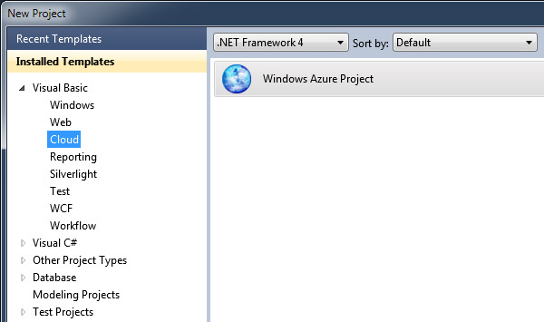

# Makinemizi Windows Azure'a hazırlamak 

**[Aşağıdaki makalenin SDK2.2 ile beraber yeni Azure özelliklerine uygun
şekilde güncellenmiş halini
[burada](http://daron.yondem.com/tr/post/Makinemizi_Windows_Azure_a_hazirlamak_SDK2_2)
bulabilirsiniz.]**

Windows Azure dünyasına girişimize devam ederken :) sıra geldi yavaş
yavaş elleri kirletmeye... Azure ile ilgili ilk projemizi yaratma
yolunda ilerlerken doğal olarak Visual Studio açıp birşeyler yapmak için
bazı yüklemeler yapmamız gerekecek. Fakat onların öncesinde birkaç sorun
yaratabilecek noktadan bahsetmek istiyorum, sonra da yükleme senaryomuza
bakarız.

### SQL 2008 R2 Express  

Benim gibi kaç tane çılgın var bilmiyorum fakat ben developer
makinesinde SQL Express sevmeyen bir insandım :) Bunu desteklemek için
birçok neden bulabilirim ama detaylara girmeyelim :) Genelde hep SQL'in
Developer Edition'ı default instance kurar devam ederdim. Windows Azure
SDK'yi kurup local emülatörleri kullanmaya başladığınızda göreceksiniz
ki bu emülatörlerin bazıları arka planda SQL kullanıyor. Maalesef
default ayarlarda SQLEXPRESS'i arıyorlar :) Aslında çok büyük bir sorun
değil bu çünkü isterseniz konsoldan birkaç takla ile konfigürasyonu
değiştirebiliyorsunuz fakat siz de benim gibi tembelseniz :) SQLExpress
kurun dertlerden kurtulun :) Saçma ve tembelce bir tavsiye olduğunu
biliyorum ama parayla değil ya, kurun gitsin :)

### VMWare Workstation  

Şimdi bu da nereden çıktı diyorsunuz :) Eğer makinenizde VMWare
Workstation kurulu ise ... silin! Şaka şaka :) Evet Microsoft büyük
ihtimal ile silmenizi tercih edecektir malum rakipler :) ama sadece
gidip servislerden Workstation Server servisini durdurmanız da yeterli
olabilir :) Söz konusu servisin kullandığı portlar local azure emülatörü
ile çakışıyor ve süper anlamlı hatalar alarak günlerinizi
çürütüyorsunuz.. :) yani çürütebilirdiniz eğer bu yazıyı okumasaydınız.

### Regional Settings  

Az kaldı bir gün Windows Azure Türkiye'ye de gelecek. İşte o zamana
kadar Control Panel'e gidip Regional Settings'deki herşeyi İngilizce
yapıyorsunuz! :) Buna dil ayarlarından tutun bulunduğunuz ülke ayarına
kadar herşey dahil. Dil İngilizce, ülke ABD olursa hiçbir sorun
yaşamazsınız. (Not: Lütfen bu cümleyi tek başına kullanmayalım :)).

### Son dokunuşlar  

Şimdi olur ya ... birşeyler ters gider diye birkaç noktadan daha
bahsedelim hızlıca. Makinenizde ASP.NET ve IIS kurulu olsun :) Özellikle
IIS çoğu yazılımcının makinesinde olmayabiliyor. ASP.NET Development
Server (Cassini) kullanmaya alıştığımız için özel senaryolar haricinde
IIS makinede kurulu mu değil mi detayını gözden kaçırabiliyoruz. Azure
emülatörü için IIS şart.

### Yükleme yollarında...  

 Artık sıra geldi yüklemelerimizi yapmaya. Bunun için hızlıca Visual
Studio'yu açıp yeni bir Cloud projesi yaratabilirsiniz desem de
inanmayın :)

\
*Azure araçlarını edinirken...*

Yukarıdaki manzarada gördüğünüz "Enable Windows Azure Tools"u seçerek
yeni bir proje yaratırmış gibi ilerleyebilirsiniz. Ekrana hemen (Visual
Studio) içerisinde bir web sayfası açılacak ve oradan direk download
işlemini yaparak yüklemenizi başlatabileceksiniz.

\
*Yüklemeye doğru adım, adım...*

Download düğmesine bastığınızda karşınıza "Web Platform Installer"
yüklemesi gelecek. Yine web sitesinden "**Download / Install**" diyerek
yüklemeyi yapabilirsiniz. Yükleme öncesinde makinenizdeki gerekli
şartları kurulum uygulaması test edecektir. Bu şartlar ve makinenizde
hali hazırda yüklü olanlar da göz önüne alınarak yeni bir download
listesi oluşturulacak. Listeyi onayladığınız gibi tek tek herşey
makinenize indirilecek ve kurulacak :) Tüm bu süreç bittikten sonra
artık Visual Studio'da Cloud projelerinizi görebileceksiniz.

\
*Yükleme tamam.*

İşte herşey tamam. Artık yeni Azure projeleri yaratmak için herşey
hazır. Hadi ne bekliyorsunuz?

Bir sonraki yazıda görüşmek üzere ;)

*Bu yazi http://daron.yondem.com adresinde, 2012-3-27 tarihinde yayinlanmistir.*