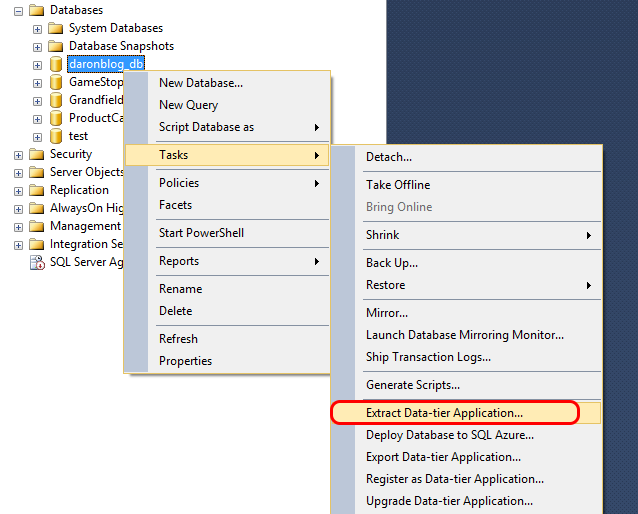
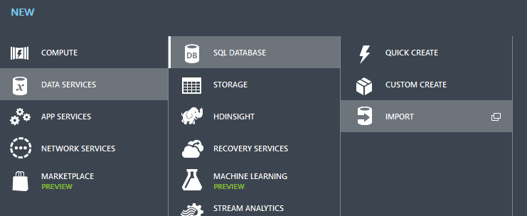

# Varolan bir veritabanını Azure ortamına taşımak! (SDK2.5) 

SQL Azure ile birşeyler yapmaya başladınız fakat hala elinizdeki
veritabanı ile nasıl ilerleyebileceğinizi kestiremiyorsunuz. Gelin o
zaman beraber bir göz atalım. Birincisi ilk olarak web panelinde nasıl
araçlarımız var bir ona bakalım.

*SQL Azure veritabanını yönetmek.*

SQL Azure üzerinde yarattığınız bir veritabanını yönetmek isterseniz en
kolay yöntemlerden biri web üzerinden kullanılabilen management studio
tadındaki Silverlight uygulaması. Uygulama açıldıktan sonra admin
kullanıcı adı ve şifresini girerseniz herşey kendini yavaş yavaş
göstermeye başlayacaktır.

*Web tabanlı SQL Management Studio*

Güzel bir Metro UI implementasyonu olan web tabanlı SQL Management
Studio tamamen Silverlight ile yazılmış durumda. Uygulama içerisinde
veritabanınız tasarım sürecinde ihtiyacınız olacak çoğu şeyi bulmakla
beraber performans analizi (Query Analyzer) gibi şeyleri de
kullanabilirsiniz. Eğer web tabanlı araçların hayranı değilseniz :) tabi
ki hala masaüstünüzdeki SQL Server Management Studio da işinizi
görebilir.

### Var olan bir veritabanını Azure'a taşımak 

Gelelim asıl konumuza. Elimizdeki bir veritabanı var ve onu SQL Azure
ortamına taşımak istiyoruz. En basit yöntemlerden biri veritabanınızın
scriptini alıp SQL Azure'a doğru çalıştırmak :) Bunu yaparken dikkat
etmeniz gereken birkaç ufak nokta var, isterseniz onlara bir bakalım.

*Bildiğimiz "Generate Scripts"*

Bildiğimiz eski teknikler ile **Generate Scripts** diyerek yola
çıkacağız. Ama bunu yapmadan önce SQL Server Management Studio'nun 2012 sürümüne sahip olduğunuzdan emin olun. Aksi halde göreceğimiz bazı
seçenekler maalesef sizdeki kopyalarda bulunmayacaktır.

"Generate Scripts" sihirbazında yolunuza devam ederken, tam da Script'i
nereye kaydetmek istediğiniz sorusu geldiğinde durun ve :) "Advanced"
düğmesine tıklayın.

*SQL Azure yolunda ufak ayarlar.*

Yukarıdaki üç farklı ayar sanırım ekran görüntüsünde net olarak
gözüküyordur :) Biri UDDT'lerden vaz geçmek anlamına geliyor. Diğeri ise
"USE" keyword'ü ve filegroup gibi ayarlarla ilgili T-SQL'lerin
yaratılmamasını sağlamak adına "Database Engine Type"ı değiştiriyor, son
ayar ise sadece veritabanı şemasını değil berbarinde datayı da almamızı
sağlıyor.

Tüm bu ayarlarla beraber aldığınız bir script SQL Azure tarafında %99.95
:) çalışacaktır.

### DAC veya BACPAC Kullanarak veritabanınız taşımak 

Veritabanınızı ve verisinizi Azure ortamına taşırken bir diğer seçenek de DAC veya BACPAC dosyalarını kullanmak. Bu dosyaları özellikle Azure'da Database Import ile beraber kullanabiliyor olmak büyük avantaj sağlayacaktır. Süreç özünde şöyle çalışıyor; ilk olarak uygun şekilde DAC veya BACPAC'i elinizdeki veritabanından extract/export ediyorsunuz. Sonra bu dosyayı Azure'da bir blob'a upload edip, Azure'daki Database Import'u kullanarak paketinizin Azure ortamındaki bir veritabanına import edilmesini sağlayabiliyorsunuz. Import süreci tamamen Azure Datacenter içerisinde olduğu için bir önceki senaryodaki gibi uzaktan bağlanıp T-SQL çalıştırmanın getireceği olası bağlantı problemleri ile uğraşmıyorsunuz. Malum, eğer veritabanınızın boyutu büyükse veya versiyonlama yapıyorsanız DAC veya BACPAC çok daha uygun ve pratik olacaktır.

*DAC Export ederken...*	

Export işlemini yaptıktan sonra hemen Azure portalına geçip yeni bir database yaratırken elinizdeki DACPAC dosyasını kullanabilirsiniz. Tabi bunun öncesinde dosyayı uygun bir Storage Account içerisindeki bir bloba atmayı unutmamanız gerek.

*DACPAC Import ederken...*	

DACPAC yerine BACPAC Export/Import yaparsanız sadece şema değil veritabanı içerisindeki veriniz de taşınacaktır. Bunun için en başta SQL Management Studio içerisinde **"Extract Data-Tier Application"** yerine **"Export Data Tier Application"** seçeneğini seçmeniz yeterli.

### Deploy to Azure 

Tüm bunlardan bahsederken SQL Management Studio içerisinde DACPAC/BACPAC komutlarının hemen yanında "Deploy database to Azure" seçeneği de dikkatinizi çekmiş olabilir :) Hatta kendi kendinize sormuş da olabilirsiniz "Bu adam neden bunu kullanmıyor?" diye... Aslında sözün özü, sadece o komutu kullanarak her şeyi halledebilirsiniz :) Sizin yerinizde otomatik olarak bir BACPAC yaratıp deployment'ı da yapacaktır.

Gördüğünüz üzere kullanılabilecek bir çok seçenek mevcut. Bunlardan hangisi size uygun ve pratik geliyorsa onunla devam edebilirsiniz. Arada ufak bir detay olarak klasik DACPAC/BACPAC Export seçeneklerinde aslında database'inizin Azure SQL Database uyumluluk testinden geçmediğini belirtmem gerek. O nedenle eğer ki Azure SQL Database'lerde desteklenmeyen bir şeyler varsa IMPORT esnasında güzel güzel hatalar alırsınız :) Benden söylemesi.

Hepinize kolay gelsin ;)

*Bu yazi http://daron.yondem.com adresinde, 2014-12-3 tarihinde yayinlanmistir.*