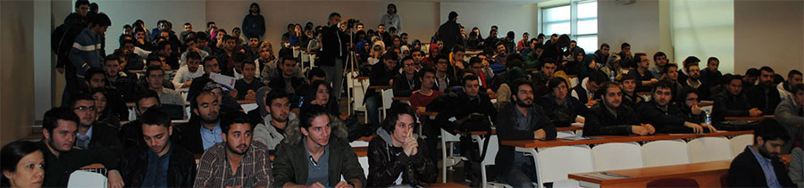

# Konya Karatay Üniversitesi, Boş Durma Boşa Çalış 

Bu hafta içi (dün) Konya, Karatay Üniversitesi'ndeydim. Her zamankinden farklı olarak teknik bir oturum yerine ilk defa aylar önce yine Konya'da sunduğum **"Boş durma, boşa çalış."** adındaki oturumumu sundum. Bu oturum özellikle benim "[Uykudan Önce Bir Doz](www.leanpub.com/uykudan_once_bir_doz)" ile paylaşmaya çalıştıklarımla aynı yönde bir paylaşım diyebiliriz.

Tabi ki dönüşte gençlerle bir etli ekmek yemeyi de unutmadık :) Nitekim eski performansımı gösteremiyorum artık ama olsun :) Benim için süper eğlenceliydi. Umarım katılan herkes için de faydalı olmuştur. Etkinliğin organizasyonunda görev alan tüm arkadaşlara da ayrıca çok teşekkürler. Elinize sağlık.

Görüşmek üzere!

*Bu yazi http://daron.yondem.com adresinde, 2014-12-12 tarihinde yayinlanmistir.*