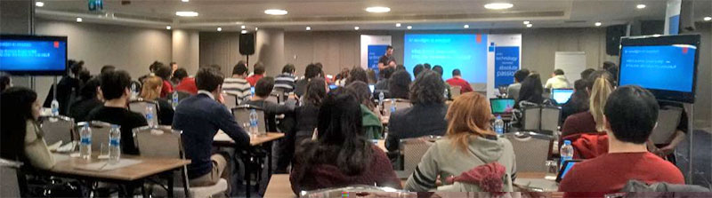

# Microsoft Student Partner Programı 2015 Açılışı 

Dün Türkiye'deki MSP (Microsoft Student Partner) programının açılış etkinliğindeydim :) Etkinlikte biraz kişisel gelişim, kariyer ve biraz da Azure konuştuk gençlerle. Ülkedeki Azure konusundaki eksiklere artık şaşırmıyorum. Alıştım :) ama emin olun Cloud'un ne olduğunu bilmeyen veya bilerek [saptıran](http://en.wiktionary.org/wiki/Citations:cloudwash) kurumlara karşı bilinçli bir gençlik geliyor :) Birkaç üniversite oturumu ile bu kadar optimist olmam garip gelebilir ama optimizm iyidir ;)

Gün boyunca diğer gördüğüm bir sorun ise aslında ilk defa tanışmadığım ve mentorluk yaptığım gençlerde de gördüğüm bir "çok şey öğrenmeliyim" sendromu :) Bu konuda uzun uzun konuşabilirim fakat özünde beni "[Uykudan Önce Bir Doz](http://www.leanpub.com/uykudan_once_bir_doz)" gibi başka kitaplar yazmaya da itiyor diyebilirim. Nasıl ki bundan bir süre önce "[Hangi programlama dilini öğrenmeli?](https://www.youtube.com/watch?v=fQ5B9Fdu6XA&list=TLvqLbBwtz6nY)" sorusuna biraz garip bir cevap verdiysem aslında gençlerin kendi içlerinde sordukları çoğu sorunun yanlış cevapları aradığını düşünüyorum. Yavaş yavaş bu konunun bir "nesil" farkı yansıması olduğunu da düşünmeye başlıyorum. Anlayacağınız bu konuda bir şeyler paylaşabilmek için biraz daha düşünmem ve hazırlanmam gerekiyor :)

MSP açılış etkinliğinde beni misafir eden, Microsoft'tan sevgili Mustafa Kasap'a buradan teşekkür ediyorum. Benim için çok eğlenceli bir kaç saat oldu. Umarım gençler için de faydalı olmuştur ;)

Görüşmek üzere. 

*Bu yazi http://daron.yondem.com adresinde, 2015-2-24 tarihinde yayinlanmistir.*