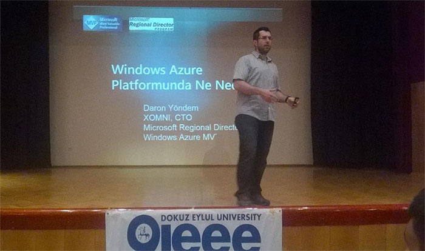

# Izmir Dokuz Eylül Üniversitesi'nde Cloud 101 

Tam dört yıl olmuş İzmir’e gitmeyeli :) Dün Dokuz Eylül Üniversitesi’ndeki Bilişim Günleri’ndeydim. “Cloud 101” oturumumla Cloud dünyasında farklı üreticilerin gözü ile geniş bir bakış attık.

İzmir’e kadar gitmişken uçağı en geç saate alıp sahile inmemek olmazdı tabi :) Açık konuşmak gerekirse IEEE ekibi beni tam da bu planla davete ikna etti :) Şaka bir yana etkinlik sonrasında da güzel bir sohbet yapma şansım oldu tüm ekiple. 

Etkinlikte emeği geçen tüm kardeşlerime çok teşekkürler. Dört yıl sonra görüşmek üzere :) Şaka şaka… İlk fırsatta görüşürüz umarım. ;)

*Bu yazi http://daron.yondem.com adresinde, 2015-5-8 tarihinde yayinlanmistir.*