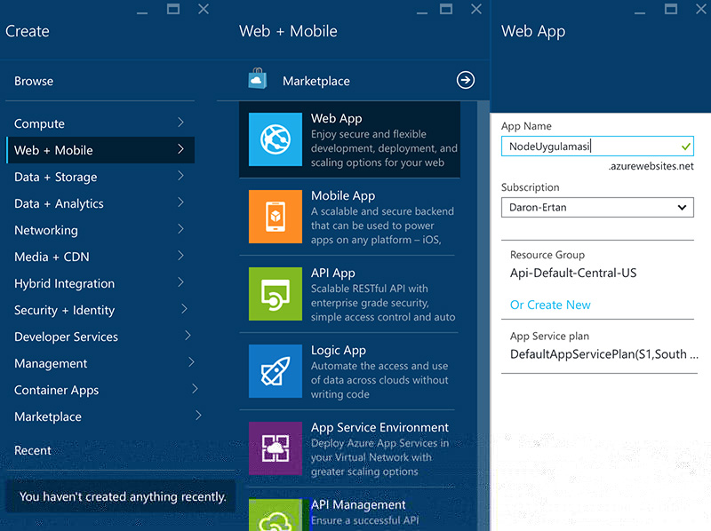
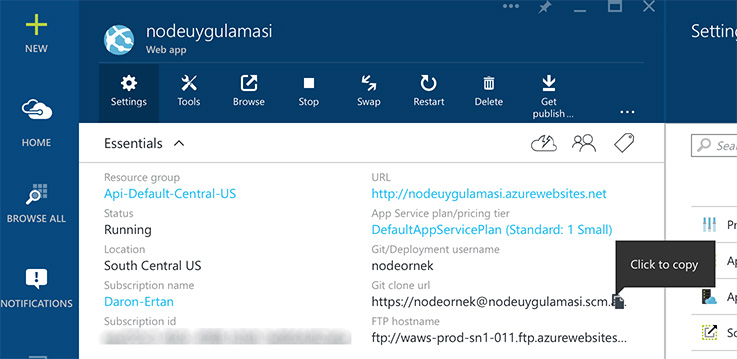

# Azure'da ilk NodeJS Uygulamamız 

Eski JavaScript'cilerden kimler kaldı bakiyim? :) Kendi adıma parmak kaldırabilirim :) Malum zamanında 800 sayfa [ASP.NET AJAX](http://daron.yondem.com/software/post/15adba9f-e264-45ac-a318-b5038c24f488) kitabı yazmışlığım var. O günlerden bugünlere tabi ki JavaScript nerelerden nerelere geldi. Özellikle adını duyduğunuzdan emin olduğum Node.JS ile beraber sunucu tarafında da epey popülerleşen JavaScript'in gelecekte nerelere gideceğini de artık Allah bilir. Konuyu çok geyiğe vurmadan, bu yazıda Azure üzerinde Node uygulamaları konseptine bir giriş yapalım istiyorum. Basit bir Azure Web App yaratarak elimizdeki örnek bir Node uygulamasını Azure'a nasıl atarız bir bakalım.

İlk olarak yapmamız gereken Azure Portal'ına gidip Web App slotumuzu provision etmek. Bunun için yeni portalda Web+Mobile sekmesinden "Web App"'i seçerek ilerleyebilirsiniz. Provisioning işlemi tamamlandırken bir yandan da "Merhaba Dünya" kıvamında bir Node uygulaması hazırlayalım.



Basit bir Node uygulaması için şu an ihtiyacımız olan tek şey bir JavaScript dosyası. Bu dosyanın içerisinde Node http modülünü kullanarak localhost üzerinde 2001 portunda bir http sunucusu oluşturacağız. Sonra da gelen her talebe cevaben bir selam vereceğiz :)

```js
var http = require('http')
var port = process.env.PORT || 2001;
http.createServer(function(req, res) {
  res.writeHead(200, { 'Content-Type': 'text/plain' });
  res.end('Selamlar!\n');
}).listen(port);
```

Basit bir şekilde yukarıdaki kodu server.js adında bir dosyaya yerleştirebilirsiniz. Tabi Node bilenlerinizin elinde hazır projeler varsa kendi projeniz ile de devam edebilirsiniz. Maksat burada çalışan bir örneğe sahip olup Node'un deployment sonrası çalışıp çalışmadığını test edebilmek.

Local'de test etmek isterseniz tabi Node'un bilgisayarınızda yüklü olması gerekecek. Node'un platformunuza uygun yükleme paketine [buradan](https://nodejs.org/en/download/) ulaşabilirsiniz. Yükleme işlemi bittikten sonra console'dan "node server.js" demeniz JavaScript dosyanızın çalıştırılması için yeterli olacaktır.

Siz bunları yaparken Azure'da Web App provisioning bitmiştir. Hemen "Settings" kısmına geçerseniz "Publishing" sekmesinde "Continuous Deployment" (CI) veya "Deployment Credentials" seçeneklerini göreceksiniz. CI kısmından gittiğinizde Git, TFS gibi source control repoları üzerinden deployment yapabileceğiniz gibi Dropbox gibi ilginç seçenekler de söz konusu olduğunu göreceksiniz. Deployment Credentials ise eğer Local Git Repo seçeneğini seçerseniz veya FTP ile deployment yapmak isterseniz kullanacağınız kullanıcı adı ve şifreyi belirlemek için kullanılıyor. 

Örneğimizin devamın "Local Git Repo" seçeneğini seçerek devam edeceğim. Bu seçeneğin adından da anlaşılacağı üzere bilgisayarımızda Local bir Git Repo'su olduğunu söylemiş oluyoruz. Şu ana kadar server.js dosyasının tuttuğumuz yerde böyle bir repo yoktu :) O nedenle hemen yaratmakta fayda var.

```console
git init
git add .
git commit -m "initial commit"
git remote add azure https://nodeornek@nodeuygulamasi.scm.azurewebsites.net:443/NodeUygulamasi.git
```

Yukarıdaki komutları server.js'in bulunduğu yerde çalıştırmamız gerekiyor. İlk satırda yeni bir git repo yaratmış oluyoruz. İkinci satırda klasördeki dosyaları source control indexine ekliyoruz. Üçüncü satırda ise localdeki değişikliklerimizi bir mesaj ile (-m) source controle commitliyoruz (check-in). Dördüncü satır biraz daha karışık sayılabilir. Şimdi bizim local git reposuna remote (uzak nokta) olarak Azure'daki git reposunu vermemiz gerekiyor. Böylece localdaki repodan istediğimiz commitleri alıp Remote'a, yani Azure'a gönderebileceğiniz. Bir Git Repo'sunun birden çok Remote endpointi olabilir. Biz komutumuzda hem remote'un adresini hem de söz konusu remote'a azure adını veriyoruz. Böylece aynı repodaki birden çok remote adresi varsa bunları rahatlıkla ayırt edebiliriz.

Azure'daki Git Remote Endpoint adresini nasıl alacağınız merak ediyorsanız, o da aslında portalda mevcut. 



Git clone url olarak geçen adresi alıp kullanabilirsiniz. Aslına bakarsanız tüm remote ekleme senaryosu yerine doğrudan Clone mantığını da kullanabilirdik :) ama localde olan biteni görmenizin daha faydalı olacağını düşündüm. Artık her şey hazır olduğuna göre, local repo'dan Azure'a değişiklikleri gönderebiliriz.

```console
git push azure master
```

Yukarıdaki git komutu ile master branchimizdeki değişiklikleri azure adındaki remote repoya gönderiyoruz. İşte bundan sonra console'da görecekleriniz çok eğlenceli olacak :)

```console
git push azure master
Password for 'https://nodeornek@nodeuygulamasi.scm.azurewebsites.net:443': 
Counting objects: 3, done.
Delta compression using up to 8 threads.
Compressing objects: 100% (2/2), done.
Writing objects: 100% (3/3), 373 bytes | 0 bytes/s, done.
Total 3 (delta 0), reused 0 (delta 0)
remote: Updating branch 'master'.
remote: Updating submodules.
remote: Preparing deployment for commit id '2a8923dab9'.
remote: Generating deployment script.
remote: .........
remote: Generating deployment script for node.js Web Site
remote: Running deployment command...
remote: Handling node.js deployment.
remote: KuduSync.NET from: 'D:\home\site\repository' to: 'D:\home\site\wwwroot'
remote: Deleting file: 'hostingstart.html'
remote: Copying file: 'server.js'
remote: Looking for app.js/server.js under site root.
remote: Using start-up script server.js
remote: Generated web.config.
remote: The package.json file does not specify node.js engine version constraints.
remote: The node.js application will run with the default node.js version 0.10.32.
remote: Finished successfully.
remote: Deployment successful.
To https://nodeornek@nodeuygulamasi.scm.azurewebsites.net:443/NodeUygulamasi.git
 * [new branch]      master -> master
```

Push işlemini başlattıktan sonra yukarıdaki manzara ile karşı karşılaya kalacaksınız. Merak etmeyin, bir sıkıntı yok. Tüm logun en sonunda da yazdığı gibi "Deployment successful", herşey yolunda ve sitemiz Azure'da çalışır durumda. Arada neler oldu derseniz. Hemen ilk adımda zaten deployment şifresi sorulduğunu görebilirsiniz. Sonrasında ise özellikle remote'dan gelen mesajlar çok manidar. Bloğu takip edenler daha önceleri [Kudu](http://daron.yondem.com/software/post/Azure_Web_Sites_Kudu_ve_Custom_Site_Extensions) ile ilgili yazımı görmüşlerdir. Kudu Node projemizin ayağa kalkması konusunda da devreye giriyor. İlk olarak Azure node.JS'e özel [bir deployment scripti](https://gist.github.com/daronyondem/8716efb2bccc21c6c035#file-kudu_node_deployment) Kudu'ya veriyor. Scripti incelerseniz KuduSync.NET adında bir aracın ortama eklendiğini görebilirsiniz. [KuduSync.NET](https://github.com/projectkudu/KuduSync.NET) hali hazırda Github'da open source bir proje. KuduSync ile Web App'in repository klasörü ve esas wwwroot arasında sync işlemi tamamlandıktan sonra bir de **package.json** dosyasına bakılıyor. Bizde bu dosya yoktu, ama eğer olsaydı o dosyada sıralı NPM paketleri de deploymentın parçası olarak yüklenecekti. En sonda bir de Web.Config dosyası yaratıldığını göreceksiniz. Azure Web Apps içerisinde Node projeleri IIS altında duruyor. O nedenle Web.Config'de de bazı ayarlar yapmak şart ki server.js Node modülü tarafından ele alınsın. Azure Web Apps'in varsayılan ayarlarda eklediği [web.configi incelemek isteyenler buradan](https://gist.github.com/daronyondem/8716efb2bccc21c6c035#file-azure-web-app-node-web-config) bulabilirler. 

İşte böyle :) Eğlenceli bir yazı oldu. Farklı parçaların nasıl yan yana geldiğini ve Azure Web Apps'in Node, Git desteğini nasıl verdiğini de hafiften görmüş olduk. Unutmadan hatırlatiyim, varsayılan ayarlarda Azure Web Apps'de çalışan Node sürümü biraz eski. O nedenle 0.12'ye geçmek isterseniz project.json dosyası yaratıp içerisine yazmanız yeterli olacaktır.

**[Project.JSON]**
```js
{
    "name": "hellojs",
    "version": "0.1.0",
    "engines": {
        "node": "0.12.x"
    }
}
```

Kolay gelsin.


*Bu yazi http://daron.yondem.com adresinde, 2015-9-4 tarihinde yayinlanmistir.*