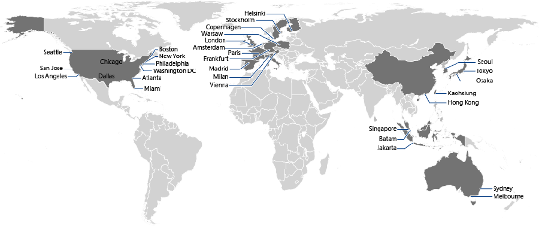

# Microsoft Azure CDN Kullanımı 

CDN (Content Delivery Network)'leri tüm dünyaya yayılmış bir static
içerik cacheleme servisi olarak düşünebilirsiniz. Uygulamanıza veya
blob'unuza gelecek trafiğin ciddi şekilde azalmasını, kaldırılabilecek
yükün artmasını ve farklı bölgelerde önbelleklemeler sayesinde genel
performasın da tabiri caiz ise :) tavan yapmasını sağlayabilirsiniz.

Azure web yönetim panelinden aktif hale getirebileceğimiz Azure CDN
servisini bir Azure Storage'daki bloblar,  Web Apps, Cloud Services ve Media Services için 
aktifleştirdiğiniz anda söz konusu endpointlerin tüm
public access'i olan içerik CDN edge caching'e tabi tutulacaktır :) Yani
blobdaki bir dosyayı değiştirdiğinizde CDN'deki cache'li halinin TTL'i
bitip expire edene kadar değişiklik dışarıya yansıyamayacaktır. Bu
durumun sorun yaratacağını düşündüğünüz senaryolarda CDN seçeneğini
tekrar değerlendirmeniz faydalı olabilir. Ayrıca 10GB üstü bloblarınızda da CDN'de performans sorunları
yaşayabileceğinizi şimdiden söyliyim. 

Tüm bunların haricinde isterseniz 
Azure DataCenter dışındaki bir endpoint için de CDN ayarlayabilirsiniz. 
Bunun için **Origin Type** olarak **Custom Origin** diyerek URL vermeniz yeterli. 
Verdiğiniz URL kendi veri merkezinizde veya Amazon'da vs olabilir. 

  
*Yeni bir CDN Endpoint eklerken.*

Endpointi yarattıktan sonra ihtiyacınıza göre **HTTPS** ve/veya **QueryString** desteğini de alt 
menüden açabilirsiniz.

  

Ek olarak standard CDN Endpoint adresi yerine kendi domaininizden bir sub-domain
kullanmak isterseniz bunu da **Manage Domains* bölümünden yaparak ufak bir CNAME ayarı
ile işi bitirebilirsiniz.

  

Görüşmek üzere!

*Bu yazi http://daron.yondem.com adresinde, 2015-10-9 tarihinde yayinlanmistir.*