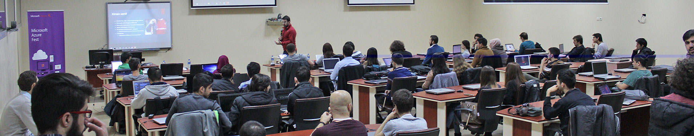

# Karadeniz Teknik Üniversitesi Ziyaretim 

Dün Trabzon Karadeniz Teknik Üniversitesi'ndeydim. [Bilgisayar Mühendisliği kulübü](https://twitter.com/ktu_cec)nün düzenlediği Azure Fest etkinliğinde Azure konuştuk. Azure oturumunun haricinde yoğun istek üzerine :) "Boş Durma Boşa Çalış" sunumumu da yaptım.  

Benim için eğlenceli ve bir o kadar da hızlı geçen bir gündü. Maalesef bu ikinci Trabzon ziyaretimde de günübirlik hızlı bir yolculuk yaparak pek de Trabzon'un tadını çıkaramadım :) Bir dahakine artık.

Etkinlikte emeği olan tüm Bilgisayar Mühendisliği ekibine ve sevgili MSP kardeşlerimiz Hilal Şener, Yavuz Gedik'e de çok teşekkür ediyorum. 

Görüşmek üzere.

*Bu yazi http://daron.yondem.com adresinde, 2015-12-20 tarihinde yayinlanmistir.*