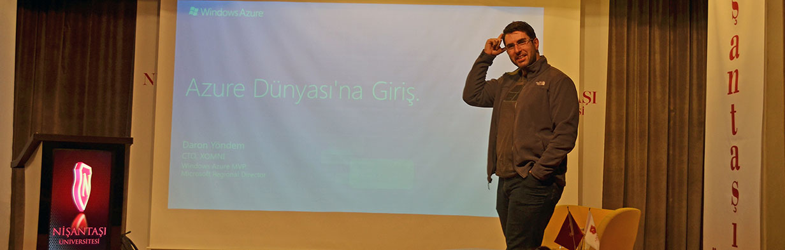

# Nışantaşı Üniversitesi'nde Azure 

Dün Nışantaşı Üniversitesi'nde **Azure Dünyası'na Giriş** şapkası altında farklı farklı şeyler anlattım :) Önce free-format başladık oturuma, ben bir ara gaza gelip EcmaScript'ten girip taaaa TypeScript'ten çıktım :) Sonra toparlayıp Azure, AWS ve Google Cloud diyerek oturumu bitirdik.

Eğlenceli ve hızlı bir oturumdu. Etkinlikte emeği geçen sevgili **Eren Bozarık** kardeşime ve tüm **IEEE** ekibibe çok teşekkürler. Tekrar görüşmek üzere ;)

*Bu yazi http://daron.yondem.com adresinde, 2016-1-15 tarihinde yayinlanmistir.*