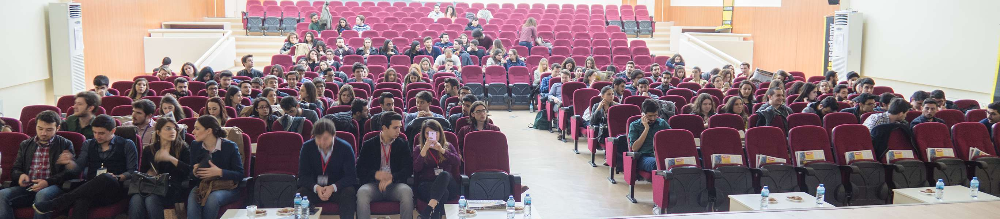

# Ege Üniversitesi'nde Boş Durma Boşa Çalış 

Dün İzmir'de Ege Üniversitesin'deydim. IEEE ekibinin düzenlediği "Kelebek Etkisi 2" adlı etkinlikte "Boş Durma Boşa Çalış" oturumumu sundum. İtiraf etmek gerekirse uzun süredir İzmir'de bu kadar geniş katılımlı bir hafta sonu etkinliğine denk gelmemiştim :)

Etkinliğin organizasyonunda emeği geçen herkese çok teşekkürler. Eğer hala [Youtube kanalına](https://www.youtube.com/user/daronyondem/) üye değilseniz ve gerçek zamanlı olarak takip etmiyorsanız :) günün VLOG'u da aşağıda.

<iframe width="560" height="315" src="https://www.youtube.com/embed/89_ViEi3Pwc" frameborder="0" allowfullscreen></iframe>

Görüşmek üzere.

*Bu yazi http://daron.yondem.com adresinde, 2016-3-13 tarihinde yayinlanmistir.*