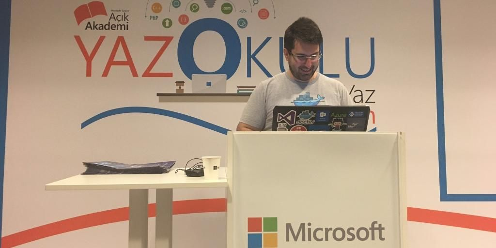

# Açık Akademi Yaz Okulu 2016 

Geçen hafta Perşembe ve Cuma günlerinde Microsoft'un açık Açık Akademi Yaz Okulu'ndaydım. Tahmin edebileceğiniz üzere Azure ve Cloud anlattım. Bu vesile ile Github'da tuttuğum [Azure örneklerini](https://github.com/daronyondem/AzureOrnekler) de bir elden geçirdim. 

Azure konusunda daha fazlasını isteyenler olursa geçen seneki yaz okulu videolarının kayıtlarının da bulunduğu [youtube sayfama](https://www.youtube.com/playlist?list=PLoEH73F0Yy5oUBWhW4oCDaAe0diRWxUOz) beklerim :)

Görüşmek üzere.

*Bu yazi http://daron.yondem.com adresinde, 2016-8-16 tarihinde yayinlanmistir.*