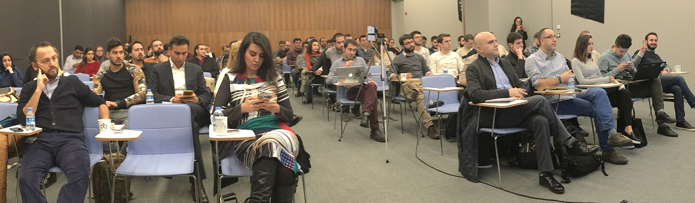

# Başarısızlıkları Konuştuk 

Dün enteresan bir etkinliğe katıldım :) Geçenlerde katıldığım bir başka etkinlikte startuplardan bahsedildiğinde her zaman yaptığım yorumu yapmıştım. "*Herkes başarıları paylaşıyor, başarısızlığını konuşan yok*". Sonrasında ayak üstü kendi geçmişimdeki başarısızlıklardan çıkardığım derslerden bir kaçını paylaştım. Ve sonrasında birileri beni başarısızlıkları konuşmak üzere bir etkinliğe davet etti :) İşte böyle bir hikaye ile [The Pitcher Meetup](https://www.meetup.com/thepitcherorg/) ile tanışmış oldu. 

Etkinlik benim için çok eğlenceli geçti. Canlı yayın yapıp sonra [kaydını da Facebook üzerinden yayınlamış](https://www.facebook.com/thepitcherorg/videos/641233416064281/) ekip :) İzlemek isteyebilecekler için paylaşmak istedim ;) 

Bu arada, son son katıldığım etkinliklerden haberdar olamayanlar için [bir mail listesi](http://yondem.us3.list-manage.com/subscribe?u=221fa688556db43335ce36eef&id=d9a830e78e) yarattım. Basit bir şekilde etkinlik planlarımı belli oldukça mail ile paylaşıyorum. Böylece artık "Bilsem gelirdim." şikayetleri tarih olacak inşallah :)

Bir sonrakinde görüşmek üzere.

*Bu yazi http://daron.yondem.com adresinde, 2016-11-17 tarihinde yayinlanmistir.*