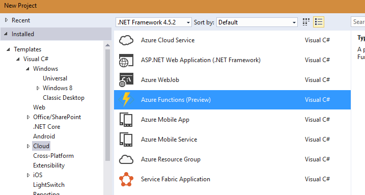
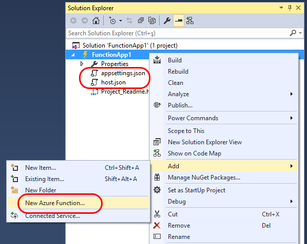
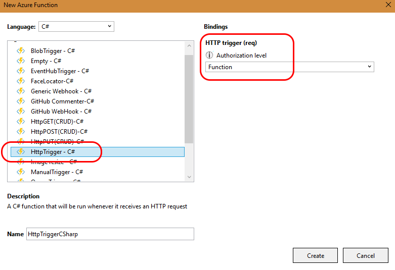
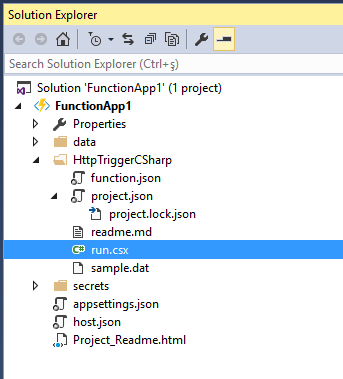
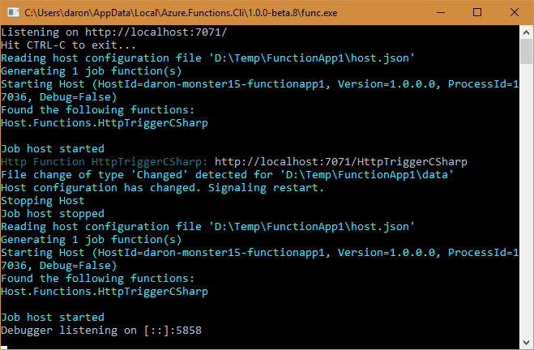
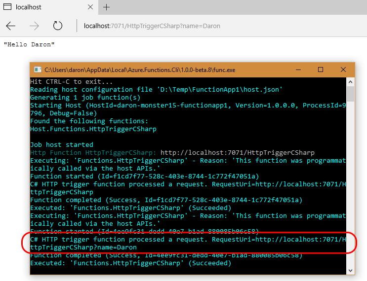
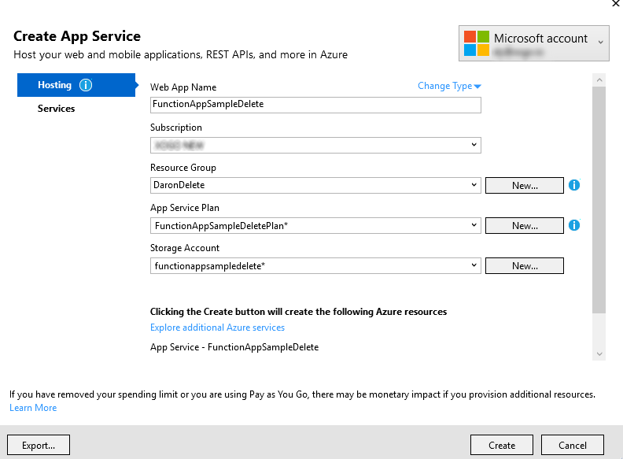
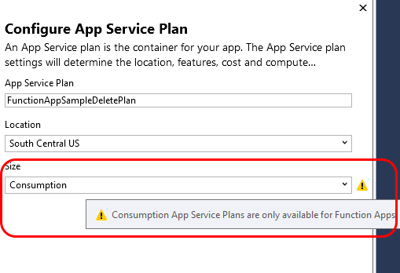
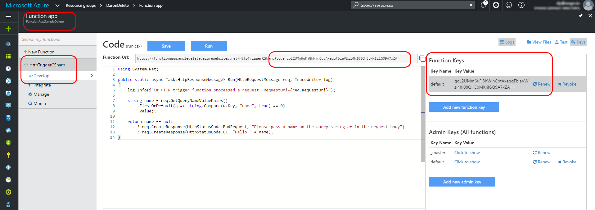

# Azure Functions ile ilk Serverless Maceramız 

Azure Functions konusunda uzun süredir yazı yazmak istiyordum. Geri durmamın nedeni ise Visual Studio içerisindeki Tooling'inin rezalet olması, veya başka bir deyişle aslında Tooling'inin olmamasıydı :) Azure Functions kullanımı için bugüne kadar tavsiye edilen kullanım yöntemi tamamen Azure Portalı'ndaki araçlarla kısıtlıydı. Bugün Azure Functions için Tooling'in Preview sürümü duyurulunca ben de hemen hızlıca bir yazı yazmak istedim.

### Azure Functions neden bu kadar seni heyecanlandırıyor?   

Size bu soruyu sorduracak kadar ipucu verememiş olabilirim :) ama Azure Functions beni çok heyecanlandırıyor. Azure Functions Microsoft'un Serverless ürünü. Bilenler için AWS Lambda diyebilirim. Buradaki amaç yazılım geliştiriciyi sunucunun varlığından olabildiğince uzaklaştırmak. O kadar ki Azure Functions'ın "Consumption Plan" denilen [fiyatlandırma planına bakarsanız](https://azure.microsoft.com/en-us/pricing/details/functions/) fiyatlandırmanın **GB-s** (Gigabyte Seconds) gibi bir birim üzerinden yapıldığını görebilirsiniz. Peki ne demek bu? Bir function çalışırken kullandığı RAM miktarı ile çalışma süresi (saniye cinsinden) hesaplanarak birbiri ile çarpıldığında ortaya çıkan biri GB-s oluyor :) Azure Functions fiyatlandırması da tamamen bu birim üzerinden hesaplanıyor. Ayrıca her bir execution için de alınan standard bir ücret var. Her ay ilk 1 milyon execution ve 400,000 GB-s ücretsiz. 

Sanırım şimdi anlamışsınızdır neden Azure Functions'ın heyecan verici olduğunu :)

### Kolları sıvamaca...   

Şimdi gelin "Hello World" tadında bir tur yapalım. İlk olarak Azure Functions için Preview seviyesinde olan Tooling'i [buradan bir indirin](https://aka.ms/azfunctiontools). Yanlış anlaşılma olsun istemem, Azure Functions kendisi geçen Connect etkinliğinde GA oldu. Preview olan tek şey şu anda Visual Studui içerisindeki entegrasyonu.



Yüklemeyi bitirdikten sonra hemen yeni projeler listesinde Azure Functions'ı göreceksiniz. Yeni bir proje yaratın ve içerisinde varsayılan ayarlarlda neler geliyor bir bakalım.



Proje içerisinde gelen iki dosya var. Bunlardan ilki **appsettings.json**. Adından da anlaşılacağı üzere burası bizim tüm connection string vs gibi şeyleri saklayacağımız yer olacak. İkinci dosya ise **host.json**. Bu dosya tüm uygulama genelinde geçerli olacak, bir anlamda sistem ayarlarının bulunduğu yer. 

**[host.json]**  
```javascript
{
  "http": {
    "routePrefix": ""
  }
}
```

Biz birazdan bir HTTP API oluşturacağız. Varsayılan ayarlarda Azure Functions tüm URL Pathlerin önüne "api" routingini ekliyor. Yukarıda gördüğünüz şekilde host.json içerisinde bunu değiştirebiliyoruz. Ben basit bir şekilde bu parametreyi boş geçerek routingi kaldırıyorum.



Bir sonraki adımda artık "New Azure Function" diyerek fonksyon eklemek istediğinizde karşınıza bir şablon listesi gelecek. Buradan hazır function şablonlarından istediğinizi seçebilirsiniz. Ben bu yazıda bir API örneği yapmak istediğim için basit bir şekilde "HttpTrigger - C#" örneğini seçeceğim. 

HttpTrigger yaratırken yan tarafta "Authorization level" diye bir seçenek göreceksiniz. Burada üç farklı tercihte bulunabiliyoruz. Birincisi "Function"; eğer bunu tercih ederseniz function'ın kendi anahtarı (key) ile function'a ulaşmanız gerekiyor. Eğer "Admin" seçeneğini kullanırsanız Function App'in Master Key'i ile bu functiona ulaşabilirsiniz. Tüm bu key'leri Azure Portal'ında deployment sonrası bulabilirsiniz. Eğer "Anonymous" seçerseniz doğrudan herkes ulaşabilir anlamına geliyor. Azure Portal'ında Federated Identity gibi özellikler de var, ama şimdilik makaleyi bir kitaba çevirmemek için bu konuları atlıyorum. İleriki yazılarda detaylarına bakarız. 



İlk Function'ı eklediğimiz gibi Solution Explorer'da function'ın adında bir klasör göreceksiniz. Function ile ilgili herşey buraya geliyor. İçerisindeki **function.json** dosyası bir functionın girdi ve çıktılarını tanımlıyor. 

**[function.json]**
```javascript
{
  "disabled": false,
  "bindings": [
    {
      "authLevel": "function",
      "name": "req",
      "type": "httpTrigger",
      "direction": "in"
    },
    {
      "name": "res",
      "type": "http",
      "direction": "out"
    }
  ]
}
```

Bizim örneğimizde **req** adında ve **httpTrigger** tipinde bir girdimiz var. Authorization'u da **function** seviyeside yapacağız. Ayrıca **res" adında bir de **http** outputumuz var. Bu tanımlardan kullandığımız isimler doğrudan birazdan göreceğimiz C# function'ın method imzasında yer alacak. Son olarak, **project.json** dosyası da her zamanki, tanıdığımız, dependency'lerimizi vs tanımladığımız yer. 

**[run.csx]**
```CS 
public static async Task<HttpResponseMessage> Run(HttpRequestMessage req, TraceWriter log)
{    
    string name = req.GetQueryNameValuePairs()
        .FirstOrDefault(q => string.Compare(q.Key, "name", true) == 0)
        .Value;  
    return name == null
        ? req.CreateResponse(HttpStatusCode.BadRequest, "Please pass a name on the query string.")
        : req.CreateResponse(HttpStatusCode.OK, "Hello " + name);
}
```

Yukarıda **run.csx** dosyasının içeriği görebilirsiniz. Ben basitleştirmek adına gelen örnekten bazı noktaları kaldırdım. Şimdilik QueryString'de name adında bir parametre gelmişse değerini alıp geri döndürüyoruz. Eğer parametre gelmemişse uygun uyarı ile beraber geriye BadRequest'i paslıyoruz. 

Projeyi "Start" deyip Debug modda başlattığınızda Azure Functions CLI'ı indirmek isteyip istemediğiniz sorulacak. Azure Functions için yazılmış functionlarınızın hepsini olmasa da özellikle API'ları local'de de çalıştırabilirsiniz. Kullandığınız binding tiplerine göre localde çalıştırma kısıtları mevcut. Biz HttpTrigger kullandığımız için rahatlıkla devam edebiliriz. Azure Function CLI indikten sonra function localde çalışacak ve doğrudan bir endpoint sahibi olacağız.



Azure Function default olarak 7071 portundan başlıyor. Sonrasında her çalıştırdığınız functionsHost 7071'den başlayarak, bir artarak devam eder. 



Local'deki testi gerçekleştirmek için doğrudan tarayıcıyı kullanabiliriz. Basit bir HTTP GET ile gönderdiğim parametreyi almayı başardım. Dikkat ettiyseniz Authorization olarak Function level'ı seçmiş olsak da localde bu yapı çalışmıyor. Azure Functions'ı deploy ettiğimizde bu functiona ulaşmak için ek olarak Azure'dan alacağımız anahtarı kullanmamız gerekecek.

*** Deployment

Gelin son olarak, hızlıca bu function'ı bir deploy edelim. Projeye sağ tuş tıklayıp "Publish" dediğinizde "Microsoft Azure App Service"i seçmeniz gerekiyor. 



Bir sonraki adımda klasik Azure Deployment hikayelerinden biri ile karşı karşıyayız. Ama burada dikkat etmeniz gereken bir şey var. Eğer varsayılan ayarlarla deployment yaparsanız sihirbaz size "App Service Plan" yaratırken "Free Tier" veya "Shared Plan" kullanamayacağınıza dair uyarılar verecektir. Aslında yapmak istediğimiz şey bu yazının başında da bahsettiğim gibi "Consumption Plan"ı kullanmak.



Bunu yapabilmek için "App Service Plan"ın yanında "New" düğmesine basarak "Size" olarak **Consumption** seçmeniz gerekiyor. Bu plan sadece Function deploy etmek için kullanılabiliyor. Zaten bizim de başka bir şey deploy etme planımız yok. Fakat eğer sizin hali hazırda App Service Plan'larınız var ve o planlarda olan diğer uygulamalar ile Azure Functions'ın ortak çalışmasını istiyorsanız tabi ki diğer planlarınızı da seçebilirsiniz. Tabi böyle bir tercih yaptığınızda artık kendi seçtiğiniz VM Set'de çalışıyorsunuz demektir ve fiyatlandırması da ona göre olacaktır. Yani özetle, "Consumption Plan"da değilsiniz aslında "Serverless" falan da değilsiniz demektir :) Sihirbazın bundan sonrası artık bir "Next, next, next" hikayesi.

Deployment sonrasında Azure Portal'ına giderseniz Function'ı görebilir ve erişim için gerekli olan Authorization Key'de Functions Key altından ulaşabilirsiniz. 



Yukarıdaki ekran görüntüsünde sağ tarafta yazdığımız Function'ı, sol tarafta gerekli Authorization Key'i ve ortada da Visual Studio'da yazdığımız kodu bulabilirsiniz. 

İlk Serverless maceramız hepimize hayırlı olsun ;) Görüşmek üzere.


*Bu yazi http://daron.yondem.com adresinde, 2016-12-1 tarihinde yayinlanmistir.*