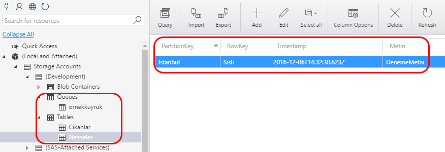
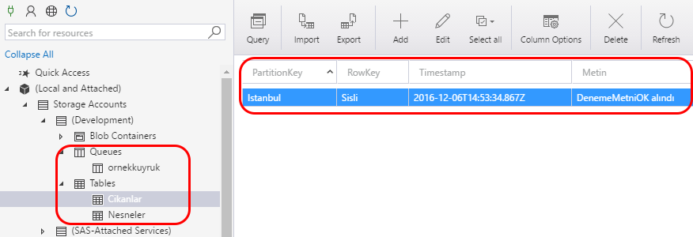

# Azure Functions ve Table Binding Kullanımı 

Azure Functions ile Azure Storage'daki Table Services arasında bir TableTrigger yok. Fakat [QueueTrigger](http://daron.yondem.com/software/post/Azure_Functions_ile_QueueTrigger_Kullanmak) veya [TimerTrigger](http://daron.yondem.com/software/post/Azure_Functions_ve_TimerTrigger_Kullanimi) gibi tetkikleyicilerle beraber kullanarak TableBinding ile Table Services'dan veri alıp gönderebilirsiniz. Tüm bunlardan önce eğer "Table Services da neyin nesi?" diyorsanız :) [Giriş](http://daron.yondem.com/software/post/Azure_Storage_Table_Services_SDK2_5), [gelişme](http://daron.yondem.com/software/post/Table_Services_SDK25_Sinsi_Relationlar) ve [sonuç](http://daron.yondem.com/software/post/Table_Services_SDK_25_Continuation_Token) diyerek tüm bunların öncesinde Table Services yazılarımı okumanızı tavsiye ederim.

### Input Binding   



İlk olarak yukarıdaki şekilde local storage ortamını hazırlayalım. Örneğimizde **ornekkuyruk** adında bir kuyruk kullanacağız. Bu kuyruğa atacağımız ilçe ismine göre **Nesneler** adındaki Table'dan **PartitionKey** şehir ve **RowKey** de ilçe olacak şekilde doğru ilçeyi bulacağız. Sonrasında eldeki veriden birkaç absürd değişiklik yapıp :) **Cikanlar** tablosuna da ayrı bir binding ile veri atmayı deneriz.

**[function.json]**
```javascript
{
  "bindings": [
    {
      "queueName": "ornekkuyruk",
      "connection": "AzureWebJobsStorage",
      "name": "kuyruk",
      "type": "queueTrigger",
      "direction": "in"
    },
    {
      "name": "gelenNesne",
      "type": "table",
      "tableName": "Nesneler",
      "partitionKey": "Istanbul",
      "rowKey": "{queueTrigger}",
      "connection": "AzureWebJobsStorage",
      "direction": "in"
    }
  ],
  "disabled": false
}
```

İlk aşamada **function.json** dosyamız yukarıdaki gibi olacak. Üst kısımda basit bir **QueueTrigger** tanımı yapıyoruz. QueueTrigger detaylarını [burada](http://daron.yondem.com/software/post/Azure_Functions_ile_QueueTrigger_Kullanmak) bulabilirsiniz. Böylece birazdan göreceğimiz Azure Function'a bu kuyruğa gelen görevlerin **kuyruk** adlı bir nesne ile gönderileceğini biliyoruz.

Sonraki adımda bir Table Binding oluşturuyoruz. Bunun için **type**'ı **table** olan bir nesne koymamız gerekiyor. Bu JSON nesnesinin **name** özelliği yine bizim Azure Function içerisine parametre olarak gönderilecek verinin adını tanımlıyor. Tabi Table Storage'dan bahsettiğimiz için bir Table'ı hedeflememiz gerek. Onun için de **tableName**'e ilk adımda yarattığımız test table'larından **Nesneler** adındaki table'ı veriyoruz. **connection** yine **appsettings.json**daki storage account connection stringi gösteriyor, **direction** ise içeriye data aktaracağımız için **in** şeklinde tanımlanmış. 

Farkındaysanız **paritionKey** ve **rowKey** özelliklerini atladım. Onlara ayrıca odaklanmak istedim. Table Services'da bildiğiniz üzere her nesne bir **ParitionKey** ve **RowKey** sahibi olmak zorunda. Detaylarını yazının başında linkini verdiğim yazılardan inceleyebilirsiniz. Bu noktada Table Services'ı bildiğinizi varsayıyorum. TableBinding yaparken Table'dan bir data bulmaya çalışacağız. Bu datanın bir şekilde **ParitionKey** ve **RowKey** ile aranması gerekiyor. Bizim örneğimizde **ParitionKey** olarak **Istanbul** değerini vererek aslında bu Function'da kullanılacak binding'in her zaman **Istanbul** Parition'ına gideceğini söylemiş oluyoruz. Siz tabi ki ihtiyacınıza göre farklı bir tasarım yapabilirsiniz. **rowKey** özelliğine baktığınızda ise **{queueTrigger}** diye bir placeholder göreceksiniz. Aslında bu da bir binding. Bu keyword'ü kullanarak QueueTrigger'dan gelen değeri TableBinding'in içindeki **RowKey**'e bind etmiş oluyoruz. Yani eğer kuyruktan için "Sisli" yazan bir mesaj gelirse bizim Table Binding ile Istanbul **PartitionKey**'li ve "Sisli" yazan **RowKey**'li obje dönecek. Eğer kuyruktan gelen veriyi bu kadar rahat bir şekilde **ParitionKey** veya **RowKey**'e bind edemiyorsanız yazının sonunda bu filtrelemeyi Azure Function'ın kendi içinde nasıl yapabileceğinizden de bahsedeceğim.

**[run.cxs]**
```CS
public static void Run(string kuyruk, OrnekObje gelenNesne, TraceWriter log)
{
    log.Info($"C# Queue trigger'dan gelen: {kuyruk}");
    log.Info($"Table Services'dan gelen metin: {gelenNesne.Metin}");
    gelenNesne.Metin += "OK";
}

public class OrnekObje
{
    public string PartitionKey { get; set; }
    public string RowKey { get; set; }
    public string Metin { get; set; }
}
```

Yukarıdaki koda baktığınızda birincisi alt kısımda binding için kullanacağımız **OrnekObje** adındaki POCO'yu görüyorsunuz. Nesne Table Services'dan geleceği için **ParitionKey** ve **RowKey** özellikleri mecburi. 

Esas Azure Function'a baktığımızda ise hem kuyruktan gelen verinin **kuyruk** değişkeni ile geldiğini hem de Table Services'dan **Istanbul** ParitionKey'li ve kuyruktan gelen değere uyan **RowKey**li nesnenin **gelenNesne** adı ve **OrnekObje** tipi ile geldiğini görebilirsiniz.

Daha da fazlası, **gelenNesne**nin **Metin** adındaki Property'sinde ufak bir değişiklik de yapıyoruz. Bu değişikliği ayrıca commit etmeniz vs gerekmiyor. Function bittiği anda bu değişiklik doğrudan Table Services'daki Entity'ye yansıyacak.

### Output Binding   

Şimdi sıra geldi bir de Output Binding denemeye. **Nesneler** adındaki table'dan veri aldık. Aldığımız veriyi biraz değiştirip bu sefer **Cikanlar** adındaki table'a atacağız. 

**[function.json]**
```javascript
{
  "bindings": [
    {
      "queueName": "ornekkuyruk",
      "connection": "AzureWebJobsStorage",
      "name": "kuyruk",
      "type": "queueTrigger",
      "direction": "in"
    },
    {
      "name": "gelenNesne",
      "type": "table",
      "tableName": "Nesneler",
      "partitionKey": "Istanbul",
      "rowKey": "{queueTrigger}",
      "connection": "AzureWebJobsStorage",
      "direction": "in"
    },
    {
      "name": "cikanNesneler",
      "type": "table",
      "tableName": "Cikanlar",
      "connection": "AzureWebJobsStorage",
      "direction": "out"
    }
  ],
  "disabled": false
}
```

Bir önceki örneğin üzerine adı **cikanNesneler** olan, tipi **table** olan ve **direction**'ı da **out** olan bir binding daha ekledik. Tablo adı olarak da **Cikanlar**'ı verdik. Azure Functions tarafına bu tablo ile ilgili bir **ICollector** gelecek.

**[run.csx]**
```CS
public static void Run(string kuyruk, OrnekObje gelenNesne, ICollector<OrnekObje> cikanNesneler, TraceWriter log)
{
    log.Info($"C# Queue trigger'dan gelen: {kuyruk}");
    log.Info($"Table Services'dan gelen metin: {gelenNesne.Metin}");
    gelenNesne.Metin += "OK";
    OrnekObje gidenObje = new OrnekObje();
    gidenObje.PartitionKey = gelenNesne.PartitionKey;
    gidenObje.RowKey = gelenNesne.RowKey;
    gidenObje.Metin = $"{gelenNesne.Metin} alındı";
    cikanNesneler.Add(gidenObje);
}
   
public class OrnekObje
{
    public string PartitionKey { get; set; }
    public string RowKey { get; set; }
    public string Metin { get; set; }
}
```

Yine önceki örnek üzerinden ilerliyorum. **gidenObje** adında ve **OrnekObje** tipinde bir değişken daha tanımladım ve **Metin** kısmına da bir önceki nesnenin metninin üzerine bir şeyler ekleyerek yeni bir değer verdim. Unutmayın ki bu nesne **Cikanlar** adındaki yeni tablomuza gidecek. O nedenle **ParitionKey** ve **RowKey** değerlerini de aynı bıraktım. Bu şekilde **ICollector**'ı kullanarak birden çok obje gönderebilirsiniz. 

Bu örneği çalıştırıp kuyruğa "Sisli" adında bir mesaj eklediğimde ilk olarak **Nesneler** tablosundaki nesnenin **Metin** değerinin sonunda "OK" ekleniyor. Sonrasında da yeni **Cikanlar** tablosuna yeni bir satır ekleniyor.



Bu noktada ufak bir sorun var :) Farkındaysanız iki ayrı tabloda işlem yapıyoruz ve daha önce de bahsettiğim gibi tüm bunlar Function bittiğinde commit oluyor. Peki ya birinde hata alırsak? Çok basit :) hata aldığınız gerçekleşmez, diğeri gerçekleşir. Yani herşey en sonda commit olsa da bütün function bir transaction'dadır gibi hayallere kapılmayalım :) (Bu arada unutmadan özellikle ICollector'ın Add vs özellikleri sona kalmaz, anında çalışır) Özellikle varsayılan ayarlarda 5 defa Function'ın tekrar deneneceğini de düşünürseniz içeride tek bir operasyondan aldığınız tek bir exception yüzünden diğer bütün operasyonların ışık hızında 5 defa yapılabilir :) O nedenle [Idempotent](https://en.wikipedia.org/wiki/Idempotence) tasarım bu noktada çok kritik. 

### İstediğin gibi filtrele    

Bu bölüme başka başlık bulamadım :) Hatırlarsanız başlarda bir yerlerde table services'dan alacağınız veriye karar vermek için kullanacağınız filtrelemenin ille binding içerisinde olmasının sınırlayıcı olabileceğinden bahsetmiştim. Alternatif olarak **ParitionKey** ve **RowKey**'i bindinge karıştırmadan filtreleme işini tamamen Azure Function içerisinde de yapabilirsiniz.

**[function.json]**
```javascript
{
  "bindings": [
    {
      "queueName": "ornekkuyruk",
      "connection": "AzureWebJobsStorage",
      "name": "kuyruk",
      "type": "queueTrigger",
      "direction": "in"
    },
    {
      "name": "gelenNesne",
      "type": "table",
      "tableName": "Nesneler",
      "connection": "AzureWebJobsStorage",
      "direction": "in"
    },
    {
      "name": "cikanNesneler",
      "type": "table",
      "tableName": "Cikanlar",
      "connection": "AzureWebJobsStorage",
      "direction": "out"
    }
  ],
  "disabled": false
}
```

İlk olarak **function.json** dosyasında table inputbinding'den **PartitionKey** ve **RowKey**'e dair herşeyi kaldırıyoruz. Bu noktada artık sadece bir table'ın bir referansını almış olacağız. Ek bir binding yapılmayacak.

**[run.csx]**
```CS
 #r "Microsoft.WindowsAzure.Storage"
using Microsoft.WindowsAzure.Storage.Table;
public static void Run(string kuyruk, IQueryable<OrnekObje> gelenNesne, ICollector<OrnekObje> cikanNesneler, TraceWriter log)
{
   OrnekObje tekNesne = gelenNesne.Where(p => p.PartitionKey == "Istanbul" && p.RowKey == kuyruk).SingleOrDefault();
        
   log.Info($"C# Queue trigger'dan gelen: {kuyruk}");
   log.Info($"Table Services'dan gelen metin: {tekNesne.Metin}");
   tekNesne.Metin += "OK";
       
   OrnekObje gidenObje = new OrnekObje();
   gidenObje.PartitionKey = tekNesne.PartitionKey;
   gidenObje.RowKey = tekNesne.RowKey;
   gidenObje.Metin = $"{tekNesne.Metin} alındı";
   cikanNesneler.Add(gidenObje);
}

public class OrnekObje : TableEntity
{
   public string Metin { get; set; }
}
```

Bir sonraki adımda ise yukarıdaki gibi birkaç değişiklik yapmamız gerekiyor. Bize Table'ın kendisi geleceği için kuyruktan gelen mesaj ile Table'ı nasıl sorgulayacağımıza biz karar vereceğiz. Bunun için de LINQ kullanmak istersek tabi ki Azure Storage SDK'i kullanmamız gerek. Üst kısımda Azure Functions'da bir harici bir assembly nasıl reference alır onu görüyorsunuz **#r** bu işi görüyor. Sonraki değişiklik **OrnekObje** ile ilgili. Nesnemizi artık **TableEntity**den türetmemiz gerekiyor ki rahatlıkla SDK'yi kullanabilelim. **IQueryAble** interface'i bunu şart koşuyor. 

En sonunda artık kodun içindeki LINQ sorgusunu görebilirsiniz. Ben yine **ParitionKey** olarak Istanbul ve **RowKey** olarak de kuyruktan gelen mesajı kullandım. Siz tabi ki bu sorguyu istediğiniz gibi değiştirebilir, isterseniz birden çok row da alabilirsiniz Table Services'dan. Fakat artık sorgulamayı biz yaptığımız ve Azure Functions'ın bindingini doğrudan nesne seviyesinde kullanmadığımız için nesnelerde yaptığımız değişiklikler doğrudan table'a gitmeyecek. Yani yukarıdaki örneği çalıştırırsanız **tekNesne**nin **Metin** özelliği storage'da hiç değişmeyecek, çünkü artık onu Commit eden yok. Eğer istiyorsanız bunu elle yapmanız gerekecek.

**[run.csx]**
```CS
 #r "Microsoft.WindowsAzure.Storage"
using Microsoft.WindowsAzure.Storage.Table;
public static void Run(string kuyruk, CloudTable gelenNesne, ICollector<OrnekObje> cikanNesneler, TraceWriter log)
{
   TableOperation operation = TableOperation.Retrieve<OrnekObje>("Istanbul", kuyruk);
   TableResult result = gelenNesne.Execute(operation);
   OrnekObje tekNesne = (OrnekObje)result.Result;
   tekNesne.Metin += "OK";
    
   operation = TableOperation.Replace(tekNesne);
   gelenNesne.Execute(operation);
}

public class OrnekObje : TableEntity
{
   public string Metin { get; set; }
}
```

 Hem inputBinding'de hem de outputBinding'de eğer metod imzasında yukarıdaki gibi obje tipini **CloudTable** olarak tanımlarsanız azami esnekliğe sahip olur ve Azure SDK ile beraber gelen tüm **TableOperation**'ları kullanabilirsiniz. Yukarıdaki örnekte hem sorgulama işinin, hem de nesne güncelleme işinin tamamen Azure Storage SDK ile yapılmış halini görebilirsiniz.

 Kolay gelsin ;)


*Bu yazi http://daron.yondem.com adresinde, 2016-12-7 tarihinde yayinlanmistir.*