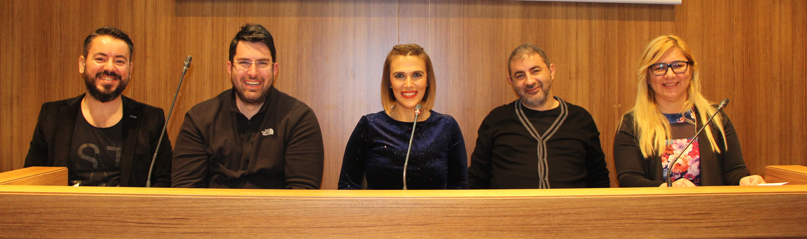

# 2. Blog Çalıştayı 

Bugün çok güzel bir etkinliğe konuk oldum. İstanbul Sabahattin Zaim Üniversitesi'nin ev sahipliği yaptığı **2. Blog Yazarları Çalıştayı**'na konuşmacı olarak katıldım. İlk blog postumu yazalı **11 yıl olmuş** olsa da kendimi hiçbir zaman bugünkü tanımı ile bir **blogger** olarak görmemişimdir :) Sanırım bu durumun bir nedeni de aslında benim blogun pek doğal bir "günlük" havasında olmaması. Yazdığım teknik yazılara birer blog post değil de "makale" gözü ile bakıyorum. Teknik içerikli makalelerin haricinde de çok az sayıda blog postum var. Aslında bir ara [**Dertli Kerem**](http://daron.yondem.com/software/search/Dertli) yazıları yazıyordum, eskiler hatırlarlar :) Fakat bu tarz yazıların cımbızlanması, öncesinde ve sonrasında gerektirdiği emeği göz önüne alınca bu enerjiyi teknik yazılara yönlendirmeyi daha uygun gördüm. Diğer yandan [Youtube](https://www.youtube.com/daronyondem) videoları ile beraber de daha tembel bir şekilde kendimi ifade edebilme lüksünü yakalayınca :) sanırım Dertli Kerem'ler biraz rafa kalktı.

Bu vesile ile aslında sizlere de şunu sorayım; siz ne düşünüyorsunuz? Off-topic takılacaksan git başka blog aç diyebilirsiniz :) Yok, buraya koy, iyi oluyor da diyebilirsiniz. Özetle, fikirlerinizi merak ediyorum. 

2.Blog Çalıştayı benim için profesyonel anlamda blogging yapılan dünyaya bir pencere oldu :) Benim genelde blogumdaki yaklaşımım, *"faydalı olacağını düşündüğüm, bildiğim şeyleri yazarım"*'dan öteye geçmezken profesyonel anlamda blogging dediğimizde ise tabi ki işi çok daha ciddiye almak gerekiyor. Enteresan şeyler öğrendim :) ama anlatmayacağım. Bir sonraki çalıştayı kaçırmayın derim. Şaka bir yana, etkinlikte inanılmaz emeği olan sevgili [**Evren Soyuçok**](http://www.evrengunlugu.net/)'a buradan da çok teşekkür ediyorum. Bu gibi etkinliklerin organizasyonundaki zorlukları eski [INETA](http://daron.yondem.com/software/search/INETA) yıllarımdan çok iyi bilirim :) Etkinlikte konuşmacı olarak yer alan diğer bloggerlar [Atıf Ünaldı](https://atifunaldi.com.tr/), [Funda Güleç Yalçın](http://www.fundalina.com/) ve [Yeşim Mutlu](http://www.yesimmutlu.com/) ile de tanışmak süperdi. Yazılım dünyasında bir blogger olarak aslında ne kadar da şanslı olduğumun farkına varmamı sağladılar :) 

Çalıştayın video kaydı da alındı diye hatırlıyorum. Elime ulaştığınıda [Twitter](http://www.twitter.com/daronyondem) ve [Facebook](http://wwww.facebook.com/daronyoendem) üzerinden paylaşacağım. 

Görüşürüz.

*Bu yazi http://daron.yondem.com adresinde, 2016-12-29 tarihinde yayinlanmistir.*