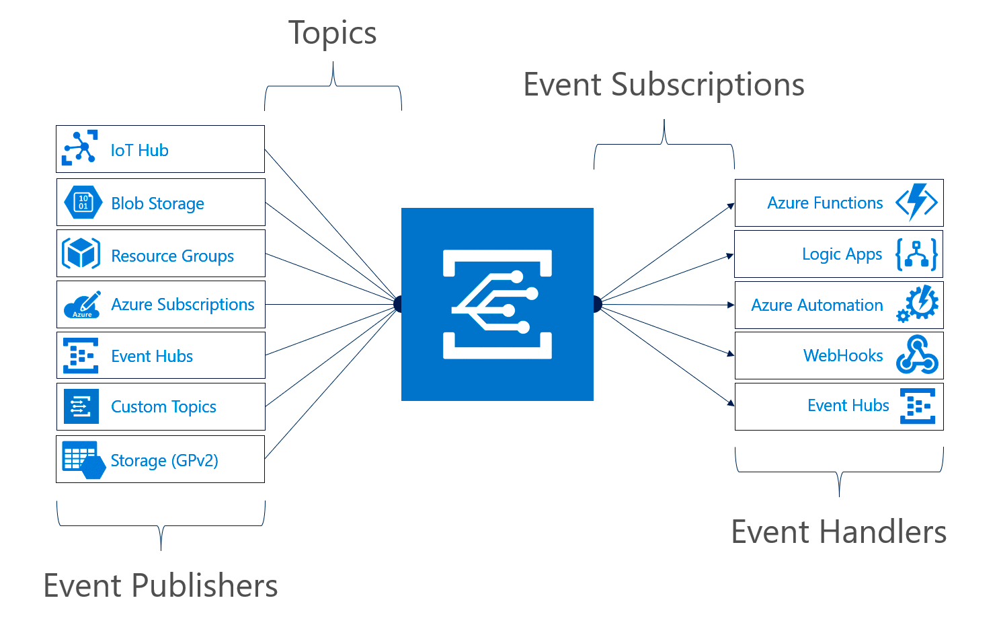
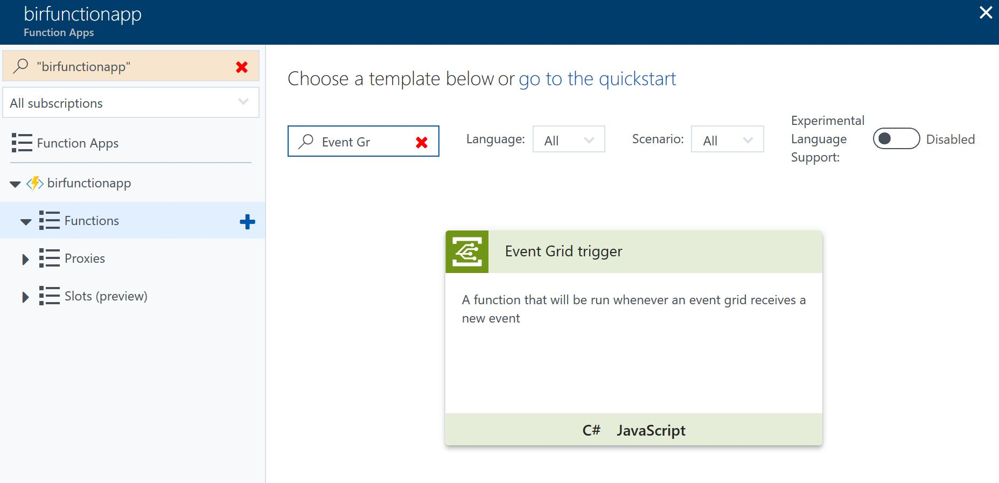
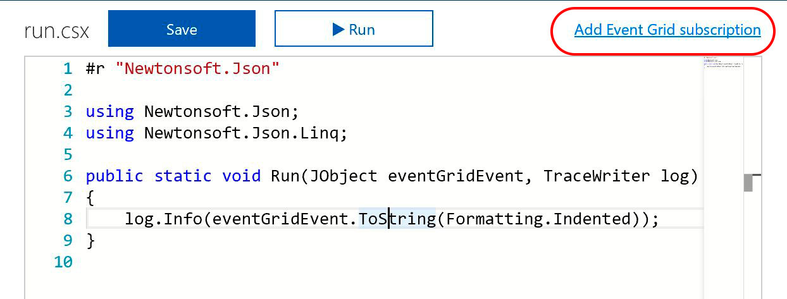
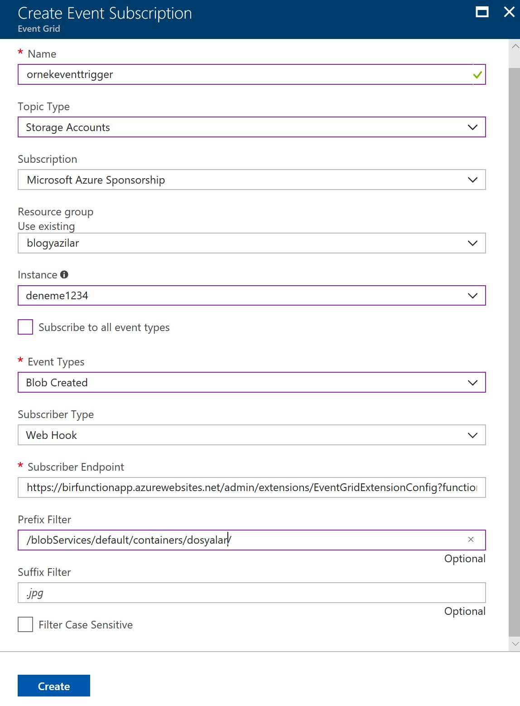

# Azure Event Grid Nedir?  

Hiç webhook açmak zorunda kaldiniz mi? Veya şöyle sorayim; hiç size ait olmayan, harici bir HTTP Endpointi belirli bir olay gerçeklestiginde iteklemeniz gerekti mi? :) Peki itekleyemeyip, sonra tekrar denemeniz gerekti mi? Peki böyle bir altyapi olusturup milyonlarca farkli yeri, milyonlarca defa, hatta hata durumunda tekrar deneyebilecek sekilde iteklemeniz gerekti mi? "Yahu bu bildigimiz pub/sub?" diyorsaniz dogru yolda sayiliriz. Gelin devam edelim. 

Özellikle Serverless'in popülerlesmesi ile beraber event based uygulamalardaki eventlerin tabiri caiz ise cloud eventlerine dönüsmesi giderek hizlaniyor. Azure'daki bir uygulamada olusan durumla gidip AWS'deki bir uygulamayi tetiklemeniz gerekebiliyor. Bunu yaparken AWS'deki uygulamanin hayatta oldugunu da varsayamazsiniz, çünkü burasi Cloud, her sey olabilir :) Azure Event Grid'in çözdüğü problem de bu. Uygulamalar gelip "Subscribe" olduktan sonra Event'ler dogrudan uygulamalara Azure Event Grid tarafindan gönderiliyor. **HTTP200 veya 202 disinda** bir cevap geldigi anda Azure Event Grid söz konusu eventi teslim etmeyi tekrar deniyor. 10 saniye, 30 saniye, 1 dakika, 5 dakika, 10 dakika, 30 dakika, 1 saat... Bir saatten sonra tekrar birer saat ara ile denemeler devam eder. Deneme süreleri arasinda ufak rastgele zaman araliklari da var, yani nokta atisi beklemeyin. 24 saat içerisinde bir event teslim edilemezse silinir, iptal edilir. **1 milyon event operasyonu için 0.60$** ödersiniz. Bu operasyon sayisina tekrar denemeler de dahildir. Azure Event Grid budur :)

### Eventin hangi tarafindasiniz?  

Bu noktadan sonra Event Grid ile ilgilenme sekliniz aslinda Event'in hangi tarafinda olacaginiza göre degisiyor. Event alacak olan taraftaysaniz (Handler) size verilecek bir endpointe subscribe olmaniz gerekecek. Bu konuda da eger elinizde özel olarak custom bir publisher (event yollayan) yoksa Azure içerisindeki implemantasyonlara göz atabilirsiniz. Azure kendi içinde de Event Grid'i kullaniyor ve çogu hizmetin zaten Event Grid entegrasyonu var. Asagidaki grafikte de görebileceginiz üzere default Azure Publisher'larindan herhangi birine gidip subscribe olabilirsiniz. (Custom Topics konusuna sonraki bir yazida bakacagiz *Edit:[Event-Grid-Harici-Publisher-Handler](Yazi burada)*)



Eger aldiginiz eventi yine Azure içerisindeki bir hizmete aktarmak isterseniz bunun için de hazir handler entegrasyonlari var. Yine yukaridaki grafikte sag tarafta platform ile beraber gelen Handler'larin listesine bakabilirsiniz. Örnegin bir blob yaratildiginda Azure Function çalistirmak istiyorsaniz Event Grid süper dogru bir tercih olacaktir.

### Azure Function mi? BlobTrigger vardi ya? Neden Event Grid?  

Azure Functions ile hiç ugrasmamis olsaniz da bu bölümü atlamayin :) Çünkü bir anlamda Microsoft'un neden Event Grid diye bir seyle ortaya çiktigini anlamak için güzel bir örnek olacak. 

Azure Functions içerisinde BlobTrigger denilen bir yapi var. [Hatta ben bu yapiyla ilgili de 2016'da detayli bir yazi yazmistim](http://daron.yondem.com/azure_functions_ile_blobtrigger_kullanmak). Functions SDK içerisindeki BlobTrigger ile bir Blob degistiginde Function'lar tetiklenebiliyor. Fakat BlobTrigger aslinda kendi logunu tutarak, polling yaparak çalisiyor. Zaten eski yazida da bahsetmisim, çok sayida blobun oldugu senaryolarda QueueTrigger vs kullanmak daha iyi oluyordu. Isin güzel tarafi Event Grid kullandiginizda artik sizin  polling yapmaniza gerek kalmiyor yok, execution log tutup onu incelemnize de gerek yok. Event Grid kendisi gelip Function'inizi tetikleyebiliyor. Yani eskiden Event Grid olaydi Azure Function ekibinin BlobTrigger yapisini yazmasina falan gerek kalmayacakti :) 

### Azure içinden Publisher ve Handler Kullanmak  

Gelin hizlica yukaridaki senaryonun Azure'da nasil çalistigina bir göz atalim. Bunun için bir Azure Function App yarattiktan sonra içine basit bir Function koyacagiz. Amacimiz bu Function'in Event Grid entegrasyonunu kullanarak Publisher olarak ayarlayip istedigimiz Storage Account'tan gelen eventleri karsilamasini saglamak. 



Yukaridaki ekran görüntüsünde de görebileceginiz üzere ben Azure Functions sitesinde template'lardan hazir olarak gelen Event Grid Trigger'i seçtim. Çok önemli bir detay degil bu, beraberinde getirecegi sadece metod imzasinda iki tane hazir parametre.



Gelen kod yukaridaki kadar. Sag üstte gördüğünüz "Add Event Grid Subscription"a basarak ilerleyecegiz. Bunu yapmadan önce Event Grid destegi olan V2 bir Azure Storage hesabiniz olmasi gerekiyor. Eski Storage Account'larda Event Grid destegi yok.



Yukaridaki ekran görüntüsünde tüm gerekli ayarlari görebilirsiniz. Anlatilmasi gerekenlere gelirsek;

- **Topic Type**: Tabi Storage Account dinleyecegimiz için bunu seçtik.
- **Instance**: Bu benim storage account'un adi :) çok yaratici :)
- **Event Types**: Burada Created ve Deleted'lari alabiliyoruz. Ben sadece Created seçtim.
- **Subscriber Type**: Event Hub veya Webhook olabiliyor. Azure Function için built-in Webhook destegi daha rahat oluyor diye düşündüm.
- **Subscriber Endpoint**: Buradaki endpoint [EventGridExtensions](https://github.com/Azure/azure-functions-eventgrid-extension/blob/master/src/EventGridExtension/EventGridExtensionConfig.cs)'dan geliyor. Event Grid'e subscribe olurkenki validasyon gibi konulari bu extension hallediyor ve bizim Function içinde ugrasmamiza gerek kalmiyor. Bu konuyu da ileriki bir yazida Azure disi handler kullanirken inceleyecegiz.
- **Prefix Filter**: Sadece belirli bir containerdaki dosyalari isleyebilecek örnek bir filtre koymak istedim.
- **Suffix Filter**: Ben kullanmadim fakat ne ise yaradigi sanirim belli :) Blob URL suffix matching yapabiliyorsunuz.   
   
Azure Functions tarafinda Event'i adam gibi deserialize etmek için de kodu asagidaki sekilde degistirebilirsiniz:)   
   
```CS

#r "Newtonsoft.Json"  
#r "Newtonsoft.Json"  
#r "Microsoft.Azure.WebJobs.Extensions.EventGrid"  

using Newtonsoft.Json;
using Newtonsoft.Json.Linq;
using Microsoft.Azure.WebJobs.Extensions.EventGrid;

public static void Run(EventGridEvent eventGridEvent, TraceWriter log)
{
    log.Info($"Subject: {eventGridEvent.Subject}");
    log.Info($"Time: {eventGridEvent.EventTime}");
    log.Info($"Data: {eventGridEvent.Data.ToString()}");
}
```

Su EventGridExtension ve beraberinde gelen custom endpointten biraz daha bahsetmekte fayda var. Azure Event Grid'e herhangi bir endpoint kendini subscribe ederken ayni anda valide de etmesi gerekiyor. Bunun için  Event Grid subscribe olan tarafa bir **SubscriptionValidationEvent** gönderiyor. Bu normal eventlerden farkli bir event ve içerisinde **validationCode** var. Subscribe olan tarafin bunu alip **validationResponse** olarak geri döndürmesi gerekiyor ki subscription olusturulsun. Validasyon sürecinden geçildikten sonra artik karsi tarafa normal eventler gönderilmeye baslaniyor. Biz bunlari Azure Function içerisinde sifirdan yapmayalim diye Azure Function ekibi bir Extension yazmis. Tüm bunlari sifirdan nasil yapacagimiza ileriki yazilarda custom subscriber olustururken göz atacagiz. 

### Polling'e son  

Azure Event Grid gerçek anlaminda pollingden kurtulmamizi sagliyor. Bugüne kadar Azure içerisinde de Azure Function'lar olsun Logic Apps olsun birçok hizmet öyle veya böyle birbirleri ile konusabilmek için polling yapiyordu. Oysa artik Event Grid ile pollingin maliyetinden ve kismi gecikmelerinden kurtulmus oluyoruz. Serverless tarafina baktiginizda ise eventing için kuyruk kullanma ve kuyrugu poll'lamaya süper bir alternatif. Tabi bu "kuyruk yerine artik Event Grid" gibi bir sonuç da çikarmiyor :) Kuyruklarin yeri ayri, fakat artik eventing için kuyruklari kötüye kullanmaya gerek yok. Event Grid bugün saniyede milyonlarca eventi destekleyecek bir altyapiya sahip. En güzel tarafi ise bir event publisher'a birden çok subscriber da olabiliyor olmasi. Bir anlamda fan-out da yapabiliyorsunuz. 

### Fiyatlandirma  

Azure Event Grid'in fiyatlandirmasi gerçek bir cloud hizmetinin fiyatlandirmasina çok güzel bir örnek. Hiç kullanmazsaniz hiç ödemezsiniz. Provisioning vs yok. **Ayda 100.000 operasyon ücretsiz**. Bu kota yazilim gelistirme süreçlerindeki, test vs ihtiyaçlarinizi rahatlikla karsilasayacaktir. Azure Event Grid için bir operasyon demek gelen, giden event, servisle konusmak için sizin kullandigimiz management api'lari ve bir eventin teslim edilmesi için eger gerekmisse farkli denemelerin toplami anlamina geliyor. Unutmadan bir de bu "Advanced matching" var ayri operasyon olarak kabul edilen. Bu da "subject pattern filtering", yani "Subject ends with" sorgusunu kullandiginizda geçerli olacaktir. 

### Son olarak...  

* 99.99% SLA
* [Management SDK'leri Python, .Net, ve Node.js](https://docs.microsoft.com/azure/event-grid/sdk-overview)'leri için su an yayinda. Go, Ruby, ve Java SDK'leri ise yakinda gelecek. 
* [Publish SDK için su an .Net destegi var](https://docs.microsoft.com/azure/event-grid/sdk-overview). Python, Node.js, Go, Ruby, ve Java yakinda gelecek.   
   
Simdilik bu kadar :) Sonraki yazilarda görüsmek üzere.

*Bu yazi http://daron.yondem.com adresinde, 2018-2-13 tarihinde yayinlanmistir.*