# Azure Functions ile Linux'te Pyhton  

Geçenlerde Microsoft'un Connect adındaki online etkinliği gerçekleşti. Her Microsoft konferansında olduğu gibi bu etkinlikte de birçok yenilik duyuruldu. Bu yeniliklerden biri de Azure Functions tarafında **Consumption Plan** için Linux desteği oldu. 

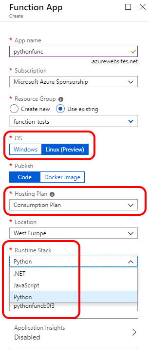

Yukarıdaki ekran görüntüsünde de inceleyebileceğiniz üzere artık Linux'e deployment yaparken "Consumption Plan" seçebiliyoruz. Bir üst adımda, ekran görüntüsünde işaretlememiş olsam da :) seçenek olarak **Code** ve **Docker Image** deployment seçenekleri de mevcut. Şimdilik o taraflara girmeyeceğim, ama bir altını çizmek istedim :) Ben bir docker image ile function app'in one-to-one maplenmesine alerjik olduğum için o kısmı es geçiyorum. Nitekim .NET ile Function App yazdığımızda assembly deploy etmek de kısmen de olsa aynı problemli yola çıkıyor. Konuya dönelim, Linux tarafında tüm Function App'ler siz nasıl deploy ederseniz edin aslında birer Docker Container içerisinde çalışıyor. Eğer kendi docker image'iniz ile ilerlemek isterseniz [base imageler burada](https://hub.docker.com/r/microsoft/azure-functions/). 

Bir alt adımda "Runtime Stack" kısmında .NET, JavaScript ve Python seçeneklerini görüyorsunuz. Buradaki .NET'ten kasıt tabi ki Azure Function 2.0 üzerinde çalışan .NET Core. Function 1.0 Runtime ile full .Net Framework gidiyorsanız doğal olarak Linux based bir function app yazma şansınız olmayacak. Aynı şekilde Pyhton ile gittiğinizde de isteseniz de Windows based function app plan alamazsınız. Şimdi bu noktada *"yahu kim gidip Windows alır ki zaten Pyhton yazıyorsa?"* diyebilirsiniz :) ama bu detaylar özellikle consumption plan dışına çıktığınızda kritik oluyor. Malum Function App'inizi hali hazırda var olan bir App Service Plan'ın içine sokmak isterseniz App Service Plan'ın hangi işletim sistemine sahip olduğuna göre Function yazarken kullanabileceğiniz dil de değişmiş oluyor. Örneğin Python ile Function Runtime 2.0 üzerinde bir function yazacaksanız bunu Windows tabanlı bir App Service Plan'a koyamazsınız. Aslında Function ekibi istese Windows üzerinde de Phyton functionları host edebilir. Teknik bir engel yok. Hatta bir dönem [**Experimental** olarak Function V1 üzerinde Pyhton kullanılabiliyordu](https://github.com/yokawasa/azure-functions-python-samples/blob/master/docs/create-function-app-in-azure-portal.md). Fakat V2'de bu yatırımı yapmaya değer görecekler mi zaman gösterecek. Önce, şu an Preview'da olan Java desteğini Linux'e taşımayı düşünebilirler :) malum şu anda Java Function'lar sadece Windows planlarda çalışıyor. Serverless dedik... ama yine kodu yazmadan önce kernelin ne olduğuna kadar ilgilenmek zorunda kalmak can sıkıcı açıkçası.

Ufak bir not geçiyim bu arada :) Linux based Azure Function 2.0 Runtime instanceları tamamen Service Fabric Mesh üzerinde çalışıyor. Service Fabric meraklısı için bahsetmeden geçmiyim dedim. 

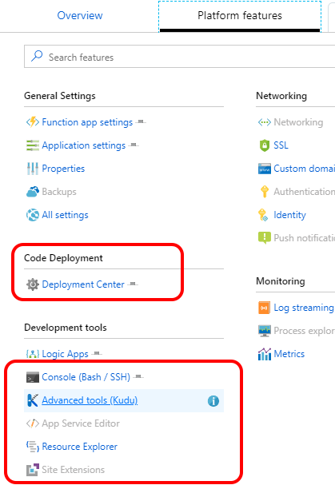

Deployment için ben 1990'lar metodunu kullanacağım :) Repo falan ayarlamaya üşendim. FTP'den atacağım herşeyi. Ekran görüntüsünde de görebileceğiniz üzere **Deployment Center**'a giderseniz oradan her tür seçenek mevcut zaten. Yukarıdaki ekran görüntüsünü esas koyma nedenim aslında Console seçeneğinin **Bash** olarak değiştiğini göstermekti. Tabi bunun yanı sıra **Site Extensions** ve **App Service Editor** de elden gitmiş durumda. Atla deve mi? Değil.

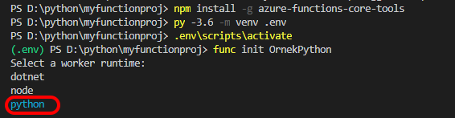

Eğer ortamınız hazır değilse hemen yukarıdaki komutları VSCode'da sırası ile çalıştırarak ortamı hazırlayabilirsiniz. Bu kodlar makinenize [Azure Functions Core Tools](https://docs.microsoft.com/en-us/azure/azure-functions/functions-run-local#v2) yükleyecek. Tabi öncesinde [Python](https://www.python.org/downloads/) da yüklemiş olmanız gerekir :)

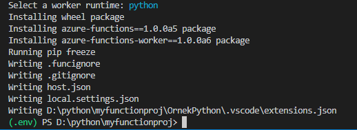

Yukarıdaki işlemler bittiğinde artık için bir **host.json** olan function app sahibi oluyorsunuz. Sıra geliyor ilk functionımızı eklemeye.

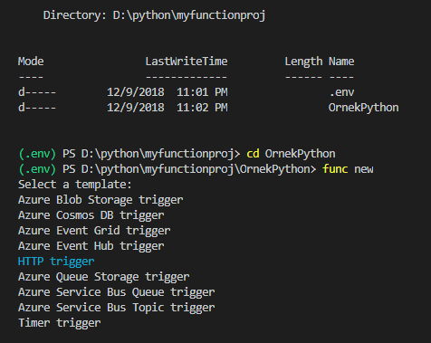

Ben örnek olarak bir HttpTrigger almaya karar verdim. En pratik ayağa kaldırabileceğimiz örneklerden biri.

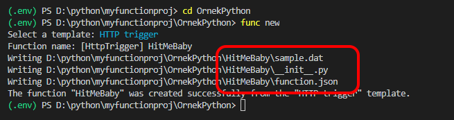

**HitMeBaby** adındaki yeni functionımızın toplam üç tane dosyası var. *sample.dat* dosyasını şimdilik önemsemeyin. İçinde basit bir JSON data var. Aslında template bu dosyayı kullanmıyor :) Eski örneklerde kullanılıyordu, kalmış ve silmeyi unutmuşlar :) Neyse, konuya dönersek.. esas bizi ilgilendiren **function.json** ve **__init__.py** dosyaları. 

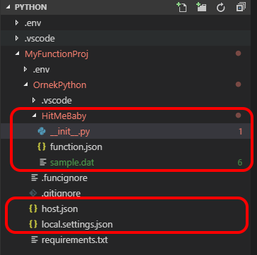

Yukarı şöyle genel olarak bir proje yapısnı da görelim istedim. Her zaman olduğu gibi function dosyalarımız function adındaki bir klasörün altında. Kodumuz ve **function.json** HitMeBaby klasöründe duruyor. Bir üst klasör ise Function App klasörü. Orada da **host.json** var zaten. Yani genel hatları ile aslında herşey normal bir function app ile uyumlu.

```javascript
{
  "scriptFile": "__init__.py",
  "bindings": [
    {
      "authLevel": "anonymous",
      "type": "httpTrigger",
      "direction": "in",
      "name": "req",
      "methods": [
        "get",
        "post"
      ]
    },
    {
      "type": "http",
      "direction": "out",
      "name": "$return"
    }
  ]
}
```

Eğer daha önce Azure Functions ile ilgilendiyseniz yukarıdaki dosya süper tanıdık gelecektir. Her zamanki **function.json**'ın ta kendisi. Buradaki önemli noktalarda biri tabi ki **scriptFile** parametresi. Tanrı'ya şükür ki **__init__.py** convention değilmiş :) Geri kalanlar klasik Azure Function input/output bindinglerinden ibaret. 

```python
import logging

import azure.functions as func
def main(req: func.HttpRequest) -> func.HttpResponse:
    logging.info('Python HTTP trigger function processed a request.')

    name = req.params.get('name')
    if not name:
        try:
            req_body = req.get_json()
        except ValueError:
            pass
        else:
            name = req_body.get('name')

    if name:
        return func.HttpResponse(f"Hello {name}!")
    else:
        return func.HttpResponse(
             "Please pass a name on the query string or in the request body",
             status_code=400
        )
```

Yukarıdaki dosya da bizim Python kodumuz. Tüm Azure Function HTTP örnekleri ile uyumlu bir örnek kod hazırlanmış. Gelen request içinde querystringde **name** adında bir parametre varsa, veya body'de **name** attribute varsa alınıp **Hello Name** denerek response döndürülüyor. Süper basit :)

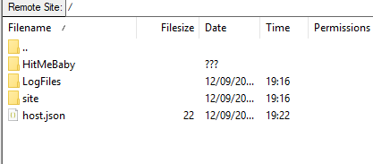

Eğer siz de benim gibi FTP'den atacak olursanız (ki yapmayın, etmeyin :)) functionlarınızı "site" klasörünün içine falan atmayın sakın :) direk host.json'ın bulunduğu yere atın. **host.json** zaten sizi orada karşılayacak.

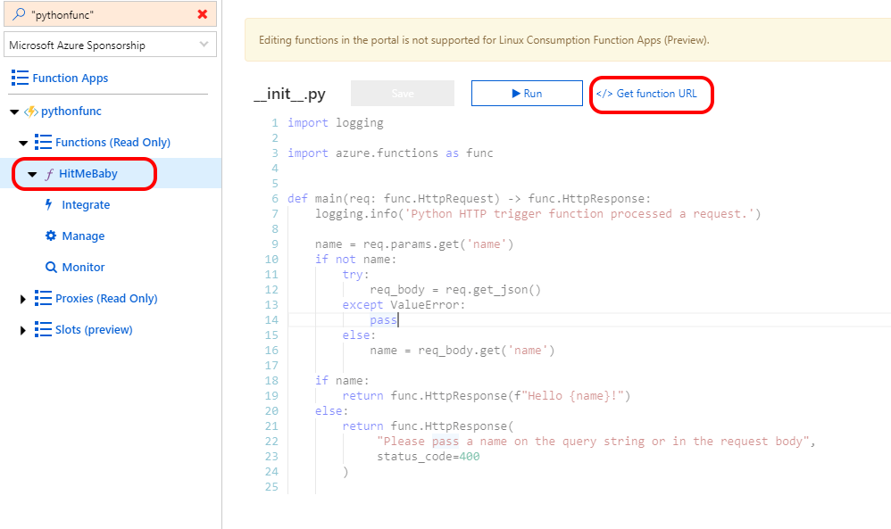

Herşey başarılı bir şekilde deploy olduğunda Azure Portal'de functionı görebilirsiniz. Hemen **Get function URL** diyerek adresi alıp bir GET veya POST request gönderebiliriz.

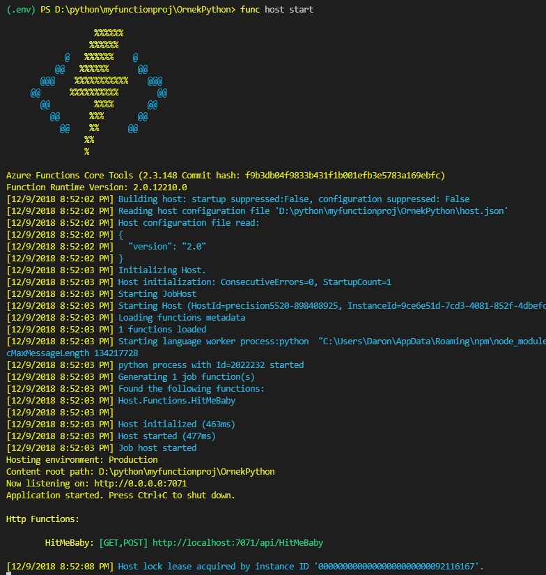

Eğer isterseniz yukarıdaki gibi direk *func host start* diyerek localde de function'ı test edebilirsiniz. Aşağıdaki ekran görüntüsünde Fiddler'dan gönderdiğimiz basit request ve aldığımız Hello World cevabı var :)

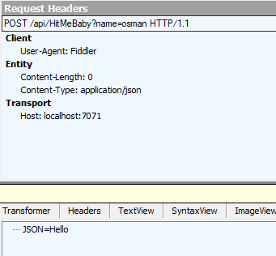

Böylece kabaca bir Python function'ı Linux based consumption plan'da çalıştırdık. Tabi tüm bunları deneyecek olursanız şu an hem Linux üzerinde çalışan Azure Functions'ın hem de Python desteğinin **Preview** olduğunu unutmayın derim. Her tür gariplikle karşılaşabilirsiniz. Örneğin ben testlerimde bolca gereksiz 502'ler aldım Azure ortamında :) Preview'dur, olur böyle şeyler ;) diyerek yazıyı burada sonlandırıyorum. Görüşmek üzere!

*Bu yazi http://daron.yondem.com adresinde, 2018-12-10 tarihinde yayinlanmistir.*